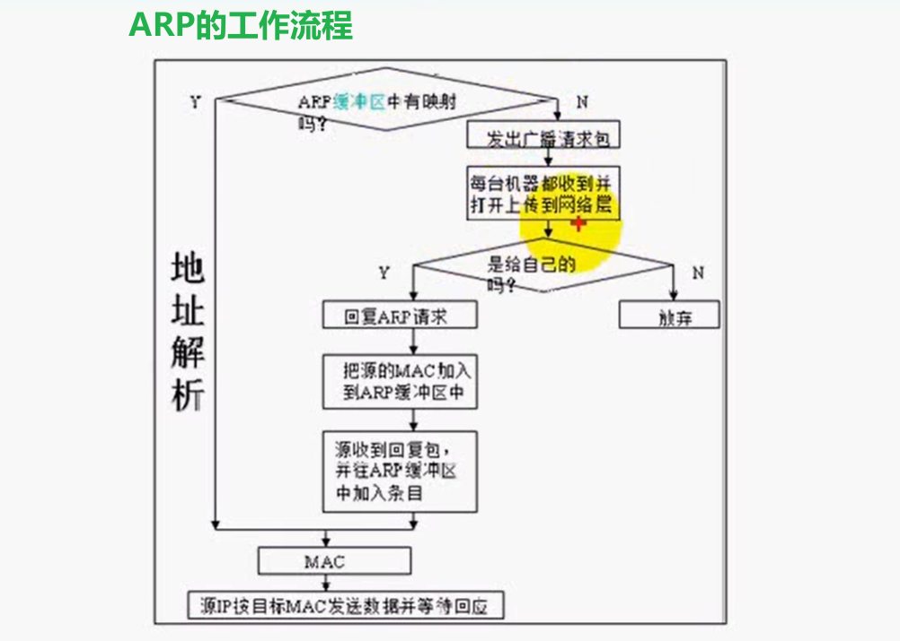

# linux网络编程

## TCP/IP基础篇

### 对等通信的概念

TCP/IP四层模型中，每个层之间才能发生对等的通信；

因此，也经常将TCP/IP整个协议称为`TCP/IP协议栈`

### 封装

### 端口

 **端口的作用：**用于区分一台主机上的应用程序

端口的分类：

- 众所周知的端口：从0-1023，这个端口的通讯明确表明了某种服务的协议。如21端口用于ftp服务端口
- 注册端口：从1024-49151，松散地绑定于一些服务。
- 动态或私有端口：从49152到65535，可以由用户自行分配

### 最大传输单元（MTU）、路径（MTU）

### 以太网帧格式

### ICMP协议（IP层协议）

**错误的类型：**

- 设置不分片，而发送的信息长度超过MTU，就是一种差错信息
- IP地址无法通过ARP协议解析的时候
- **实际上，ping应用程序就是基于ICMP协议实现的（查询的请求）**

### ARP/RARP（链路层协议）

IP->MAC地址：通过ARP协议解析

MAC->IP地址：通过RARP协议解析（**无盘工作站，没有配置文件来保存自身的IP地址。只有向RARP服务站查询**）

### IP数据包格式

### 网际校验和

# socket编程篇

## socket相关

### 什么是socket

- **套接口socket是两个进程间通信的抽象，忽略了内核网络协议栈的底层**

- 能够用于异构系统间的通信

### 套接字的属性

- 地址
  - 地址族
  - 端口号
  - IP地址
- 

## 进程间通信篇

# 知识点总结

## ping程序流程

## 