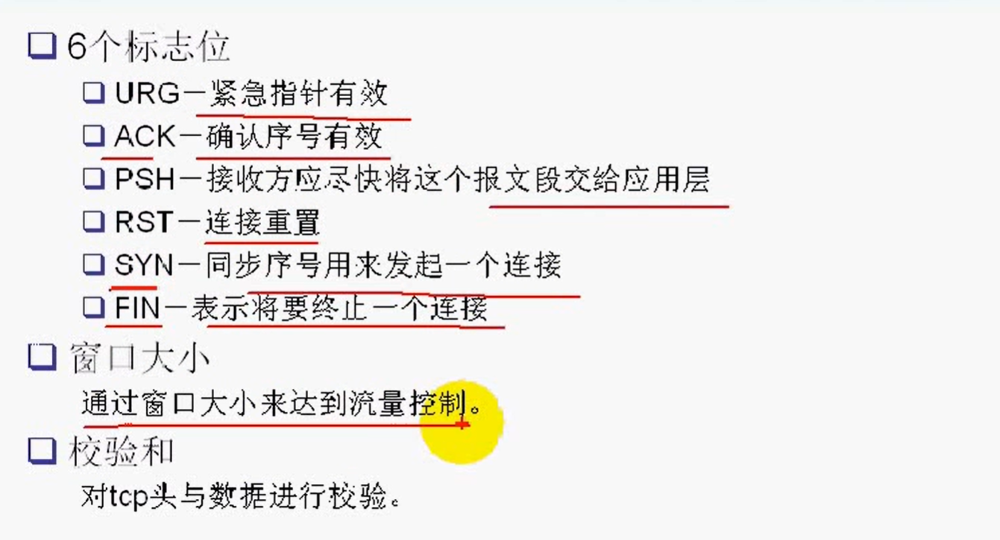
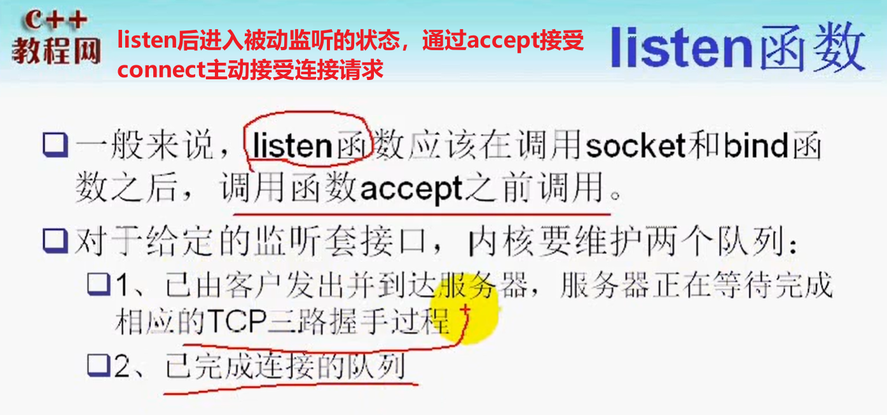
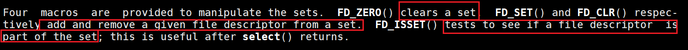
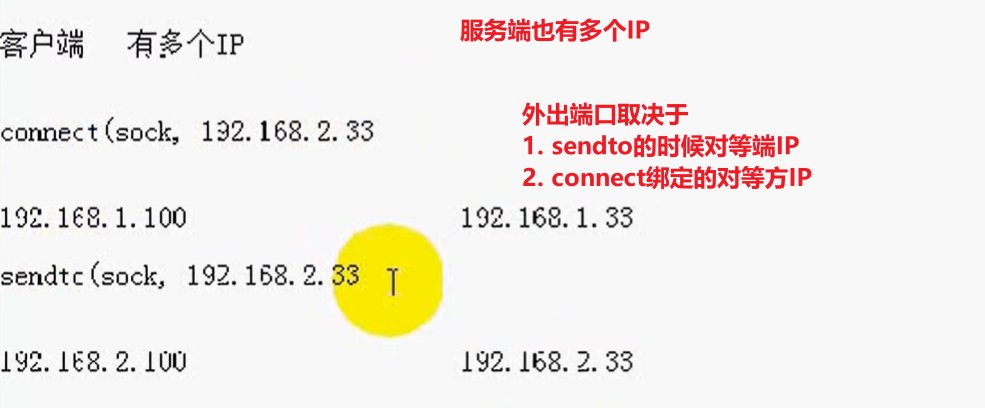
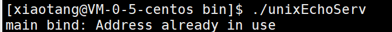
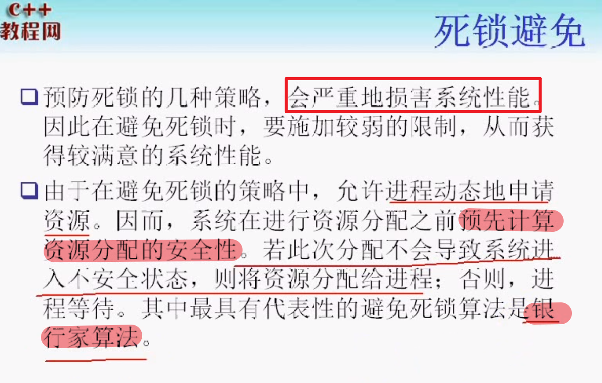
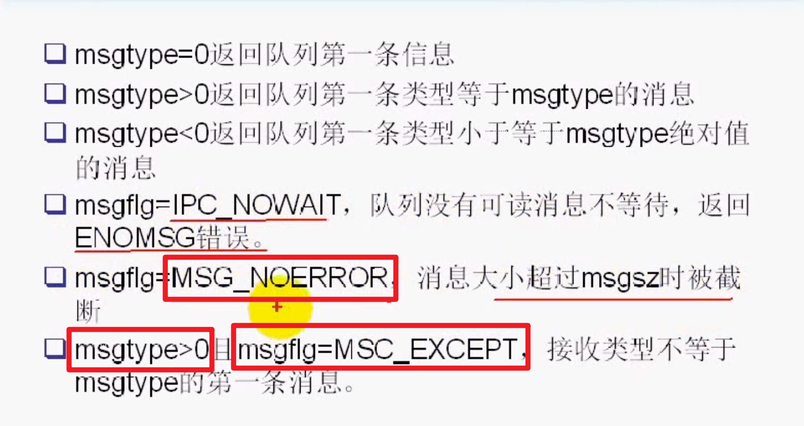
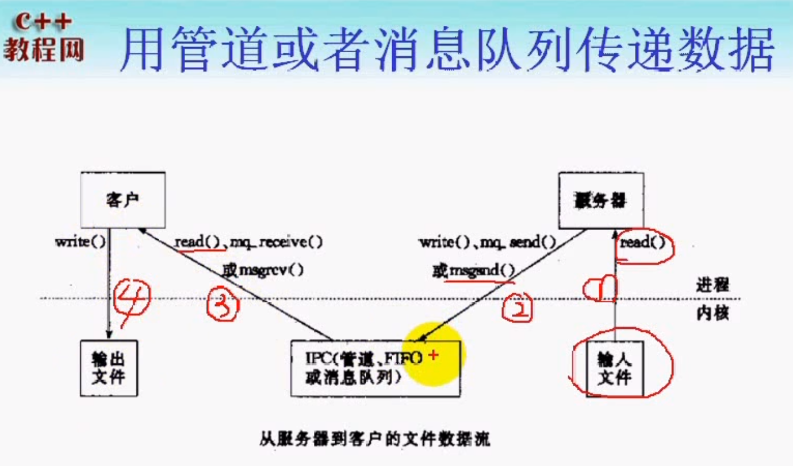
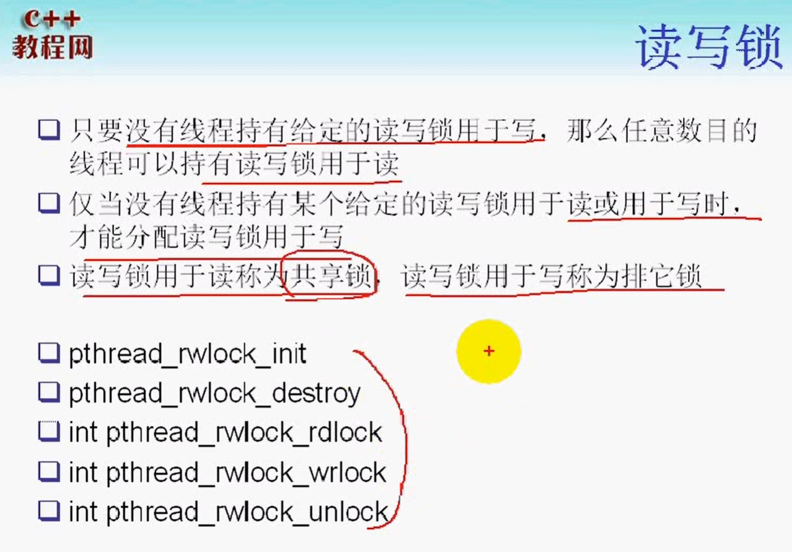
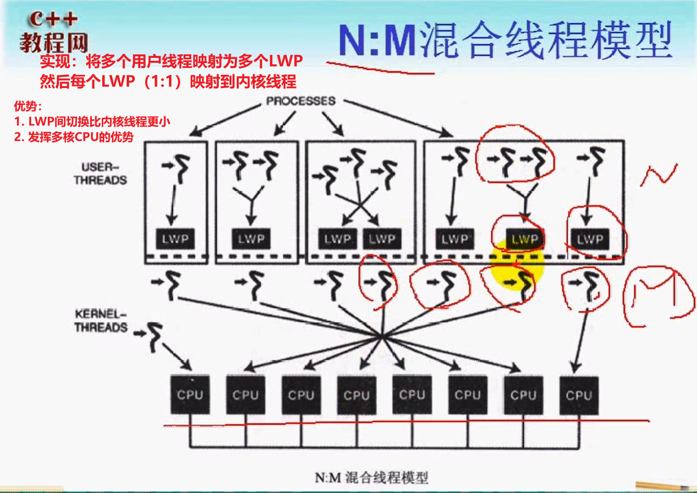

# linux网络编程

## TCP/IP基础篇


### 对等通信的概念

TCP/IP四层模型中，每个层之间才能发生对等的通信；

因此，也经常将TCP/IP整个协议称为`TCP/IP协议栈`

### 封装


### 端口

 **端口的作用：**用于区分一台主机上的应用程序

端口的分类：

- 众所周知的端口：从0-1023，这个端口的通讯明确表明了某种服务的协议。如21端口用于ftp服务端口
- 注册端口：从1024-49151，松散地绑定于一些服务。
- 动态或私有端口：从49152到65535，可以由用户自行分配

### 最大传输单元（MTU）、路径（MTU）


### 以太网帧格式


### ICMP协议（IP层协议）


**错误的类型：**

- 设置不分片，而发送的信息长度超过MTU，就是一种差错信息
- IP地址无法通过ARP协议解析的时候
- **实际上，ping应用程序就是基于ICMP协议实现的（查询的请求）**


### ARP/RARP（链路层协议）

IP->MAC地址：通过ARP协议解析

MAC->IP地址：通过RARP协议解析（**无盘工作站，没有配置文件来保存自身的IP地址。只有向RARP服务站查询**）


### IP数据包格式


### 网际校验和


## TCP协议

### TCP的特点

1. 基于字节流

   - 无格式的
   - 无边界的
   - **存在TCP粘包问题：**在应用层来处理粘包问题

2. 面向连接的

   > 确定TCP连接的四个要素
   >
   > - 源端口号、IP地址
   > - 目的端口号、目的IP地址

3. 可靠的传输服务

   - 不会乱序
   - 不会重复

4. 缓冲传输（NAGLE算法）

5. 全双工

6. 流量控制：通过窗口机制





### TCP如何保证可靠性

**不可靠的特征：**

1. 差错：校验和
2. 失序：每个报文都有一个序号（序号机制）
3. 丢包：超时重传（**确认机制**）
4. 重复：序号机制

**TCP如何保证：**

1. 超时重传：解决丢包问题
2. 确认机制：解决丢包问题
3. 序号机制：解决失序、重复问题
4. 校验机制：解决差错问题


### 滑动窗口协议

**TCP协议的头部，会维护一个窗口大小。在三次握手建立连接的时候，确认对方各自的接收窗口大小，以及MSS大小**

**流量控制算法：**

- 链路层：以帧为单位进行确认
- 传输层：以字节为单位进行确认

**TCP的累计确认机制：**多个ACK只确认最后到来的报文


**拥塞控制算法：**

- 慢启动阈值
- 慢启动阶段
- 拥塞避免阶段
- 拥塞发生
- 拥塞恢复

### UDP特点

1. 无连接的
2. 不可靠的
   - 可能重复、丢失
   - 乱序
3. 一般情况下，UDP更加高效

**问：什么时候UDP不如TCP高效**

1. 当我们要求UDP实现可靠传输的时候，这时候，就需要添加一些可靠的传输机制。但是这些机制可能没有TCP协议自身设计来得高效。


## TCP进阶

### TCP的11种状态


**closing状态产生的原因：**


### 连接建立三次握手

### 连接终止四次挥手

### `TIME_WAIT`与`SO_REUSEADDR`

### `SIGPIPE`信号产生的原因


**当产生SIGPIPE信号以后，默认终止当前进程**

**从管道的角度理解SIGPIPE:**

> SIGPIPE的产生是如果没有任何读端进程，这时候向管道中写入数据。这时候就会产生断开的管道信号`SIGPIPE`
>
> 而TCP协议是全双工的。当收到对等方的`FIN`报文以后，无法确定对等方是否关闭。只是表示他们的写通道关闭。
>
> 这时候需要客户端调用`write`，如果对方的读端也关闭了，那么TCP协议栈会返回一个`RST`报文。如果再次调用`write`，这时候会产生`SIGPIPE`信号。
>
> **通过以`signal(SIGPIPE, SIG_IGN)`忽略即可**

# socket编程篇

## socket相关

### 什么是socket


- **套接口socket是两个进程间通信的抽象，忽略了内核网络协议栈的底层**

- 能够用于异构系统间的通信

### 套接字的属性

- 地址

  - 地址族
  - 端口号
  - IP地址

  

  > 仅适用于IPv4地址结构

- 通用地址结构

  

## 字节序


### 字节序转换函数


### 地址转换函数


**套接字类型**


## TCP客户/服务器模型





### echo客户服务器模型

一个连接一个进程，不会出现串线问题

**进一步完善：**

- 解决tcp的粘包问题
  - readn/writen
  - readline（√）

### 点对点的聊天服务实现

需要两个进程：一个进程用来接收数据，一个进程用来发送数据

**需要考虑的问题：**

父进程退出了，如何让子进程也退出（信号）（**进程间通信问题**）

## 粘包

### 流协议与粘包问题

**流协议：**

> TCP是基于字节流的传输协议，因此传输数据是无边界的。
>
> 而UDP是基于消息的传输协议，因此，UDP是有边界的。
>
> **对于字节流传输协议，对等方在接收数据的时候，不确定一次读操作能返回多少个字节**。而对于基于消息的协议，它能够保证一次传输的是一条完整的消息。（**这也是流协议与粘包问题）**

### 粘包产生的原因

1. TCP的流量控制
2. TCP的拥塞控制
3. TCP的延迟发送机制
4. 数据发送过程的问题（见下图）
5. **在局域网上不存在粘包问题，但是在广域网上就存在粘包问题了**


### 粘包处理方案

**本质上是要在应用层维护消息与消息的边界**

- 定长包：存在的问题，消息实际长度没有这么长，造成网络流量的浪费
- 包尾加上`\r\n`,(ftp协议)
- 包头加上包体的长度（muduo的消息设计）
- 更复杂的应用层协议

### readn和writen

**用于接收定长包的处理函数**

```c++
17  // readn的实现
18  ssize_t readn(int fd, void *buf, size_t count)
19  {
20      size_t nleft = count;
21      ssize_t nread;
22      char *bufp = (char*)buf;
23  
24      while (nleft > 0)
25      {
26          if (nread = read(fd, bufp, nleft) < 0)
27          {
28              if (errno == EINTR)
29                  continue;
30              return -1;
31          }
32          else if (nread == 0)
33             return count - nleft; // 套接字连接关闭，返回已读的字节数
34          bufp += nread;
35          nleft -= nread;
  1     }
  2 
  3     return count;
  4 }
  5 
  6 // writen实现
  7 ssize_t writen(int fd, const void *buf, size_t count)
  8 {
  9     size_t nleft = count;
 10     ssize_t nwritten;
 11     char *bufp = (char*)buf;
 12 
 13     while (nleft > 0)
 14     {
 15         if ((nwritten = write(fd, bufp, nleft)) < 0)
 16         {
 17             if (errno == EINTR)
 18                continue;
 19 
 20         }
 21         else if (nwritten == 0)
 22             continue;
 23         bufp += nwritten;
 24         nleft -= nwritten;
 25     }
 26 
 27     return count;
 28 }
```

**存在的问题：**目前客户端的消息到来之后，阻塞读取1024个字节。**因此需要设置消息格式。来区分消息与消息之间的边界**

- 发送接收定长包（存在空间浪费）

## 数据IO

### read、write与recv、send

`man recv`函数

**区别之一：**

- recv只能用于套接字IO，不能用于文件IO和其他IO
- 而read函数可以用于其他IO
- recv多了一个`flags`标志。
  - MSG_OOB
  - MSG_PEEK：接受缓冲区的数据，但是不会将数据从缓冲区中清除

### readline实现

**readline**读取到`\n`为止。可以用于解决`TCP粘包问题`

**按行读取方法的封装：**

- 一个字符一个字符的实现，判断是否有`\n`。这种方法的效率比较低。这样会多次调用read或者recv函数（导致性能的损失）
- 采用静态变量来接收、缓存（函数是不可重入的）
- **采用偷窥的方法**

```c++
// recv_peek实现
ssize_t recv_peek(int sockfd, void *buf, size_t len)
{

    while (1)
    {
        int ret = recv(sockfd, buf, len, MSG_PEEK); 
        // 从sockfd的套接字缓冲中peek长度为len的字符到buf中
        if (ret == -1 && errno == EINTR)
            continue;
        return ret;
    }
}
// readline实现
ssize_t readline(int sockfd, void *buf, size_t maxline)
{
    int ret;
    int nread;
    char *bufp = (char*)buf;
    int nleft = maxline;
    while (1)
    {
        ret = recv_peek(sockfd, bufp, nleft);
        if (ret < 0)
            return ret;
        else if (ret == 0)
            return ret;
        nread = ret;
        int i;
        for (i = 0; i < nread; ++i)
        {
            if (bufp[i] == '\n')
            {
                ret = readn(sockfd, bufp, i+1);
                if (ret != i+1)
                    exit(EXIT_FAILURE);

                return ret;
            }
        }
        if (nread > nleft)
            exit(EXIT_FAILURE);

        nleft -= nread;
        ret = readn(sockfd, bufp, nread);
        
        if (ret != nread)
            exit(EXIT_FAILURE);
        bufp += nread;

    }

    return -1;
}
```


### 用readline实现回射服务器

```c
//
// Created by jxq on 19-7-21.
//

#include <iostream>
#include <stdio.h>
#include <cstring>
#include <unistd.h>
#include <sys/types.h>
#include <sys/socket.h>
#include <netinet/in.h>
#include <arpa/inet.h>

using namespace std;
// 定义报错的宏
#define ERR_EXIT(m) \
        do  \
        {   \
            perror(m);  \
            exit(EXIT_FAILURE); \
        } while(0);

// recv_peek实现
ssize_t recv_peek(int sockfd, void *buf, size_t len)
{

    while (1)
    {
        int ret = recv(sockfd, buf, len, MSG_PEEK); 
        // 从sockfd的套接字缓冲中peek长度为len的字符到buf中
        if (ret == -1 && errno == EINTR)
            continue;
        return ret;
    }
}
ssize_t readn(int fd, void *buf, size_t count)
{
    size_t nleft = count;   // 剩余字节数
    ssize_t nread;
    char *bufp = (char*) buf;

    while (nleft > 0)
    {
        nread = read(fd, bufp, nleft);
        if (nread < 0)
        {
            if (errno == EINTR)
            {
                continue;
            }
            return  -1;
        } else if (nread == 0)
        {
            return count - nleft;
        }

        bufp += nread;
        nleft -= nread;
    }
    return count;
}

ssize_t writen(int fd, const void *buf, size_t count)
{
    size_t nleft = count;
    ssize_t nwritten;
    char* bufp = (char*)buf;

    while (nleft > 0)
    {
        if ((nwritten = write(fd, bufp, nleft)) < 0)
        {
            if (errno == EINTR)
            {
                continue;
            }
            return -1;
        }
        else if (nwritten == 0)
        {
            continue;
        }
        bufp += nwritten;
        nleft -= nwritten;
    }
    return count;
}

ssize_t readline(int sockfd, void *buf, size_t maxline)
{
    int ret;
    int nread;
    char *bufp = (char*)buf;
    int nleft = maxline;
    while (1)
    {
        ret = recv_peek(sockfd, bufp, nleft);
        if (ret <= 0)
            return ret;
        nread = ret;
        int i;
        for (i = 0; i < nread; ++i)
        {
            if (bufp[i] == '\n')
            {
                ret = readn(sockfd, bufp, i+1);
                if (ret != i+1)
                    exit(EXIT_FAILURE);

                return ret;
            }
        }
        if (nread > nleft)
            exit(EXIT_FAILURE);

        nleft -= nread;
        ret = readn(sockfd, bufp, nread);
        
        if (ret != nread)
            exit(EXIT_FAILURE);
        bufp += nread;

    }

    return -1;
}
void do_service(int connfd)
{
    char recvbuf[1024];
    // struct packet recvbuf;
    while (1)
    {
        memset(&recvbuf, 0, sizeof recvbuf);
        int ret = readline(connfd, recvbuf, 1024);
        if (ret == -1)
        {
            ERR_EXIT("readline");
        }
        else if (ret == 0)
        {
            printf("client close\n");
            break;
        }

        fputs(recvbuf, stdout);
        writen(connfd, recvbuf, strlen(recvbuf));
    }

}

int main(int argc, char** argv) {
    // 1. 创建套接字
    int listenfd;
    if ((listenfd = socket(AF_INET, SOCK_STREAM, IPPROTO_TCP)) < 0) {
        ERR_EXIT("socket");
    }

    // 2. 分配套接字地址
    struct sockaddr_in servaddr;
    memset(&servaddr, 0, sizeof servaddr);
    servaddr.sin_family = AF_INET;
    servaddr.sin_port = htons(6666);
    servaddr.sin_addr.s_addr = htonl(INADDR_ANY);
    // servaddr.sin_addr.s_addr = inet_addr("127.0.0.1");
    // inet_aton("127.0.0.1", &servaddr.sin_addr);

    int on = 1;
    // 确保time_wait状态下同一端口仍可使用
    if (setsockopt(listenfd, SOL_SOCKET, SO_REUSEADDR, &on, sizeof on) < 0)
    {
        ERR_EXIT("setsockopt");
    }

    // 3. 绑定套接字地址
    if (bind(listenfd, (struct sockaddr*) &servaddr, sizeof servaddr) < 0) {
        ERR_EXIT("bind");
    }
    // 4. 等待连接请求状态
    if (listen(listenfd, SOMAXCONN) < 0) {
        ERR_EXIT("listen");
    }
    // 5. 允许连接
    struct sockaddr_in peeraddr;
    socklen_t peerlen = sizeof peeraddr;


    // 6. 数据交换
    pid_t pid;
    while (1)
    {
        int connfd;
        if ((connfd = accept(listenfd, (struct sockaddr *) &peeraddr, &peerlen)) < 0) {
            ERR_EXIT("accept");
        }

        printf("id = %s, ", inet_ntoa(peeraddr.sin_addr));
        printf("port = %d\n", ntohs(peeraddr.sin_port));

        pid = fork();

        if (pid == -1)
        {
            ERR_EXIT("fork");
        }
        if (pid == 0)   // 子进程
        {
            close(listenfd);
            do_service(connfd);
            //printf("child exit\n");
            exit(EXIT_SUCCESS);
        }
        else
        {
            //printf("parent exit\n");
            close(connfd);
        }


    }
    // 7. 断开连接
    close(listenfd);


    return 0;
}

```

## 僵尸进程和SIGCHILD信号

### 僵尸进程的产生原因

主要是子进程的结束后，exit或者return的返回值未能及时被父进程接收。因此，这样的进程在系统中占用着资源。需要解决

```c
#include <signal.h>

signal(SIGCHLD, SIG_IGN); // 直接忽略不处理，然后消灭僵尸进程
signal(SIGCHLD, handle_sigchld); // 但通常情况下，应这样做。进行事件处理。
// 因为僵尸进程存在的意义就是，督促父进程处理子进程的返回值。通过子进程的返回值对子进程的运行状态做一个了解

void handle_sigchld(int sig)
{
    wait(NULL);
}
// wait存在的问题：
// 只能等待一个进程的退出。因此要采用waitpid
// wait是阻塞式的等待
```

### 僵尸进程的处理wait/waitpid

**wait存在的问题：**

- 只能等待一个进程的退出
- wait是阻塞式的等待

```c++
#include <sys/wait.h>

pid_t wait(int *status);
pid_t waitpid(pid_t pid, int *status, int options);
int waitid(idtype_t idtype, id_t id, siginfo_t *infop, int options);
```

> All  of these system calls are used to **wait for state changes in a child of the calling process,** and obtain information about the child whose state has changed.


**waitpid存在的问题：**

如果我们只是`waitpid(-1, NULL, WNOHANG)；`那么我们也不能能够处理完所有的僵尸进程。因为`SIGCHLD`信号会被丢失

## 五种I/O模型

### 阻塞I/O


### 非阻塞I/O

**应用范围很窄：**

- 循环接收环节（忙等待busy-loop，占用CPU片）


### 异步IO


**图中特点的错误：**也需要信号，由`aio_read`指定

## select

利用select来管理多个I/O，一旦其中一个I/O或多个I/O检测到我们所感兴趣的事件。selecct函数返回。返回值为检测到的事件个数。

并且返回哪些I/O发生了事件

遍历这些事件，进而处理事件

```c
#include <sys/select.h>

int select(int nfds, fd_set *readfds, fd_set *writefds, fd_set *exceptfds, struct timeval *timeout);
// 这些参数都是输入输出参数
// 1. 读写异常集合中的文件描述符的最大值+1
// 2. 要关注的可读集合
// 3. 要关注的可写集合
// 4. 异常集合
// 5. 超时结构体
```

**如何标志有事件到来：**

```c
void FD_CLR(int fd, fd_set *set);
int DF_ISSET(int fd, fd_set *set);
void FD_SET(int fd, fd_set *set);
void FD_ZERO(fd_set *set);
```



**为什么要最大描述符+1**

> 因为select在内核中循环检测的时候，也是[0, nfds)遍历。因此，需要`maxFd + 1`

**这种IO复用模式称为：并发式运行，而不是并行**

- 要求每个事件响应处理事件不能过长
- 对于多核CPU，一个select无法充分利用

### select限制

**两方面限制**

1. 一个进程所能打开的最大文件描述符限制。可以通过以下几种方式调整

   - 通过`ulimit -n`查看一个进程能够打开的文件描述符个数

   - **通过命令的方式修改最大描述符个数：`ulimit -n newSize`**

     > 只能更改当前进程及其子进程的最大描述符个数，无法影响父进程

   ```c
   // 通过程序获取文件描述符
   int main(void)
   {
       struct rlimit r1;
       if (getrlimit(RLIMIT_NOFILE, &rl) < 0)
           ERR_EXIT("getrlimit");
       
       printf("%d\n", (int)r1.rlim_max);
   }
   
   #include <sys/time.h>
   #include <sys/resource.h>
   
   int getrlimit(int resource, struct rlimit *rlim);
   int setrlimit(int resource, const struct rlimit *rlim);
   
   struct rlimit
   {
       rlim_t rlim_cur; // soft limit
       rlim_t rlim_max; // hard limit(ceiling for rlim_cur)
   }
   ```

   **其中，可以管理的资源为**

   - RLIMIT_CPU
   - RLIMIT_FSIZE
   - RLIMIT_LOCKS
   - ....

2. select中的`fd_set`集合容量的限制（FD_SETSIZE，1024）；可以修改。但是需要重新编译内核
3. 

## 用select改进回射客户端程序

**之前版本存在的问题：**网络事件和键盘输入事件无法同时捕获

```c++
void echoClient(int sockfd)
{
// 通过select进行IO复用
   fd_set rset;
   FD_ZERO(&rset);

    int nready;
    int maxfd;
    int fd_stdin = fileno(stdin); // fileno将流对象转换为文件描述符
    // 为什么不用STD_FILENO = 0，不保证stdin是否被重定向
    if (fd_stdin > sockfd)
    {
        maxfd = fd_stdin;
    }
    else
    {
        maxfd = sockfd;
    }
    char sendbuf[1024] = {0};
    char recvbuf[1024] = {0};
    while (1) // 让进程阻塞在select上，而不是阻塞在while(fgets(...))上
    {
       FD_SET(fd_stdin, &rset); // 不能够省略，每一次处理完已就绪事件后，需要重新关注
       FD_SET(sockfd, &rset);

        nready = select(maxfd + 1, &rset, NULL, NULL, NULL);
        if (nready == -1)
            ERR_EXIT("select");

        if (nready == 0)
            continue;
        if (FD_ISSET(sockfd, &rset))
        {
            int ret = readline(sockfd, recvbuf, sizeof(recvbuf));
            if (ret == -1)
                ERR_EXIT("readline");
            if (ret == 0)
            {
                printf("server close\n");
                break;
            }
            fputs(recvbuf, stdout);
            memset(recvbuf, 0, sizeof(recvbuf));
            
        }
        if (FD_ISSET(fd_stdin, &rset))
        {

            if (fgets(sendbuf, sizeof(sendbuf), stdin) == NULL)
                break;
            writen(sockfd, sendbuf, strlen(sendbuf));
        }
    }
}
```

**IO复用的优点：**可以在一个进程中实现多个事件监听处理

### 读、写、异常发生的条件


## close和shutdown的区别

TCP是一个全双工的管道。

`man shutdown`

- SHUT_WR关闭写端
- SHUT_RD关闭读端


## 套接字I/O超时设置的方法

1. alarm：很少使用（涉及到冲突）

   ```c++
   alarm(5);
   
   void handler(int sig) // 作用在于打断read
   {
       return; 
   }
   signal(SIGALRM, handler);
   int ret = read(fd, buf, sizeof(buf));
   if (ret == -1 && errno == EINTR)
   {
       errno = ETIMEOUT;
   }
   else if (ret >= 0)
   {
       alarm(0); // 读到数据，关闭闹钟
   }
   ```

2. 设置套接字选项

   - SO_SNDTIMEO
   - SO_RCVTIMEO

   ```c++
   setsockopt(sock, SOL_SOCKET, SO_RCVTIMEO, 5);
   int ret = read(sock, buf, sizeof(buf));
   
   if (ret == -1 && errno == EWOULDBLOCK)
   {
       errno = ETIMEOUT;
   }
   ```

3. **用select实现超时**，其他IO复用呢？

### 用select实现超时

1. read_timeout函数

   ```c++
   /*
   1. fd: 文件描述符
   2. wait_seconds: 返回超时秒数，如果为0表示不检测超时
   3. 成功（未超时）返回0，失败返回-1，超时返回-1并且errno = ETIMEDOUT
   */
   int read_timeout(int fd, unsigned int wait_seconds);
   {
   	int ret = 0;
       if (wait_seconds > 0)     
       {
           fd_set read_fdset;
           struct timeval timeout;
           
           FD_ZERO(&read_fdset);
           FD_SET(fd, &read_fdset);
           
           timeout.tv_sec = wait_seconds;
           timeout.tv_usec = 0;
       }
       
       do
       {
           ret = select(fd + 1, &read_fdset, NULL, NULL, &timeout);
       } while (ret < 0 && errno == EINTR);
       
       if (ret == 0) // 超时,由定时器中断跳出，此时errno = EINTR
       {
           ret = -1;
           errno = ETIMEDOUT; 
       }
       else if (ret == 1)
       {
           ret = 0;
       }
       return ret;
   }
   
   // 使用方式
   int ret;
   ret = read_timeout(fd, 5);
   
   if (ret == 0) // 未超时，进行读操作
   {
       read(fd, ...);
   }
   else if (ret == -1 && errno == ETIMEDOUT)
   {
       printf("timeout");
   }
   else
   {
   	ERR_EXIT("read_timeout");
   }
   ```

2. write_timeout函数封装

   ```c++
   /*
   1. fd: 文件描述符
   2. wait_seconds: 返回超时秒数，如果为0表示不检测超时
   3. 成功（未超时）返回0，失败返回-1，超时返回-1并且errno = ETIMEDOUT
   */
   int read_timeout(int fd, unsigned int wait_seconds);
   {
   	int ret = 0;
       if (wait_seconds > 0)     
       {
           fd_set write_fdset;
           struct timeval timeout;
           
           FD_ZERO(&write_fdset);
           FD_SET(fd, &write_fdset);
           
           timeout.tv_sec = wait_seconds;
           timeout.tv_usec = 0;
       }
       
       do
       {
           ret = select(fd + 1, NULL, &write_fdset, NULL, &timeout);
       } while (ret < 0 && errno == EINTR);
       
       if (ret == 0) // 超时,由定时器中断跳出，此时errno = EINTR
       {
           ret = -1;
           errno = ETIMEDOUT; 
       }
       else if (ret == 1)
       {
           ret = 0;
       }
       return ret;
   }
   ```

3. accept_timeout函数封装

   ```c++
   /*
   accept_timeout: 带超时的accept
   fd: 套接字
   addr: 输出参数，返回对方地址
   wait_seconds: 等待超时秒数，如果为0表示正常模式
   成功（未超时）返回已连接套接字，超时返回-1并且errno = ETIMEDOUT
   */
   int accept(int fd, struct sockaddr_in *addr, unsigned int wait_seconds)
   {
       int ret;
       socklen_t addrlen = sizeof(struct sockaddr_in); // 得到地址长度
       
       if (wait_seconds > 0)
       {
           fd_set accept_fdset;
           struct timeval timeout;
           FD_ZERO(&accept_fdset);
           FD_SET(fd, &accept_fdset);
           timeout.tv_sec = wait_seconds;
           timeout_tv_usec = 0;
       }
       
       do
       {
           ret = select(fd + 1, &accept_fdset, NULL, NULL, &timeout);
       } while (ret < 0 && errno == EINTR);
       
       if (ret == -1)
       {
           return -1;
       }
       if (ret == 0)
       {
           errno = ETIMEDOUT;
           return -1; // 超时，也返回-1
       }
       // 此时要么是未设置超时，要么就是超时时间内，有事件响应
       if (addr != NULL)
       {
           ret = accept(fd + 1, (struct sockaddr_in)&addr, &addrlen);
       }
       else
           ret = accept(fd, NULL, NULL);
       if(ret == -1)
           ERR_EXIT("accpet");
      
       return ret;    
   }
   ```

4. connect_timeout函数封装

   **为什么要设置连接超时？**

   > 当网络状况不好的时候，连接发起方通过调用`connect`发送完`SYN`之后，会进入`SYN_SENT`状态。此时connect函数会阻塞。一般是一个`RTT(75s)`时间。
   >
   > 当网络状况不好的时候，connect可能会超时。

   ```c++
   // 设置I/O为非阻塞模式
   void activate_nonblock(int fd)
   {
       int ret;
       int flags = fcntl(fd, F_GETFL);
       if (flags == -1)
           ERR_EXIT("fcntl");
       
       flags |= O_NONBLOCK;
       
       ret = fcntl(fd, F_SETFL, flags);
       if (ret == -1)
           ERR_EXIT("fcntl");
   }
   // 设置I/O为阻塞模式
   void deactivate_nonblock(int fd)
   {
       int ret;
       int flags = fcntl(fd, F_GETFL);
       if (flags == -1)
           ERR_EXIT("fcntl");
       
       flags &= ~O_NONBLOCK;
       
       ret = fcntl(fd, F_SETFL, flags);
       if (ret == -1)
           ERR_EXIT("fcntl");
   }
   
   // connect_timeout实现
   int connect_timeout(int fd, struct sockaddr_in *addr, unsigned int wait_seconds)
   {
       int ret;
       socketlen_t addrlen = sizeof(struct sockaddr_in);
       
       if (wait_seconds > 0)
       {
           activate_nonblock(fd);
   	}
       
       ret = connect(fd, (struct sockaddr*)&addr, &addrlen);
       
       if (ret < 0 && errno == EINPROGRESS)
       {
           fd_set connect_fdset;
           struct timeval timeout;
           FD_ZERO(&connect_fdset);
           FD_SET(fd, &connect_fdset);
           timeout.tv_sec = wait_seconds;
           timeout.tv_usec = 0;
       }
       
       do
       {
           ret = select(fd + 1, NULL, &connect_fdset, NULL, &timeout);
       } while (ret < 0 && errno == EINTR);
       
       if (ret == 0) // 超时
       {
           ret = -1;
           errno = ETIMEDOUT;
       }
       else if (ret < 0) // 发生错误
       {
           return -1;
       }
       else if (ret == 1)
       {
           int err;
           socklen_t socklen = sizeof(err);
           int sockoptret = getsockopt(fd, SOL_SOCKET, SO_ERROR, &err, &socklen);
           if (sockoptret == -1) // 调用出错
           {
               return -1;
           }
           else if (err == 0)
           {
               ret = 0;
           }
           else // 套接字发生错误
           {
               errno = err;
               ret = -1;
           }
       }
       if (wait_seconds > 0)
       {
           deactivate_nonblock(fd);
       }
       
       return ret;
   }
   ```

**注意事项：**当select关注可写事件的时候，**返回值大于1**可能有两种情况

1. 有真实的可写事件发生
2. **套接字产生错误**。此时**错误信息不会保存在errno变量**中，因此，需要调用**getsockopt**来获取
3. 见muduo网络库connector

## poll

```c
#include <poll.h>

int poll(struct pollfd *fds, nfds_t nfds, int timeout);

struct pollfd{
    int fd; // file descriptor
    short events; // requested events
    short revents; // returen events
}
```


**pollServ代码示例：**

```c
#include <iostream>
#include <stdio.h>
#include <cstring>
#include <unistd.h>
#include <sys/types.h>
#include <sys/socket.h>
#include <netinet/in.h>
#include <arpa/inet.h>
#include <poll.h>

using namespace std;


#define ERR_EXIT(m) \
        do  \
        {   \
            perror(m);  \
            exit(EXIT_FAILURE); \
        } while(0);

ssize_t readn(int fd, void *buf, size_t count)
{
    size_t nleft = count;   // 剩余字节数
    ssize_t nread;
    char *bufp = (char*) buf;

    while (nleft > 0)
    {
        nread = read(fd, bufp, nleft);
        if (nread < 0)
        {
            if (errno == EINTR)
            {
                continue;
            }
            return  -1;
        } else if (nread == 0)
        {
            return count - nleft;
        }

        bufp += nread;
        nleft -= nread;
    }
    return count;
}

ssize_t writen(int fd, const void *buf, size_t count)
{
    size_t nleft = count;
    ssize_t nwritten;
    char* bufp = (char*)buf;

    while (nleft > 0)
    {
        if ((nwritten = write(fd, bufp, nleft)) < 0)
        {
            if (errno == EINTR)  // 发生中断，继续写
            {
                continue;
            }
            return -1;
        }
        else if (nwritten == 0) // 队列满了，不可写状态
        {
            continue;
        }
        bufp += nwritten;
        nleft -= nwritten;
    }
    return count;
}

ssize_t recv_peek(int sockfd, void *buf, size_t len)
{
    while (1)
    {
        int ret = recv(sockfd, buf, len, MSG_PEEK); // 查看传入消息
        if (ret == -1 && errno == EINTR)
        {
            continue;
        }
        return ret;
    }
}

ssize_t readline(int sockfd, void *buf, size_t maxline)
{
    int ret;
    int nread;
    char *bufp = (char*)buf;    // 当前指针位置
    int nleft = maxline;
    while (1)
    {
        ret = recv_peek(sockfd, buf, nleft);
        if (ret < 0) // 读取错误
        {
            return ret;
        }
        else if (ret == 0)
        {
            return ret;
        }
        nread = ret;
        int i;
        for (i = 0; i < nread; i++)
        {
            if (bufp[i] == '\n')
            {
                ret = readn(sockfd, bufp, i+1);
                if (ret != i+1)
                {
                    exit(EXIT_FAILURE);
                }
                return ret;
            } // 当前peek数据已经包含一段完整消息，那么直接readn并返回
        }
        if (nread > nleft)
        {
            exit(EXIT_FAILURE);
        }
        nleft -= nread;
        ret = readn(sockfd, bufp, nread); 
        // 当前peek数据只是一条消息的一部分，readn并且继续
        if (ret != nread)
        {
            exit(EXIT_FAILURE);
        }
        bufp += nread;
    }
    return -1;
}

void echo_srv(int connfd)
{
    char recvbuf[1024];
    // struct packet recvbuf;
    int n;
    while (1)
    {
        memset(recvbuf, 0, sizeof recvbuf);
        int ret = readline(connfd, recvbuf, 1024);
        if (ret == -1)
        {
            ERR_EXIT("readline");
        }
        if (ret == 0)
        {
            printf("client close\n");
            break;
        }

        fputs(recvbuf, stdout);
        writen(connfd, recvbuf, strlen(recvbuf));
    }

}

int main(int argc, char** argv) {
    // 1. 创建套接字
    int listenfd;
    if ((listenfd = socket(AF_INET, SOCK_STREAM, IPPROTO_TCP)) < 0) {
        ERR_EXIT("socket");
    }

    // 2. 分配套接字地址
    struct sockaddr_in servaddr;
    memset(&servaddr, 0, sizeof servaddr);
    servaddr.sin_family = AF_INET; // 套接字地址协议族
    servaddr.sin_port = htons(6666); // 端口号
    servaddr.sin_addr.s_addr = htonl(INADDR_ANY); // 本机IP地址
    // servaddr.sin_addr.s_addr = inet_addr("127.0.0.1");
    // inet_aton("127.0.0.1", &servaddr.sin_addr);

    int on = 1; 
    // 确保time_wait状态下同一端口仍可使用
    if (setsockopt(listenfd, SOL_SOCKET, SO_REUSEADDR, &on, sizeof on) < 0) 	{  
        ERR_EXIT("setsockopt");
    }

    // 3. 绑定套接字地址
    if (bind(listenfd, (struct sockaddr *) &servaddr, sizeof servaddr) < 0) 	{
        ERR_EXIT("bind");
    }
    // 4. 等待连接请求状态
    if (listen(listenfd, SOMAXCONN) < 0) {
        ERR_EXIT("listen");
    }
    // 5. 允许连接
    struct sockaddr_in peeraddr;
    socklen_t peerlen;


    // 6. 数据交换
    int nready;
    int maxfd = listenfd;
    //fd_set rset;
    //fd_set allset;
    //FD_ZERO(&rset);
    //FD_ZERO(&allset);
    //FD_SET(listenfd, &allset);
    int connfd;
    int i;
    struct pollfd client[2048];
    int ret;
    int Max = 0;
    // memset(client, -1, sizeof(client));
    for (i = 0; i < 2048; ++i)
    {
        client[i].fd = -1;
    }
    client[0].events = POLLIN; // 关注可读事件
    client[0].fd = listenfd;
    while (1)
    {
        //rset = allset;
        nready = poll(client, maxfd+1, -1);
        //nready = select(maxfd + 1, &rset, NULL, NULL, NULL);
        if (nready == -1)
        {
            if (errno == EINTR) // 发生了中断
            {
                continue;
            }
            ERR_EXIT("select");
        }

        if (nready == 0)
        {
            continue;
        }

        //if (FD_ISSET(listenfd, &rset))
        if (client[0].revents & POLLIN) // 有新连接请求到来
        {
            peerlen = sizeof(peeraddr);
            connfd = accept(listenfd, (struct sockaddr *)&peeraddr, &peerlen);
            if (connfd == -1)
            {
                ERR_EXIT("accept");
            }
            for (i = 0; i < 2048; i++)
            {
                if (client[i].fd < 0)
                {
                    client[i].fd = connfd;
                    break;
                }
            }
            if (i == 2048)
            {
                fprintf(stderr, "too many clients\n");
                exit(EXIT_FAILURE);
            }
            printf("id = %s, ", inet_ntoa(peeraddr.sin_addr));
            printf("port = %d\n", ntohs(peeraddr.sin_port));
            // FD_SET(connfd, &allset);
            client[i].events = POLLIN;
            Max++; 
            maxfd = max(maxfd, connfd);
            if (--nready <= 0)
            {
                continue;
            }
        }
        for (i = 0; i < Max; ++i)
        {
            connfd = client[i].fd;
            if (connfd == -1)
            {
                continue;
            }
            //if (FD_ISSET(connfd, &rset))
            if (client[0].fd & POLLIN)
            {
                char recvbuf[1024] = {0};
                ret = readline(connfd, recvbuf, 1024);
                if (ret == -1)
                {
                    ERR_EXIT("readline");
                }
                if (ret == 0)
                {
                    printf("client close\n");
                    client[i].fd = -1;
                    //FD_CLR(connfd, &allset);
                    Max--;
                }
                fputs(recvbuf, stdout);
                //sleep(4);
                writen(connfd, recvbuf, strlen(recvbuf));
                if (--nready <= 0)
                {
                    break;
                }
            };
        }
    }
    // 7. 断开连接
    close(listenfd);


    return 0;
}
```

## UDP回射客户/服务器

### UDP特点

1. 无连接

2. 基于消息的数据传输服务

   > TCP是基于流的，无边界的。因此，需要处理TCP粘包问题

3. 不可靠

4. 一般情况下，UDP比TCP更高效

### UDP客户、服务基本模型


### UDP回射客户、服务器

### UDP注意事项

1. UDP报文可能会丢失、重复

   > 如果要实现可靠的UDP传输，需要处理丢失和重复的问题
   >
   > - 数据丢失：那么发送端要启动一个定时器。进行超时重传。接收方如果没有收到发送端的数据（丢失），那么就一直阻塞。（**recvfrom的超时**）
   > - **重复的解决：**报文序号

2. UDP报文可能会乱序（添加序列号）

3. UDP缺乏流量控制（当UDP缓冲区满的时候，不会进行流量控制。而是将原有数据覆盖）

   

4. UDP协议数据报文截断：（如果接受到的数据报文，大于当前套接字缓冲区。就会发生数据报文截断，，**不会出现粘包问题**）

5. `recvfrom`返回0，不代表连接关闭。

   > 可能是发送包发送的数据长度为0，只包含了消息头部（TCP20 + IP20）

6. **ICMP异步错误**

   ```c
   sendto(sock, sendbuf, strlen(snedbuf), 0, (struct sockaddr*)&servaddr, sizeof(servaddr));
   // 如果发送的时候，对等端没有打开，那么只是将应用层数据发送到套接字缓冲区。这时候没有被接受。会产生一个ICMP错误。
   recvfrom(sock, recvbuf, sizeof(recvbuf), 0, NULL, NULL);
   // 但是这个ICMP错误只能在recvfrom成功返回的时候，才能够被接收到。
   // 因此称为：异步ICMP错误
   // 而TCP/IP规定，异步错误不能够返回给未连接套接字。这时候也得不到通知。recvfrom会一直阻塞，
   ```

7. UDP的connect：解决异步ICMP错误

8. UDP外出端口的确定

   

## UDP聊天室实现

### 实现的功能、逻辑架构


1. 客户端输入用户名进行登陆，向服务器端发送一条登陆消息`C2S_LOGIN`
2. 服务器端响应响应的登陆状态
   - S2C_LOGIN_OK：登陆成功
   - S2C_ALREADY_LOGINED：当前用户已经登陆
3. 服务器会给新登录用户显示当前在线用户：S2C_ONLINE_USER
4. 服务器也会给其他用户显示新登录用户：S2C_SOMEONE_LOGIN
5. 客户端退出聊天室：S2C_SOMEONE_LOGOUT，表示有用户登出

### 客户端实现

1. 利用select实现IO复用。因为客户端可能会收到多个IO事件
   - 服务端发送过来的消息
   - 客户端发送给客户端的消息
   - 等待键盘输入
2. 命令解析

## UNIX域协议编程

### UNIX域协议的特点


### UNIX域地址结构

```c
#define UNIX_PATH_MAX 108

struct sockaddr_un{
    sa_family_t sun_family; /* AF_UNIX/AF_LOCAL */
    char sun_path[UNIX_PATH_MAX]; /* pathname */
};
```

### UNIX域字节流回射客户、服务

**流程图参考TCP**

**源码及注意事项：**

- 地址族和协议族的区别
- 本地套接字文件的创建，及处理

### 注意点

1. bind成功将会创建一个文件。权限为`0777 & umask`

   - umask：查看

2. 服务器端在实现的时候，创建的本地套接字文件`test_sock`，如果不添加命令`ulink("test_sock")`会出现

   

   

3. `sun_path`最好使用一个相对路径。

4. UNIX域协议支持流式套接口和报式套接口（**需要考虑粘包问题）**

5. UNIX域流式套接字connect发现监听队列满时，会立刻返回一个`ECONNREFUSED`，这和TCP不同。如果监听队列面，会忽略到来的SYN。这会导致对方重传`SYN`

### UNIX域套接字传递文件描述字

- sendmsg

  > 如果用`sendmsg`传**文件描述字**的话，需要发送一些辅助数据。（**控制信息msg_control**）

- recvmsg

```c
ssize_t sendmsg(int sockfd, const struct msghdr *msg, int flags);
/*
1. sockfd: 只能是套接字文件描述符，不能是普通文件描述符
2. 关键在于msghdr辅助数据的填充
*/

 struct msghdr {
     void         *msg_name;       /* optional address */
     socklen_t     msg_namelen;    /* size of address */
     struct iovec *msg_iov;        /* scatter/gather array */
     size_t        msg_iovlen;     /* # elements in msg_iov */
     void         *msg_control;    /* ancillary data, see below */
     // 指向一块辅助数据cmsghdr
     size_t        msg_controllen; /* ancillary data buffer len */
     int           msg_flags;      /* flags on received message */
 };

// 结构体iovec，真正要发送的数据
struct iovec{
    void *iov_base; // starting address，指向要发送的缓冲区
    size_t iov_len; // number of bytes to transfer
};

// 辅助数据cmsghdr
struct cmsghdr {
    size_t cmsg_len;    /* Data byte count, including header
                                  (type is socklen_t in POSIX) */
    int    cmsg_level;  /* Originating protocol */
    int    cmsg_type;   /* Protocol-specific type */
    /* followed by unsigned char cmsg_data[]; */
};
/*
1. 头部和数据之间可能有填充，算入cmsg_len
2. 可能多个cmsghdr构成一个数组，这时候块与块之间也有填充。不计入cmsg_len
*/
```


**辅助数据对象`CMSG_SPACE()`**包含了块与块之间的填充数据大小

**一些宏定义：**

`man CMSG_FIRSTHDR`

```c
struct cmsghdr *CMSG_FIRSTHDR(struct msghdr *msgh);
struct cmsghdr *CMSG_NXTHDR(struct msghdr *msgh, struct cmsghdr *cmsg); // 得到第二块数据的头部指针
size_t CMSG_ALIGN(size_t length);
size_t CMSG_SPACE(size_t length); // 根据传输数据计算辅助数据的空间
size_t CMSG_LEN(size_t length); // 计算辅助数据的长度
unsigned char *CMSG_DATA(struct cmsghdr *cmsg); // 根据头部指针得到数据
```

#### 辅助信息发送封装send_fd

```c
void send_fd(int sock_fd, int send_fd)
{
    int ret;
    struct msghdr msg;
    struct cmsghdr *p_cmsg;
    struct iovec vec;
    char cmsgbuf[CMSG_SPACE(sizeof(send_fd))];
    int *p_fds;
    char sendchar = 0;
    msg.msg_control = cmsgbuf;
    msg.msg_controllen = sizeof(cmsgbuf);
    p_cmsg = CMSG_FIRSTHDR(&msg);
    p_cmsg->cmsg_level = SOL_SOCKET;
    p_cmsg->cmsg_type = SCM_RIGHTS;
    p_cmsg->cmsg_len = CMSG_LEN(sizeof(send_fd));
    p_fds = (int*)CMSG_DATA(p_cmsg);
    *p_fds = send_fd;
    
    msg.msg_name = NULL;
    msg.msg_namelen = 0;
    msg.msg_iov = &vec;
    msg.msg_iovlen = 1;
    msg.msg_flags = 0;
    
    vec.iov_base = &sendchar;
    vec.iov_len = sizeof(sendchar);
    
    ret = sendmsg(sock_fd, &msg, 0);
    if (ret != 1)
        ERR_EXIT("sendmsg");
}

int recv_fd(const int sock_fd)
{
    int ret;
    
    struct iovec vec;
    int recv_fd;
    char cmsgbuf[CMSG_SPACE(sizeof(recv_fd))];
    struct cmsghdr *p_cmsg;
    int *p_fd;
    vec.iov_base = &recvchar;
    vec.iov_len = sizeof(recvchar);
    msg.msg_name = NULL;
    msg.msg_namelen = 0;
    msg.msg_iov = &vec;
    msg.msg_iovlen = 1;
    msg.msg_control = cmsgbuf;
    msg.msg_controllen = sizeof(cmsgbuf);
    msg.msg_flags = 0;
    
    p_fd = (int*)CMSG_DATA(CMSG_FIRSTHDR(&msg));
    *p_fd = -1;
    ret = recvmsg(sock_fd, &msg, 0);
    if (ret != 1)
        ERR_EXIT("recvmsg");
    p_cmsg = CMSG_FIRSTHDR(&msg);
    if (p_cmsg == NULL)
        ERR_EXIT("no passed fd");
}
```

## socketpair全双工的流管道

1. 全双工的流管道。**跟pipe的区别在于，pipe是半双工的**
2. 只能用于父子进程间或者具有亲缘关系的进程间


# 进程间通信篇

## 基本概念

**顺序程序特征：**

- 顺序性：顺序程序的执行顺序由指令的先后顺序相关。后一条指令的执行，依赖于前一条指令的执行结果
- 封闭性：运行环境（程序状态字，通用寄存器、系统堆栈，系统上下文）的封闭性
- 确定性
- 可再现性

**并发程序特征：**

- 共享性
- 并发性
- 随机性
- 不确定性、不可再现性、非封闭性（运行环境资源有些是共享的)、无顺序性（交替执行）

### 进程同步

**进程同步（非竞争关系）：**指多个进程需要相互配合共同完成一项任务

**可以用`信号量`实现**

### 进程互斥


**解决办法：**互斥锁、信号量

### 进程间通信的目的

1. **数据传输**：一个进程需要将它的数据发送给另一个进程
2. **资源共享**：多个进程之间共享同样的资源
3. **通知事件**：一个进程需要向另一个或一组进程发送消息，通知它们发生了某种事件（进程终止时通知父进程）
4. **进程控制：**有些进程希望完全控制另一个进程的执行。如debug进程。这是控制进程希望能够拦截另一个进程的**所有陷入和异常**。并知道它的**状态改变**（SIGTRAP陷阱信号）

### 进程间通信分类

1. 管道
   - 匿名管道：只能用于父子进程、亲缘关系进程通信
   - 有名管道
2. System V进程间通信
3. POSIX进程间通信


**进程间通信方式：**

1. 文件
2. 文件锁（读写锁）
3. 管道（pipe）和有名管道（FIFO）
4. 信号（signal）
   - SIG_CHLD
   - SIG_PIPE
   - SIG_TRAP
5. 消息队列：进程与进程间信息传递
6. 共享内存：进程与进程间数据共享
7. 信号量：对**数据的互斥或者同步访问**
8. 互斥量：POSIX
9. 条件变量：POSIX
10. **套接字（socket）**

### 进程间共享信息的三种方式


### IPC对象的持续性

1. 随进程持续
   - pipe和FIFO
2. 随内核持续
   - System V的消息队列，共享内存，信号量
3. 随文件系统持续


### 死锁

**定义：**多个进程之间相互等待对方的资源，而在得到对方资源之前又不释放自己的资源。从而导致循环等待的一种现象。如果所有进程都在等待一个不可能发生的事件，在不加干预的情况下，状态无法推进，就造成了进程死锁

**进程死锁的四个必要条件：**




**死锁的产生场景：**哲学家就餐问题


**解决：**

1. 服务生解法（死锁解决办法）
2. 最多四个哲学家
3. iff一个哲学家两边叉子都可用时，才允许他拿筷子（破坏请求与保持条件）
4. 给哲学家编号。奇数号先拿左边的筷子，偶数的拿右边的筷子（破坏回路条件）

## 进程通信

### 信号量与PV原语

**为了解决进程同步问题**

- 互斥：P，V在同一个进程中
- 同步：P，V在不同进程中

**信号量值含义：**

- S > 0：S表示可用资源的个数
- S = 0：表示无可用资源，无等待进程
- S < 0：|S|表示没有资源，并且等待队列中进程的个数
- **原子性操作：不能够被中断**

```c
struct semaphore
{
    int value;
    pointer_PCB queue; // 表示当前等待的进程队列
};
```

**P,V原理的伪代码**

```c
// 不会被抢占中断（通过屏蔽中断实现）
// 消费，信号量值减1
P(s)
{
    s.value = s.value--;
    if (s.value < 0) // s.value >= 0表明之前资源是大于等于1的
    {
        1. 该进程状态置为等待状态 // 进程控制块PCB有个状态标志位
        2. 将该进程的PCB插入相应的等待队列s.queue
        3. 末尾
    }
}

// 归还资源
V(s)
{
    s.value = s.value++;
    // 如果s.value > 0表示没有进程处于等待状态
    if (s.value <= 0) // 说明归还之前s.value小于0，有进程处于等待状态
    {
        1. 唤醒相应等待队列s.queue中等待的一个进程 // 进程调度算法
        2. 改变其状态为就绪态
        3. 将其插入就绪队列
    }
}
```

#### 用pv原语解决司机与售票员问题（进程同步问题）


#### 用pv原语解决民航售票问题（临界资源访问）


#### 用pv原语解决汽车租赁问题（资源共享问题）


### System V消息队列

#### 消息队列

**消息队列**是一种进程间通信，数据传输的方法。用于一个进程向另外一个进程发送一块数据

**数据块：**

> 每个数据块都被认为是有一个类型，**接受者进程接受的数据块可以有不同的类型值**

**管道和消息队列的区别**

- 管道是面向字节流的，没有边界的。（流管道）
- 消息队列是面向消息的，消息间有边界的
- 消息队列的接受不一定按照顺序进行接受。而管道是FIFO

**存在的问题：**

1. 每个消息的长度是有限的（MSGMAX）
2. 消息队列的总字节数是有上限的（MSGMNB）
3. 消息队列的个数也是有限的（MSGMNI）

**查看：**

```bash
cat /proc/sys/kernel/msgmax # 查看一条消息的最大长度
cat /proc/sys/kernel/msgmnb # 查看消息队列的总字节上限
cat /proc/sys/kernel/msgmni # 查看消息队列的个数上限
```

#### IPC对象数据结构

**公共的数据结构struct**

```c
struct ipc_perm{
  	key_t __key; // 创建IPC对象的时候指定。1.msgget() 2. semget() 3. shmget()
  	uid_t uid; // 消息拥有者的UID
    gid_t gid; // 消息拥有者的GID
    uid_t cuid; // 消息创建者的UID
    gid_t cgid; // 消息创建者的GID
    unsigned short mode; // 访问权限
    unsigned short __seq; // 序号
};
```

1. gid_t:用户组ID
2. uid_t:用户ID

#### 消息队列结构

```c
struct msqid_ds {
    struct ipc_perm msg_perm;     /* Ownership and permissions */
    time_t          msg_stime;    /* Time of last msgsnd(2) */
    time_t          msg_rtime;    /* Time of last msgrcv(2) */
    time_t          msg_ctime;    /* Time of last change */
    unsigned long   __msg_cbytes; /* Current number of bytes in
                                                queue (nonstandard) */
    msgqnum_t       msg_qnum;     /* Current number of messages
                                                in queue */
    msglen_t        msg_qbytes;   /* Maximum number of bytes
                                                allowed in queue */
    pid_t           msg_lspid;    /* PID of last msgsnd(2) */
    pid_t           msg_lrpid;    /* PID of last msgrcv(2) */
};

// The ipc_perm structure is defined as follows (the highlighted fields are settable using IPC_SET):

struct ipc_perm {
    key_t          __key;       /* Key supplied to msgget(2) */
    uid_t          uid;         /* Effective UID of owner */
    gid_t          gid;         /* Effective GID of owner */
    uid_t          cuid;        /* Effective UID of creator */
    gid_t          cgid;        /* Effective GID of creator */
    unsigned short mode;        /* Permissions */
    unsigned short __seq;       /* Sequence number */
};

```


**内核中维护了一个消息队列实例，将到来的消息以链表的形式存储**

#### 消息队列在内核中的表示

**消息队列中的消息，按照`链表`挂载的。**


#### 消息队列函数

```c
#include <sys/types.h>
#include <sys/ipc.h>
#include <sys/msg.h>

int msgget(key_t key, int msgflg);
int msgctl(int msgid, int cmd, struct msgid_ds *buf);
int msgsnd(int msgid, const void *msgp, size_t msgsz, int msgflg);
ssize_t msgrcv(int msgid, void *msgp, size_t msgsz, long msgtyp, int msgflg);
```


**msgget的标志：**

1. 当创建的时候，如果没有指定`msgflg`就会创建失败

2. 如果创建的时候，指定了标志`IPC_EXCL`，那么重复创建会收到错误提示

   ```c++
   int main(void)
   {
       int msgid;
       msgid = msgget(1234, 0666 | IPC_CREAT | IPC_EXCL); // 6表示读写权限
   	// msgid = msgget(IPC_PRIVATE, 0666 | IPC_CREAT | IPC_EXCL);
       if (msgid == -1)
           ERR_EXIT("msgget");
       
       printf("msgget success\n");
       return 0;
   }
   ```

3. `IPC_PRIVATE（声明消息队列的key）:`创建一个private的消息队列。无法被其他进程共享。可以用于父子进程之间通信

**创建好的消息队列打开：**

```c
msgid = msgget(消息队列的key， 打开方式（0：默认权限方式打开）);
```


**消息队列的控制函数**


**控制参数：**

1. 删除消息队列
2. 获取消息队列的状态
3. 改变权限

```c++
int main(void)
{
    int msgid;
    msgid = msgget(1234, 0666 | IPC_CREAT | IPC_EXCL); // 6表示读写权限

    if (msgid == -1)
        ERR_EXIT("msgget");
    
    printf("msgget success\n");
    printf("msgid = %d\n", msgid);
    
    struct msqid_ds buf;
    msgctl(msgid, IPC_STAT, &buf); // 获取消息状态：IPC_STAT
    sscanf("600", "%o", &buf.msg_perm.mode); // 权限更改
    printf("mode = %o\n", buf.msg_perm.mode);
    //msgctl(msgid, IPC_RMID, NULL); // 移除消息队列：IPC_RMID
    return 0;
}
```

**msgsnd函数：**


1. **msgflag的选项：**
   - `msgflg = IPC_NOWAIT`表示队列满不等待，返回`EAGAIN`错误

2. **消息结构**在两方面受到制约，首先，必须小于系统规定的上限值。其次，必须以`long int`长整数开始。接收者函数将利用这个长整数确定**消息的类型（由消息结构体中的mtype确定)**

   ```c
   struct msgbuf{
     	long mtype;
       char mtext[1];
   };
   ```

**msgrecv函数**


**msgtype的作用：**

> 结合getopt一起使用




#### 用消息队列实现回射服务器

**消息队列中消息结构体的属性**

```c
struct msgbuf{
  	long mtype; // 消息的类型
    char mtext[1]; // 消息的内容
};
```

**如何实现消息队列的复用？**

1. 客户端向服务端发送的消息类型统一
2. 服务端发送的消息类型为客户端的进程ID，这个进程ID由发送消息的客户端在消息内容中提供


**存在的问题：**

> 死锁：服务端向共享消息队列写入消息数据的时候，多个客户端将消息队列写满了。这时候就造成死锁


### 共享内存

**共享内存区是最快的IPC形式。**一旦这样的内存映射到共享它的进程的地址空间，这些进程间数据传递不再涉及到内核（不用切换到内核态）。即**进程不再通过执行进入内核的系统调用来传递彼此的数据**

#### 共享内存示意图


**管道和消息队列存在的问题：**



**共享内存的优势**


#### system v共享内存

**映射过程：**

1. 通过shmget函数创建一块共享内存
2. shmat函数将共享内存段连接到进程地址空间 

**共享内存的数据结构（随内核持续的）**

```c++
struct shmid_ds {
    struct ipc_perm shm_perm;    /* Ownership and permissions */
    // IPC对象
    size_t          shm_segsz;   /* Size of segment (bytes) */
    time_t          shm_atime;   /* Last attach time */
    time_t          shm_dtime;   /* Last detach time */
    time_t          shm_ctime;   /* Last change time */
    pid_t           shm_cpid;    /* PID of creator */
    pid_t           shm_lpid;    /* PID of last shmat(2)/shmdt(2) */
    shmatt_t        shm_nattch;  /* No. of current attaches */
    ...
};

```

**共享内存接口函数：**

```c
#include <sys/ipc.h>
#include <sys/shm.h>

int shmget(int shmid, size_t size, int shmflg); // 创建或访问一块共享内存段
void *shmat(int shmid, const void *shmaddr, int shmflg); // 将一个共享内存段映射到某个进程的内存地址空间
int shmdt(const void *shmaddr); // 将共享内存段从进程中脱离
int shmctl(int shmid, int cmd, struct shmid_ds *buf); // 对共享内存的控制函数
```


**标志位：**

1. IPC_CREATE：创建一块新内存
2. IPC_EXCL：和IPC_CREATE一起使用，避免重复创建。（返回errno = EEXIST)


**shmctl函数**


### System V信号量

#### 信号量集结构


#### 信号量集函数


**控制函数能做的事情：**

1. setval
2. getval
3. `IPC_RMID`：删除信号集
4. 获取信号量集的状态

**进行PV操作的函数`semop`函数**


**SEM_UNDO:**当一个进程结束以后，对信号量做的操作会被撤销


**工具程序`semTool.cpp`的封装**

#### 用信号量实现互斥代码示例

1. semget()：创建或获取一个信号量集
2. semctl()：对一个信号量集进行操作
   - IPC_RMID：移除信号量集
   - IPC_STAT：获取信号量的状态
   - IPC_SET：设置信号量的值
   - SET_VAL：设计信号量的计数值
   - GET_VAL：获取信号量的计数值

3. setop：控制信号量的行为

   ```c
   int semop(int semid, struct sembuf *sops, unsigned nsops);
   
   struct sembuf{
       unsigned short sem_num; // 信号编号
       short sem_op; // 信号操作 +1, -1
       short sem_flg; // 操作标志：IPC_NOWAIT, SEM_UNDO
   };
   
   // 信号量P操作封装
   int semP(int semid)
   {
       struct sembuf sb = {0, -1, 0}; // 对信号量集中第一个信号，进行-1（P操作）
       int ret;
       ret = semop(semid, &sb, 1); // 1表示只操作一个信号量
       
       if (ret == -1)
           ERR_EXIT("semP semop");
       return ret;
   }


- O的输出一定是成对出现的。同理，X的输出也是成对出现的

### System V共享内存与信号量综合应用示例

#### 用信号量解决生产者消费者问题

**问题描述：**

1. 生产者线程可以有多个，生产产品
2. 消费者线程：从缓冲区中消费产品
3. 当缓冲区为空的时候，无法消费
4. 当缓冲区为满的时候，无法生产

**问题分析：**

- 利用信号量来实现。
- 一个信号量`sem_full`的计数值为**缓冲区大小**
- 一个信号量`sem_empty`的计数值为当前可以消费的产品个数
- **在生产和消费时候，可能有多个生产或者消费线程。应该互斥的访问缓冲区**


#### 利用共享内存实现先进先出的环形缓冲区

**为什么要用共享内存：**

> 因为对共享内存的访问，不涉及系统调用。效率更高

**共享内存的设计：**

1. 共享内存头部`p_shm`：表示共享内存实际有效地址起点
2. 实际有效负载的起始地址`p_payload`:


### POSIX的IPC机制

> 注：记录丢失

#### 消息队列

**POSIX接口**

```c
#include <fcntl.h>           /* For O_* constants */
#include <sys/stat.h>        /* For mode constants */
#include <mqueue.h>

mqd_t mq_open(const char *name, int oflag);
mqd_t mq_open(const char *name, int oflag, mode_t mode,
              struct mq_attr *attr);
int mq_close(mqd_t mqdes); // 关闭消息队列描述符
mqd_t mq_unlink(const char *name); // 删除一个连接数

// 属性获取与设置
int mq_getattr(mqd_t mqdes, struct mq_attr *attr);

int mq_setattr(mqd_t mqdes, struct mq_attr *newattr,
               struct mq_attr *oldattr);

struct mq_attr {
    long mq_flags;       /* Flags: 0 or O_NONBLOCK */
    long mq_maxmsg;      /* Max. # of messages on queue */
    long mq_msgsize;     /* Max. message size (bytes) */
    long mq_curmsgs;     /* # of messages currently in queue */
};

// 消息队列的发送
int mq_send(mqd_t mqdes, const char *msg_ptr,
            size_t msg_len, unsigned msg_prio);

#include <time.h>
#include <mqueue.h>

int mq_timedsend(mqd_t mqdes, const char *msg_ptr,
                 size_t msg_len, unsigned msg_prio,
                 const struct timespec *abs_timeout);
// 消息队列的接受：
ssize_t mq_receive(mqd_t mqdes, char *msg_ptr,
                   size_t msg_len, unsigned *msg_prio);

ssize_t mq_timedreceive(mqd_t mqdes, char *msg_ptr,
                        size_t msg_len, unsigned *msg_prio,
                        const struct timespec *abs_timeout); // 设置超时时间

// 消息队列的通知：用于通知当消息队列非空的时候，向注册了信号或者线程函数的进程通知
int mq_notify(mqd_t mqdes, const struct sigevent *sevp); 


```


#### 共享内存

**相关函数**

```c
#include <sys/mman.h>
#include <sys/stat.h>        /* For mode constants */
#include <fcntl.h>           /* For O_* constants */

int shm_open(const char *name, int oflag, mode_t mode); 
// 创建或打开一个共享内存

// 修改共享内存大小
#include <unistd.h>
#include <sys/types.h>
int truncate(const char *path, off_t length);
int ftruncate(int fd, off_t length);

// 获取共享内存或一个文件的状态信息
int stat(const char *pathname, struct stat *buf);  // 以路径获取
int fstat(int fd, struct stat *buf); // 以文件描述符获取

// stat结构体
struct stat {
    dev_t     st_dev;         /* ID of device containing file */
    ino_t     st_ino;         /* inode number */
    mode_t    st_mode;        /* file type and mode */
    nlink_t   st_nlink;       /* number of hard links */
    uid_t     st_uid;         /* user ID of owner */
    gid_t     st_gid;         /* group ID of owner */
    dev_t     st_rdev;        /* device ID (if special file) */
    off_t     st_size;        /* total size, in bytes */
    blksize_t st_blksize;     /* blocksize for filesystem I/O */
    blkcnt_t  st_blocks;      /* number of 512B blocks allocated */

    /* Since Linux 2.6, the kernel supports nanosecond
                  precision for the following timestamp fields.
                  For the details before Linux 2.6, see NOTES. */

    struct timespec st_atim;  /* time of last access */
    struct timespec st_mtim;  /* time of last modification */
    struct timespec st_ctim;  /* time of last status change */

    #define st_atime st_atim.tv_sec      /* Backward compatibility */
    #define st_mtime st_mtim.tv_sec
    #define st_ctime st_ctim.tv_sec
};

int shm_unlink(const char *name); // 删除一个共享内存对象name（/dev/shm下的文件）
```


**共享内存的映射(mmap)：**


#### 小结          

1. **以文件的形式创建，并挂载到`/dev/mqueue, /dev/shm`上**

   ```bash
   mount -t mqueue non /dev/mqueue # 进行挂载
   unmount 
   ```

2. POSIX的IPC名字限定

   - 必须以`/`打头，并且后续不能有其他的`/`。
   - 长度不能超过NAME_MAX

3. mq_notify注意事项

   

## posix信号量与互斥锁

### POSIX信号量相关函数

1. sem_open：初始化和打开一个有名信号量
2. sem_init：初始化一个无名信号量
3. sem_close
4. sem_destory

**信号量的PV操作函数**

1. sem_wait
2. sem_post

**注**：

1. 无名信号量也能用于不同进程间通信（**取决于信号量是否在共享内存区**）
2. 信号量的PV操作可以用于无名和有名信号量

### POSIX互斥锁相关函数

1. pthread_mutex_init：初始化
2. pthread_mutex_lock
3. pthread_mutex_unlock
4. pthread_mutex_destory

### 用信号量和互斥锁解决生产者消费者问题

### 自旋锁


**应用场景：**

1. 用于**等待时间比较短**的应用。如果等待时间比较长的话，会长时间**占用CPU时间片，造成资源浪费**

### 读写锁



## posixi条件变量


**适用于无界缓冲区**

### 条件变量函数

1. pthread_cond_init：初始化条件变量	
2. pthread_cond_destroy：销毁条件变量
3. pthread_cond_wait：在一个条件之上等待
4. pthread_cond_signal：当条件满足的时候，向一个线程发起通知
5. pthread_cond_broadcast：当条件满足的时候，向所有等待线程发起通知

### 条件变量使用


**pthread_cond_wait函数的内部工作：**

1. 内部工作1：对g_mutex进行解锁
   - mutex保护的临界区当前只有这个条件不满足的线程，如果不解锁**，其他线程无法进入该临界区。也无法修改条件**。会出现**死锁**
   - 其他线程也有机会进入临界区，等待同一个条件
2. 等待条件、直到有线程向他发起通知。
3. 函数返回的时候，重新加锁g_mutex（锁匹配）

**pthread_cond_signal作用：**

1. 向第一个等待条件的线程发起通知。如果没有任何一个线程处于等待条件的状态。这个通知将会被忽略

**pthread_cond_broadcast：**向所有等待中的线程，发起通知

### 用条件变量解决生产者消费者问题

```c
#define CONSUMER_COUNT 2
#define PRODUCERS_COUNT 1

pthread_cond_t g_cond;
pthread_mutex_t g_mutex;

pthread_t g_thread[CONSUMER_COUNT + PRODUCERS_COUNT];

int nready = 0;

// 消费者入口函数
void *consume(void *arg)
{
    int num = *((int*)arg); 
    while (1){
        pthread_mutex_lock(&g_mutex); 
        // 如果不加锁，就进行pthread_cond_wait会出错
        while (nready == 0)
        {
            printf("customer<%d> begin wait a condition...\n", (int)pthread_self());
            pthread_cond_wait(&g_cond, &g_mutex); // 当等待条件的时候，对互斥锁解锁
        }

        printf("customer<%d> end wait a condition...\n", (int)pthread_self());
        printf("customer<%d> begin consume product...\n", (int)pthread_self());
        --nready;
        printf("customer<%d> end consume product...\n", (int)pthread_self());
        pthread_mutex_unlock(&g_mutex);
        sleep(1);
    }
    return NULL;
}

// 生产者入口函数
void *produce(void *arg)
{
    int num = *((int*)arg); 
    while (1) // 生产代码
    {
        pthread_mutex_lock(&g_mutex);
        printf("producer<%d> begin produce product...\n", (int)pthread_self());
        ++nready;
        printf("producer<%d> end procduce product...\n", (int)pthread_self());
        pthread_cond_signal(&g_cond); // 发起通知
        printf("producer<%d> signal...\n",(int)pthread_self());
        pthread_mutex_unlock(&g_mutex);
        sleep(5);
    }
    return NULL;
}

int main(void)
{
    int i;
    
    pthread_cond_init(&g_cond, NULL); // 默认初始化
    pthread_mutex_init(&g_mutex, NULL); // 采用默认属性NULL

    // 创建若干个线程
    for (i = 0; i < CONSUMER_COUNT; ++i)
    {
        pthread_create(&g_thread[i], NULL, consume, (void*)&i);
    }

    for (i = 0; i < PRODUCERS_COUNT; ++i)
    {
        pthread_create(&g_thread[i + CONSUMER_COUNT], NULL, produce, (void*)&i);
    }

    for (i = 0; i < CONSUMER_COUNT + PRODUCERS_COUNT; ++i)
    {
        pthread_join(g_thread[i], NULL); // 等待每个线程终止
    }

    pthread_mutex_destroy(&g_mutex);
    pthread_cond_destroy(&g_cond);

    return 0;
}
```

**为什么要用`while (nready == 0)`？**

> 避免虚假唤醒


# 线程篇

## 线程介绍

### 线程的概念


### 线程的优缺点

**优点：**

1. 线程更快
   - 创建一个线程代价更小
   - 线程间的切换更快


**缺点：**

- 性能损失
- 健壮性降低
- 缺乏访问控制
- 编程难度提高


### 线程调度竞争范围

- 进程竞争范围
- 系统竞争范围


## 线程模型

**用户级线程定义：**由用户空间的程序库来管理的线程，OS内核不知道相关信息的线程

### N：1用户线程模型


**存在的问题：**


### 1:1核心线程模型


### 混合线程模型





## POSIX线程

### 相关函数介绍

1. pthread_
2. 引入头文件`pthread.h`
3. 连接`-lpthread`

#### 线程创建`pthread_create`函数


**注意事项：**

1. **每一个线程都有一个`errno`变量**，用于失败返回-1，将错误保存在errno的pthread函数使用
2. 读取返回值要比读取线程内的errno变量的开销更小

```c
#include <pthread.h>
#include <unistd.h>
#include <sys/types.h>
#include <stdlib.h>
#include <stdio.h>
#include <errno.h>
#include <string.h>

#define ERR_EXIT(m) \
    do { \
        perror(m); \
        exit(EXIT_FAILURE); \
       } while (0)


void *thread_routine(void *arg)
{
    for (int i = 0; i < 20; ++i)
    {
        printf("B");
        fflush(stdout);
        usleep(20);
    }


} // 线程入口函数

int main(void)
{
    pthread_t tid;

    int ret;
    ret = pthread_create(&tid, NULL, thread_routine, NULL); 
    // 参数分别为：线程ID,线程属性，线程入口函数，线程传入参数
    if (ret != 0)
    {
        // 主要ret != 0就是失败了
        fprintf(stderr, "pthread_create:%s\n", strerror(ret));
        exit(EXIT_FAILURE); // 这里不自定义ERR_EXIT是因为该宏检查的是全局的errno变量
    }

    for (int i = 0; i < 20; ++i)
    {
        printf("A");
        fflush(stdout);
        usleep(20);
    }
 
    // sleep(1); 如果不sleep等待创建的线程执行完毕，那么就可能主线程执行完毕以后，进程就结束
    printf("\n");

    return 0;
}

```

#### **pthread_join函数**

主线程等待一个线程的终止（避免出现主线程执行完毕，进而进程执行完毕，导致其他线程无法正常执行结束的情况）

```c
#include <pthread.h>

int pthread_join(pthread_t thread, void **retval);
// retval用于接收pthread_exit注册返回的值
```

#### 线程退出终止函数`pthread_exit`

```c
void pthread_exit(void *retval); // 线程运行到该处就终止，并返回值retval(void*)
```

#### 其他函数

1. pthread_self函数：返回线程ID，成功返回0
2. pthread_cancel：杀死一个正在执行中的线程。类比kill

#### 用多线程实现回射服务器

```c
void * start_routine (void *arg)
{
    pthread_detach(pthread_self());
    int conn = *((int*)arg);
    free(arg);
    echo_srv(conn);
    return (char *)"hello";
}

int main(int argc, char** argv) {
    // 1. 创建套接字
    int listenfd;
    if ((listenfd = socket(AF_INET, SOCK_STREAM, IPPROTO_TCP)) < 0) {
        ERR_EXIT("socket");
    }

    // 2. 分配套接字地址
    struct sockaddr_in servaddr;
    memset(&servaddr, 0, sizeof servaddr);
    servaddr.sin_family = AF_INET;
    servaddr.sin_port = htons(6666);
    servaddr.sin_addr.s_addr = htonl(INADDR_ANY);
    // servaddr.sin_addr.s_addr = inet_addr("127.0.0.1");
    // inet_aton("127.0.0.1", &servaddr.sin_addr);

    int on = 1;
    // 确保time_wait状态下同一端口仍可使用
    if (setsockopt(listenfd, SOL_SOCKET, SO_REUSEADDR, &on, sizeof on) < 0) {
        ERR_EXIT("setsockopt");
    }

    // 3. 绑定套接字地址
    if (bind(listenfd, (struct sockaddr *) &servaddr, sizeof servaddr) < 0) {
        ERR_EXIT("bind");
    }
    // 4. 等待连接请求状态
    if (listen(listenfd, SOMAXCONN) < 0) {
        ERR_EXIT("listen");
    }
    // 5. 允许连接
    struct sockaddr_in peeraddr;
    socklen_t peerlen = sizeof peeraddr;


    // 6. 数据交换
    pid_t pid;
    while (1) {
        int connfd;
        if ((connfd = accept(listenfd, (struct sockaddr *) &peeraddr, &peerlen)) < 0) {
            ERR_EXIT("accept");
        }

        printf("id = %s, ", inet_ntoa(peeraddr.sin_addr));
        printf("port = %d\n", ntohs(peeraddr.sin_port));

        pthread_t thread;
        int *p = (int*)malloc(sizeof(int));
        *p = connfd;
        int ret = pthread_create(&thread, NULL,  start_routine,(void*)p);
        if (ret != 0)
        {
            ERR_EXIT("pthread_create");
        }


    }
    // 7. 断开连接
    close(listenfd);


    return 0;
}
```

**需要注意的问题：**

1. 竞态问题：

   > 如果在`pthread_create`中传入参数为`(void*)*connfd`。那么可能会出现，当前创建的线程在`start_routine`中还没有将connfd取走，下一个连接就到来。这时候，指针指向的连接套接字改变

2. 不可移植问题

   > 如果直接将`connfd`作为`void*`强制转换作为线程入口函数参数传入。当操作系统的`sizeof(int)`和`sizeof(void *)`不一样的时候。就不行

3. 正确做法：

   ```c
   int *p = (int*)malloc(sizeof(int)); // malloc返回void *需要转换为int *
   *p = connfd;
   int ret = pthread_create(&thread, NULL,  start_routine,(void*)p);
   
   void * start_routine (void *arg)
   {
       pthread_detach(pthread_self()); 
       // 这里将当前线程脱离，使得主线程不需要join等待
       int conn = *((int*)arg);
       free(arg);
       echo_srv(conn);
       return (char *)"hello";
   }
   ```

### 线程属性和线程特定数据


#### 线程特定数据

**线程特定数据（Thread-Specific Data, TSD)的作用：**线程私有的全局变量


**pthread_key的创建**

```c
typedef struct tsd{
    pthread_t tid;
    char *str;
} tsd_t;

pthread_key_t key_tsd;

void *thread_routine(void *arg)
{
    tsd_t *value = (tsd_t*)malloc(sizeof(tsd_t));
    value->tid = pthread_self();
    value->str = (char*)arg;

    pthread_setspecific(key_tsd, value);
    printf("%s setspecific %p\n", (char*)arg, value);

    value = (tsd_t *)pthread_getspecific(key_tsd);
    printf("tid = 0x%x, str = %s\n", value->tid, value->str);

    sleep(2);
    value = (tsd_t *)pthread_getspecific(key_tsd);
    printf("tid = 0x%x, str = %s\n", value->tid, value->str);

    return NULL;
} // 线程入口函数

// 数据销毁函数
void destory_routine(void *value)
{
    printf("destory...\n");
    free(value); // 通过注册的destroy_routine释放在线程入口函数中申请的内存
}

int main(void)
{
    pthread_key_create(&key_tsd, destory_routine); // 所有线程都会有这个特定的key，只是key的value不一样
    
    pthread_t tid1;
    pthread_t tid2;
    pthread_create(&tid1, NULL, thread_routine, (void*)"thread1");
    pthread_create(&tid2, NULL, thread_routine, (void*)"thread2");

    pthread_join(tid1, NULL);
    pthread_join(tid2, NULL);
    
    pthread_key_delete(key_tsd);

    return 0;
}
```

**pthread_once函数使用：**

```c
// 第一个线程进来才会调用执行
#include <pthread.h>

int pthread_once(pthread_once_t *once_control,
                 void (*init_routine)(void));
pthread_once_t once_control = PTHREAD_ONCE_INIT;

void once_routine(void)
{
    pthread_key_create(&key_tsd, destory_routine);
    printf("key init...\n");
}

void *thread_routine(void *arg)
{
    pthread_once(&once_control, once_routine);
}
```

### 小结


# 知识点总结

## ping程序流程


## 网络编程的API

### 地址转换相关

1. inet_ntoa()
2. ntohs():
3. htons();

**网络地址类型**

- sockaddr
- sockaddr_in

### IO函数

1. read/write
2. send和recv
3. recvfrom和sendto

#### 处理粘包问题的readn和writen的封装实现

```c
17  // readn的实现
18  ssize_t readn(int fd, void *buf, size_t count)
19  {
20      size_t nleft = count;
21      ssize_t nread;
22      char *bufp = (char*)buf;
23  
24      while (nleft > 0)
25      {
26          if (nread = read(fd, bufp, nleft) < 0)
27          {
28              if (errno == EINTR)
29                  continue;
30              return -1;
31          }
32          else if (nread == 0)
33             return count - nleft;
34          bufp += nread;
35          nleft -= nread;
  1     }
  2 
  3     return count;
  4 }
  5 
  6 // writen实现
  7 ssize_t writen(int fd, const void *buf, size_t count)
  8 {
  9     size_t nleft = count;
 10     ssize_t nwritten;
 11     char *bufp = (char*)buf;
 12 
 13     while (nleft > 0)
 14     {
 15         if ((nwritten = write(fd, bufp, nleft)) < 0)
 16         {
 17             if (errno == EINTR)
 18                continue;
 19 
 20         }
 21         else if (nwritten == 0)
 22             continue;
 23         bufp += nwritten;
 24         nleft -= nwritten;
 25     }
 26 
 27     return count;
 28 }
```

#### recv、send函数

**只能用于套接字缓冲区的输入输出。并且多了一个`flag`选项**

```c
#include <sys/types.h>
#include <sys/socket.h>

ssize_t recv(int sockfd, void *buf, size_t len, int flags);
// recv只能接受已连接套接字的数据。当recvfrom的src_addr = null时，两者相同
ssize_t recvfrom(int sockfd, void *buf, size_t len, int flags,
                 struct sockaddr *src_addr, socklen_t *addrlen);

ssize_t recvmsg(int sockfd, struct msghdr *msg, int flags);
// The  recvfrom()  and recvmsg() calls are used to receive messages from a socket, and may be used to receive data on a socket whether or not it is connection-oriented.
```

- 如果缓冲区中没有数据可读，那么在默认情况下，将会阻塞在这个read操作上。除非设置了`no-blocking`

**flags的可选参数；**

- MSG_DONTWAIT：设置非阻塞模式


**也可以通过`fcntl()`**

**返回值类型：**

- EAGIN或EWOULDBLOCK：The  socket  is  marked  nonblocking and the receive operation would block, or a receive timeout had been set and the timeout expired before data was received.

#### recvfrom和sendto


### 域名相关

1. getsockname

   ```c
   // 获取本地地址
   #include <sys/socket.h>
   
   int getsockname(int sockfd, struct sockaddr *addr, socklen_t *addrlen);
   /*
   1. sockfd，要查看的套接字
   2. 套接字的地址保存在哪里
   3. 套接字地址长度
   */
   struct sockaddr_int localaddr;
   socklen_t addrlen = sizeof localaddr;
   getsockname(sockfd, (sockaddr*)&localaddr, &addrlen);
   // 返回值，0,-1，errno
   ```

2. getpeername

3. gethostname

4. gethostbyname

   ```c
   // gethostname
   #include <unistd.h>
   
   int gethostname(char *name, size_t len);
   int sethostname(const char *name, size_t len);
   // 获取或者设定当前处理器的hostname
   
   // gethostbyname
   #include <netdb.h>
   struct hostent *gethostbyname(const char *name);
   // name为hostname，通常由gethostname获得
   // 函数返回值是一个struct hostent
   struct hostent {
       char  *h_name;            /* official name of host */
       char **h_aliases;         /* alias list */
       int    h_addrtype;        /* host address type */
       int    h_length;          /* length of address */
       char **h_addr_list;       /* list of addresses */
   };
   
   #define h_addr h_addr_list[0] /* for backward compatibility */
   ```

   **为了获得h_addr_list中的地址。需要将这个指针数组的元素取出来**

   > h_addr_list: An array of pointers to network addresses for the host (in network byte order), terminated by a NULL pointer

   ```c++
   int getlocalip(char *ip)
   {
       char host[100] = {0};
       if (gethostname(host, sizeof host) < 0)
           return -1;
       struct hostent *hp;
       if ((hp = gethostbyname(host)) == nullptr)
           return -1;
       strcpy(ip, inet_ntoa(*(struct in_addr*)hp->h_addr));
   
       return 0;
   }
   ```

### 套接字相关

1. setsockopt
2. getsockopt

**getopt函数的使用（man 3 getop)：**

> 用于解析应用程序的外部输入参数

## 从tcp回射客户/服务器学网络编程


### 所做的完善工作

1. 消息的边界问题`\n`区分
2. 粘包问题解决
   - recv的peek功能
   - writen和readn
3. 子进程和父进程之间通信问题：SIGNAL
4. 如何打印显示主机的地址、对等端地址
   - getpeername
   - getlocalname
   - gethostname
   - gethostbyname

5. 处理多个同时关闭的连接（僵尸进程的处理）

   

## IO模型

1. 阻塞IO
2. 非阻塞IO：需要轮询，处于忙等待状态
3. IO复用
4. 信号驱动IO


5. 异步IO

### 异步IO和信号驱动IO的区别

1. 信号驱动IO需要提供`信号处理程序`
2. 在数据到来之后，应用进程还需要通过`recv`函数将内核缓冲区复制到应用程序缓冲区。
3. 拉的机制比推的机制效率低（内核缓冲区到应用层缓冲区的拷贝）

## 常见问题

1. accept和connect的区别

   - accept的是被动监听，返回的是主动套接字
   - 而connect是主动发起连接

2. 表示一个套接字连接，需要的四要素

   - 客户端的IP，端口号
   - 服务端的IP，端口号

3. 服务器端尽可能使用`REUSEADDR`，在绑定之前尽可能调用`setsockopt`来设置`REUSEADDR`套接字选项。

   > 可以使得服务端不用等待`TIME_WAIT`状态消失就可以重启服务器

### 网络状况查看

1. netstat -an | grep TIME_WAIT # 查看处于`TIME_WAIT`的套接字
2. netstat -an | grep tcp

2. 在32位计算机系统中，ssize_t 是int型，占4个字节，在64位计算机系统中，ssize_t是long int 型，占8个字节。
3. size_t是无符号整型，至于是long型，还是int型

### errno错误类型

1. EINTR错误类型

   > 当阻塞于某个**慢系统调用**的一个进程捕获某个信号且相应信号处理函数返回时，该系统调用可能返回一个EINTR错误。例如：在socket服务器端，设置了信号捕获机制，有子进程，当在父进程阻塞于慢系统调用时由父进程捕获到了一个有效信号时，内核会致使accept返回一个EINTR错误(被中断的系统调用)。
   
2. EWOULDBLOCK

3. ETIMEDOUT：超时事件发生

4. EINPROGRESS：正在处理当中

5. 

### 服务器端应该捕捉并忽略`SIGPIPE`

**SIGPIPE的产生：**当客户端调用close以后，管道的读写端都被关闭。此时，如果服务器端向客户端写入数据，第一次会收到一个`RST`报文。如果后续仍然向该管道写入数据，那么就会产生`SIGPIPE`信号。

并且，如果这个信号没有被捕获处理，那么服务器会终止。

这样的默认行为不适合服务器端，因此服务器端应该捕获并处理该信号

- signal(SIGPIPE, SIG_IGN);
- signal(SIGPIPE, handler);

### UCP存在的问题和优化

1. UDP调用connect的意义

   - 不需要建立三次握手。只是将udp套接字中的peername绑定为目标地址

   - 此时在`sendto`的时候不需要绑定地址。也可以直接调用send和write函数

     ```c
     sendto(sock, sendbuf, strlen(sendbuf), 0, NULL, 0);
     send(sock, sendbuf, strlen(sendbuf), 0);
     ```

2. UDP报文可能会丢失、重复

   > 如果要实现可靠的UDP传输，需要处理丢失和重复的问题
   >
   > - 数据丢失：那么发送端要启动一个定时器。进行超时重传。接收方如果没有收到发送端的数据（丢失），那么就一直阻塞。（**recvfrom的超时**）
   > - **重复的解决：**报文序号

3. UDP报文可能会乱序（添加序列号）

4. UDP缺乏流量控制（当UDP缓冲区满的时候，不会进行流量控制。而是将原有数据覆盖）

   

5. UDP协议数据报文截断：（如果接受到的数据报文，大于当前套接字缓冲区。就会发生数据报文截断，，**不会出现粘包问题**）

6. `recvfrom`返回0，不代表连接关闭。

   > 可能是发送包发送的数据长度为0，只包含了消息头部（TCP20 + IP20）

7. **ICMP异步错误**

   ```c
   sendto(sock, sendbuf, strlen(snedbuf), 0, (struct sockaddr*)&servaddr, sizeof(servaddr));
   // 如果发送的时候，对等端没有打开，那么只是将应用层数据发送到套接字缓冲区。这时候没有被接受。会产生一个ICMP错误。
   recvfrom(sock, recvbuf, sizeof(recvbuf), 0, NULL, NULL);
   // 但是这个ICMP错误只能在recvfrom成功返回的时候，才能够被接收到。
   // 因此称为：异步ICMP错误
   // 而TCP/IP规定，异步错误不能够返回给未连接套接字。这时候也得不到通知。recvfrom会一直阻塞，
   ```

8. UDP的connect：解决异步ICMP错误

9. UDP外出端口的确定

   

## 知识点问答

1. 为什么是主动关闭方进入`TIME_WAIT`

2. 为什么需要`TIME_WAIT`

3. 为什么应该尽量避免让服务器端进入`TIME_WAIT`

   > 因为如果处于`TIME_WAIT`状态的服务器端没有设置`SO_REUSEADDR`的话，是没有办法重新启动的。

4. 一个进程能够打开的文件描述符个数默认为1024,可以通过`ulimit`修改

5. Linux常用的信号

   - SIGCHILD
   - SIGPIPE：产生断开的管道信号
   - SIGALRM
   - SIGKILL
   - SIGHUP
   - SIGURG

6. 套接字的作用
   - 忽略了内核协议的设计，可以

7. C/S模型

   

8. 文件描述字程序：sendmsg实现

9. 银行家算法

   

10. System V的IPC对象
    - 消息队列
    - 信号量
    - 共享内存
    
11. POSIX的IPC

    - 消息队列
    - 共享内存
    - 信号量
    - 互斥锁
    - 条件变量
    - 读写锁
    - 自旋锁
    - 文件锁

11. 虚假唤醒：
