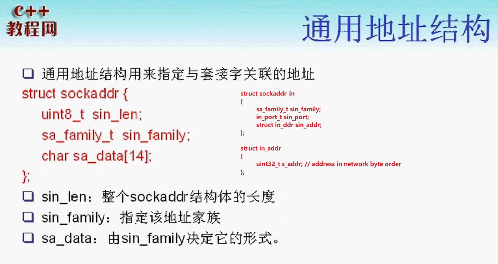

# linux网络编程

## TCP/IP基础篇


### 对等通信的概念

TCP/IP四层模型中，每个层之间才能发生对等的通信；

因此，也经常将TCP/IP整个协议称为`TCP/IP协议栈`

### 封装


### 端口

 **端口的作用：**用于区分一台主机上的应用程序

端口的分类：

- 众所周知的端口：从0-1023，这个端口的通讯明确表明了某种服务的协议。如21端口用于ftp服务端口
- 注册端口：从1024-49151，松散地绑定于一些服务。
- 动态或私有端口：从49152到65535，可以由用户自行分配

### 最大传输单元（MTU）、路径（MTU）


### 以太网帧格式


### ICMP协议（IP层协议）


**错误的类型：**

- 设置不分片，而发送的信息长度超过MTU，就是一种差错信息
- IP地址无法通过ARP协议解析的时候
- **实际上，ping应用程序就是基于ICMP协议实现的（查询的请求）**


### ARP/RARP（链路层协议）

IP->MAC地址：通过ARP协议解析

MAC->IP地址：通过RARP协议解析（**无盘工作站，没有配置文件来保存自身的IP地址。只有向RARP服务站查询**）


### IP数据包格式


### 网际校验和


## TCP进阶

### TCP的11种状态


**closing状态产生的原因：**


### 连接建立三次握手

### 连接终止四次挥手

### `TIME_WAIT`与`SO_REUSEADDR`

### `SIGPIPE`信号产生的原因


**当产生SIGPIPE信号以后，默认终止当前进程**

**从管道的角度理解SIGPIPE:**

> SIGPIPE的产生是如果没有任何读端进程，这时候向管道中写入数据。这时候就会产生断开的管道信号`SIGPIPE`
>
> 而TCP协议是全双工的。当收到对等方的`FIN`报文以后，无法确定对等方是否关闭。只是表示他们的写通道关闭。
>
> 这时候需要客户端调用`write`，如果对方的读端也关闭了，那么TCP协议栈会返回一个`RST`报文。如果再次调用`write`，这时候会产生`SIGPIPE`信号。
>
> **通过以`signal(SIGPIPE, SIG_IGN)`忽略即可**

# socket编程篇

## socket相关

### 什么是socket


- **套接口socket是两个进程间通信的抽象，忽略了内核网络协议栈的底层**

- 能够用于异构系统间的通信

### 套接字的属性

- 地址

  - 地址族
  - 端口号
  - IP地址

  

  > 仅适用于IPv4地址结构

- 通用地址结构

  

## 字节序


### 字节序转换函数


### 地址转换函数


**套接字类型**


## TCP客户/服务器模型


### echo客户服务器模型

一个连接一个进程，不会出现串线问题

**进一步完善：**

- 解决tcp的粘包问题
  - readn/writen
  - readline（√）
- 

### 点对点的聊天服务实现

需要两个进程：一个进程用来接收数据，一个进程用来发送数据

**需要考虑的问题：**

父进程退出了，如何让子进程也退出（信号）（**进程间通信问题**）

## 粘包

### 流协议与粘包问题

**流协议：**

> TCP是基于字节流的传输协议，因此传输数据是无边界的。
>
> 而UDP是基于消息的传输协议，因此，UDP是有边界的。
>
> **对于字节流传输协议，对等方在接收数据的时候，不确定一次读操作能返回多少个字节**。而对于基于消息的协议，它能够保证一次传输的是一条完整的消息。（**这也是流协议与粘包问题）**

### 粘包产生的原因

1. TCP的流量控制
2. TCP的拥塞控制
3. TCP的延迟发送机制
4. 数据发送过程的问题（见下图）
5. **在局域网上不存在粘包问题，但是在广域网上就存在粘包问题了**


### 粘包处理方案

**本质上是要在应用层维护消息与消息的边界**

- 定长包：存在的问题，消息实际长度没有这么长，造成网络流量的浪费
- 包尾加上`\r\n`,(ftp协议)
- 包头加上包体的长度（muduo的消息设计）
- 更复杂的应用层协议

### readn和writen

**用于接收定长包的处理函数**

```c++
17  // readn的实现
18  ssize_t readn(int fd, void *buf, size_t count)
19  {
20      size_t nleft = count;
21      ssize_t nread;
22      char *bufp = (char*)buf;
23  
24      while (nleft > 0)
25      {
26          if (nread = read(fd, bufp, nleft) < 0)
27          {
28              if (errno == EINTR)
29                  continue;
30              return -1;
31          }
32          else if (nread == 0)
33             return count - nleft; // 套接字连接关闭，返回已读的字节数
34          bufp += nread;
35          nleft -= nread;
  1     }
  2 
  3     return count;
  4 }
  5 
  6 // writen实现
  7 ssize_t writen(int fd, const void *buf, size_t count)
  8 {
  9     size_t nleft = count;
 10     ssize_t nwritten;
 11     char *bufp = (char*)buf;
 12 
 13     while (nleft > 0)
 14     {
 15         if ((nwritten = write(fd, bufp, nleft)) < 0)
 16         {
 17             if (errno == EINTR)
 18                continue;
 19 
 20         }
 21         else if (nwritten == 0)
 22             continue;
 23         bufp += nwritten;
 24         nleft -= nwritten;
 25     }
 26 
 27     return count;
 28 }
```

**存在的问题：**目前客户端的消息到来之后，阻塞读取1024个字节。**因此需要设置消息格式。来区分消息与消息之间的边界**

- 发送接收定长包（存在空间浪费？）

## 数据IO

### read、write与recv、send

`man recv`函数

**区别之一：**

- recv只能用于套接字IO，不能用于文件IO和其他IO
- 而read函数可以用于其他IO
- recv多了一个`flags`标志。
  - MSG_OOB
  - MSG_PEEK：接受缓冲区的数据，但是不会将数据从缓冲区中清除

### readline实现

**readline**读取到`\n`为止。可以用于解决`TCP粘包问题`

**按行读取方法的封装：**

- 一个字符一个字符的实现，判断是否有`\n`。这种方法的效率比较低。这样会多次调用read或者recv函数（导致性能的损失）
- 采用静态变量来接收、缓存（函数是不可重入的）
- **采用偷窥的方法**

```c++
// recv_peek实现
ssize_t recv_peek(int sockfd, void *buf, size_t len)
{

    while (1)
    {
        int ret = recv(sockfd, buf, len, MSG_PEEK); 
        // 从sockfd的套接字缓冲中peek长度为len的字符到buf中
        if (ret == -1 && errno == EINTR)
            continue;
        return ret;
    }
}
// readline实现
ssize_t readline(int sockfd, void *buf, size_t maxline)
{
    int ret;
    int nread;
    char *bufp = (char*)buf;
    int nleft = maxline;
    while (1)
    {
        ret = recv_peek(sockfd, bufp, nleft);
        if (ret < 0)
            return ret;
        else if (ret == 0)
            return ret;
        nread = ret;
        int i;
        for (i = 0; i < nread; ++i)
        {
            if (bufp[i] == '\n')
            {
                ret = readn(sockfd, bufp, i+1);
                if (ret != i+1)
                    exit(EXIT_FAILURE);

                return ret;
            }
        }
        if (nread > nleft)
            exit(EXIT_FAILURE);

        nleft -= nread;
        ret = readn(sockfd, bufp, nread);
        
        if (ret != nread)
            exit(EXIT_FAILURE);
        bufp += nread;

    }

    return -1;
}
```


### 用readline实现回射服务器

```c
//
// Created by jxq on 19-7-21.
//

#include <iostream>
#include <stdio.h>
#include <cstring>
#include <unistd.h>
#include <sys/types.h>
#include <sys/socket.h>
#include <netinet/in.h>
#include <arpa/inet.h>

using namespace std;
// 定义报错的宏
#define ERR_EXIT(m) \
        do  \
        {   \
            perror(m);  \
            exit(EXIT_FAILURE); \
        } while(0);

// recv_peek实现
ssize_t recv_peek(int sockfd, void *buf, size_t len)
{

    while (1)
    {
        int ret = recv(sockfd, buf, len, MSG_PEEK); 
        // 从sockfd的套接字缓冲中peek长度为len的字符到buf中
        if (ret == -1 && errno == EINTR)
            continue;
        return ret;
    }
}
ssize_t readn(int fd, void *buf, size_t count)
{
    size_t nleft = count;   // 剩余字节数
    ssize_t nread;
    char *bufp = (char*) buf;

    while (nleft > 0)
    {
        nread = read(fd, bufp, nleft);
        if (nread < 0)
        {
            if (errno == EINTR)
            {
                continue;
            }
            return  -1;
        } else if (nread == 0)
        {
            return count - nleft;
        }

        bufp += nread;
        nleft -= nread;
    }
    return count;
}

ssize_t writen(int fd, const void *buf, size_t count)
{
    size_t nleft = count;
    ssize_t nwritten;
    char* bufp = (char*)buf;

    while (nleft > 0)
    {
        if ((nwritten = write(fd, bufp, nleft)) < 0)
        {
            if (errno == EINTR)
            {
                continue;
            }
            return -1;
        }
        else if (nwritten == 0)
        {
            continue;
        }
        bufp += nwritten;
        nleft -= nwritten;
    }
    return count;
}

ssize_t readline(int sockfd, void *buf, size_t maxline)
{
    int ret;
    int nread;
    char *bufp = (char*)buf;
    int nleft = maxline;
    while (1)
    {
        ret = recv_peek(sockfd, bufp, nleft);
        if (ret <= 0)
            return ret;
        nread = ret;
        int i;
        for (i = 0; i < nread; ++i)
        {
            if (bufp[i] == '\n')
            {
                ret = readn(sockfd, bufp, i+1);
                if (ret != i+1)
                    exit(EXIT_FAILURE);

                return ret;
            }
        }
        if (nread > nleft)
            exit(EXIT_FAILURE);

        nleft -= nread;
        ret = readn(sockfd, bufp, nread);
        
        if (ret != nread)
            exit(EXIT_FAILURE);
        bufp += nread;

    }

    return -1;
}
void do_service(int connfd)
{
    char recvbuf[1024];
    // struct packet recvbuf;
    while (1)
    {
        memset(&recvbuf, 0, sizeof recvbuf);
        int ret = readline(connfd, recvbuf, 1024);
        if (ret == -1)
        {
            ERR_EXIT("readline");
        }
        else if (ret == 0)
        {
            printf("client close\n");
            break;
        }

        fputs(recvbuf, stdout);
        writen(connfd, recvbuf, strlen(recvbuf));
    }

}

int main(int argc, char** argv) {
    // 1. 创建套接字
    int listenfd;
    if ((listenfd = socket(AF_INET, SOCK_STREAM, IPPROTO_TCP)) < 0) {
        ERR_EXIT("socket");
    }

    // 2. 分配套接字地址
    struct sockaddr_in servaddr;
    memset(&servaddr, 0, sizeof servaddr);
    servaddr.sin_family = AF_INET;
    servaddr.sin_port = htons(6666);
    servaddr.sin_addr.s_addr = htonl(INADDR_ANY);
    // servaddr.sin_addr.s_addr = inet_addr("127.0.0.1");
    // inet_aton("127.0.0.1", &servaddr.sin_addr);

    int on = 1;
    // 确保time_wait状态下同一端口仍可使用
    if (setsockopt(listenfd, SOL_SOCKET, SO_REUSEADDR, &on, sizeof on) < 0)
    {
        ERR_EXIT("setsockopt");
    }

    // 3. 绑定套接字地址
    if (bind(listenfd, (struct sockaddr*) &servaddr, sizeof servaddr) < 0) {
        ERR_EXIT("bind");
    }
    // 4. 等待连接请求状态
    if (listen(listenfd, SOMAXCONN) < 0) {
        ERR_EXIT("listen");
    }
    // 5. 允许连接
    struct sockaddr_in peeraddr;
    socklen_t peerlen = sizeof peeraddr;


    // 6. 数据交换
    pid_t pid;
    while (1)
    {
        int connfd;
        if ((connfd = accept(listenfd, (struct sockaddr *) &peeraddr, &peerlen)) < 0) {
            ERR_EXIT("accept");
        }

        printf("id = %s, ", inet_ntoa(peeraddr.sin_addr));
        printf("port = %d\n", ntohs(peeraddr.sin_port));

        pid = fork();

        if (pid == -1)
        {
            ERR_EXIT("fork");
        }
        if (pid == 0)   // 子进程
        {
            close(listenfd);
            do_service(connfd);
            //printf("child exit\n");
            exit(EXIT_SUCCESS);
        }
        else
        {
            //printf("parent exit\n");
            close(connfd);
        }


    }
    // 7. 断开连接
    close(listenfd);


    return 0;
}

```

## 僵尸进程和SIGCHILD信号

### 僵尸进程的产生原因

主要是子进程的结束后，exit或者return的返回值未能及时被父进程接收。因此，这样的进程在系统中占用着资源。需要解决

```c
#include <signal.h>

signal(SIGCHLD, SIG_IGN); // 直接忽略不处理，然后消灭僵尸进程
signal(SIGCHLD, handle_sigchld); // 但通常情况下，应这样做。进行事件处理。
// 因为僵尸进程存在的意义就是，督促父进程处理子进程的返回值。通过子进程的返回值对子进程的运行状态做一个了解

void handle_sigchld(int sig)
{
    wait(NULL);
}
// wait存在的问题：
// 只能等待一个进程的退出。因此要采用waitpid
// wait是阻塞式的等待
```

### 僵尸进程的处理wait/waitpid

**wait存在的问题：**

- 只能等待一个进程的退出
- wait是阻塞式的等待

```c++
#include <sys/wait.h>

pid_t wait(int *status);
pid_t waitpid(pid_t pid, int *status, int options);
int waitid(idtype_t idtype, id_t id, siginfo_t *infop, int options);
```

> All  of these system calls are used to **wait for state changes in a child of the calling process,** and obtain information about the child whose state has changed.


**waitpid存在的问题：**

如果我们只是`waitpid(-1, NULL, WNOHANG)；`那么我们也不能能够处理完所有的僵尸进程。因为`SIGCHLD`信号会被丢失

## 五种I/O模型


## select


## 用select改进回射客户端程序


# 进程间通信篇

# 知识点总结

## ping程序流程


## 网络编程的API

### 地址转换相关

1. inet_ntoa()
2. ntohs()

### IO函数

1. read/write

   ```c++
   ```

2. send和recv


#### 处理粘包问题的readn和writen的封装实现

```c
17  // readn的实现
18  ssize_t readn(int fd, void *buf, size_t count)
19  {
20      size_t nleft = count;
21      ssize_t nread;
22      char *bufp = (char*)buf;
23  
24      while (nleft > 0)
25      {
26          if (nread = read(fd, bufp, nleft) < 0)
27          {
28              if (errno == EINTR)
29                  continue;
30              return -1;
31          }
32          else if (nread == 0)
33             return count - nleft;
34          bufp += nread;
35          nleft -= nread;
  1     }
  2 
  3     return count;
  4 }
  5 
  6 // writen实现
  7 ssize_t writen(int fd, const void *buf, size_t count)
  8 {
  9     size_t nleft = count;
 10     ssize_t nwritten;
 11     char *bufp = (char*)buf;
 12 
 13     while (nleft > 0)
 14     {
 15         if ((nwritten = write(fd, bufp, nleft)) < 0)
 16         {
 17             if (errno == EINTR)
 18                continue;
 19 
 20         }
 21         else if (nwritten == 0)
 22             continue;
 23         bufp += nwritten;
 24         nleft -= nwritten;
 25     }
 26 
 27     return count;
 28 }
```

#### recv、send函数

**只能用于套接字缓冲区的输入输出。并且多了一个`flag`选项**

```c
#include <sys/types.h>
#include <sys/socket.h>

ssize_t recv(int sockfd, void *buf, size_t len, int flags);
// recv只能接受已连接套接字的数据。当recvfrom的src_addr = null时，两者相同
ssize_t recvfrom(int sockfd, void *buf, size_t len, int flags,
                 struct sockaddr *src_addr, socklen_t *addrlen);

ssize_t recvmsg(int sockfd, struct msghdr *msg, int flags);
// The  recvfrom()  and recvmsg() calls are used to receive messages from a socket, and may be used to receive data on a socket whether or not it is connection-oriented.
```

- 如果缓冲区中没有数据可读，那么在默认情况下，将会阻塞在这个read操作上。除非设置了`no-blocking`

**flags的可选参数；**

- MSG_DONTWAIT：设置非阻塞模式


### getsockname、getpeername、gethostname、gethostbyname等

1. getsockname

   ```c
   // 获取本地地址
   #include <sys/socket.h>
   
   int getsockname(int sockfd, struct sockaddr *addr, socklen_t *addrlen);
   /*
   1. sockfd，要查看的套接字
   2. 套接字的地址保存在哪里
   3. 套接字地址长度
   */
   struct sockaddr_int localaddr;
   socklen_t addrlen = sizeof localaddr;
   getsockname(sockfd, (sockaddr*)&localaddr, &addrlen);
   // 返回值，0,-1，errno
   ```

2. getpeername

3. gethostname

4. gethostbyname

   ```c
   // gethostname
   #include <unistd.h>
   
   int gethostname(char *name, size_t len);
   int sethostname(const char *name, size_t len);
   // 获取或者设定当前处理器的hostname
   
   // gethostbyname
   #include <netdb.h>
   struct hostent *gethostbyname(const char *name);
   // name为hostname，通常由gethostname获得
   // 函数返回值是一个struct hostent
   struct hostent {
       char  *h_name;            /* official name of host */
       char **h_aliases;         /* alias list */
       int    h_addrtype;        /* host address type */
       int    h_length;          /* length of address */
       char **h_addr_list;       /* list of addresses */
   };
   
   #define h_addr h_addr_list[0] /* for backward compatibility */
   ```

   **为了获得h_addr_list中的地址。需要将这个指针数组的元素取出来**

   > h_addr_list: An array of pointers to network addresses for the host (in network byte order), terminated by a NULL pointer

   ```c++
   int getlocalip(char *ip)
   {
       char host[100] = {0};
       if (gethostname(host, sizeof host) < 0)
           return -1;
       struct hostent *hp;
       if ((hp = gethostbyname(host)) == nullptr)
           return -1;
       strcpy(ip, inet_ntoa(*(struct in_addr*)hp->h_addr));
   
       return 0;
   }
   ```

## 从tcp回射客户/服务器学网络编程


### 所做的完善工作

1. 消息的边界问题`\n`区分
2. 粘包问题解决
   - recv的peek功能
   - writen和readn
3. 子进程和父进程之间通信问题：SIGNAL
4. 如何打印显示主机的地址、对等端地址
   - getpeername
   - getlocalname
   - gethostname
   - gethostbyname

5. 处理多个同时关闭的连接（僵尸进程的处理）

   

## 常见问题

1. accept和connect的区别

   - accept的是被动监听，返回的是主动套接字
   - 而connect是主动发起连接

2. 表示一个套接字连接，需要的四要素

   - 客户端的IP，端口号
   - 服务端的IP，端口号

3. 服务器端尽可能使用`REUSEADDR`，在绑定之前尽可能调用`setsockopt`来设置`REUSEADDR`套接字选项。

   > 可以使得服务端不用等待`TIME_WAIT`状态消失就可以重启服务器

### 网络状况查看

1. netstat -an | grep TIME_WAIT # 查看处于`TIME_WAIT`的套接字
2. netstat -an | grep tcp

2. 在32位计算机系统中，ssize_t 是int型，占4个字节，在64位计算机系统中，ssize_t是long int 型，占8个字节。
3. size_t是无符号整型，至于是long型，还是int型

### errno错误类型

1. EINTR错误类型

   当阻塞于某个**慢系统调用**的一个进程捕获某个信号且相应信号处理函数返回时，该系统调用可能返回一个EINTR错误。例如：在socket服务器端，设置了信号捕获机制，有子进程，当在父进程阻塞于慢系统调用时由父进程捕获到了一个有效信号时，内核会致使accept返回一个EINTR错误(被中断的系统调用)。

## 知识点问答

1. 为什么是主动关闭方进入`TIME_WAIT`

2. 为什么需要`TIME_WAIT`

3. 为什么应该尽量避免让服务器端进入`TIME_WAIT`

   > 因为如果处于`TIME_WAIT`状态的服务器端没有设置`SO_REUSEADDR`的话，是没有办法重新启动的。