# 大并发服务器架构介绍

## 服务器的设计目标

1. 高性能：能够处理尽可能多的并发请求、并且进行快速的响应
2. 高可用：能够做到7x24小时服务，也能够进行故障转移（fail over）
3. 伸缩性（scalability）

**C/S结构：**任何网络系统都可以抽象为C/S结构

**B(rowser)/S结构：**也相当于C/S结构，只是B端时IE。浏览器相当于`HTTP客户端`，向http服务器发起HTTP请求。然后http服务器响应`http`请求

**服务器的性能杀手：**

1. 数据拷贝：尽量减少数据拷贝（**缓存机制**）
2. 环境切换：线程的切换开销，单线程好还是多线程好（**理性创建线程**）。单核服务器（**采用状态机编程**，效率最佳）
3. 内存分配：**内存池**
4. 锁竞争：锁竞争降低系统性能

**以上四点，尽可能从编程角度避免**

- 减少锁竞争范围

## 典型的服务器结构

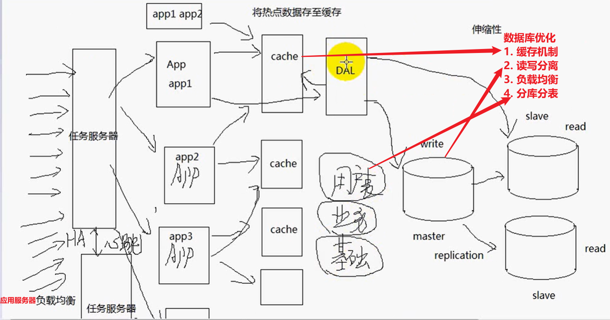

### **服务器瓶颈：**

1. 数据库导致的瓶颈

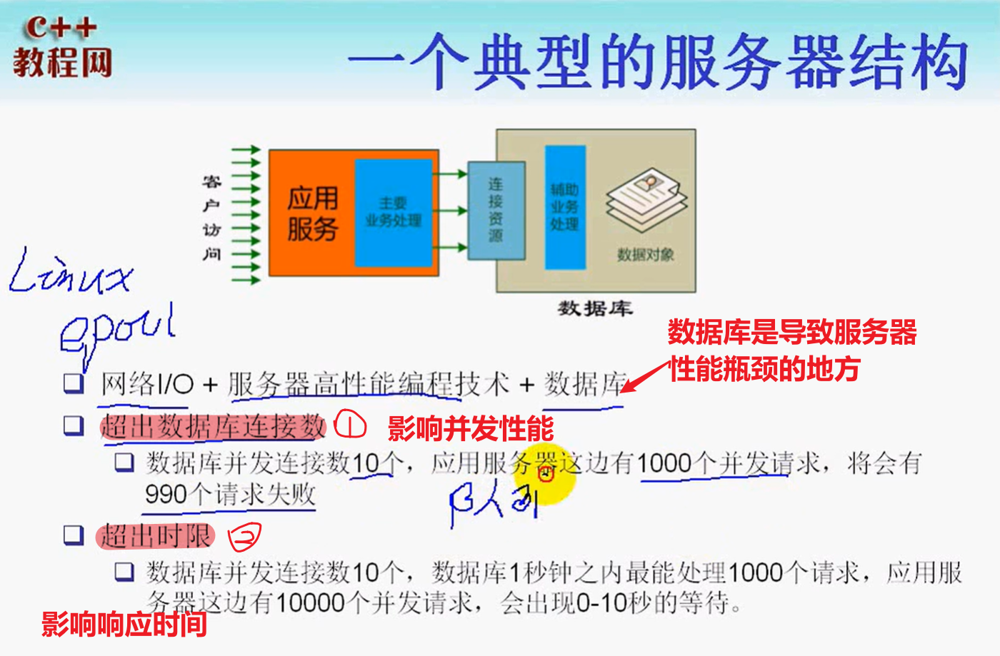

### 从数据库层面的优化

**数据库访问层设计：**

> 用于接管数据库服务器无法响应的`应用服务器`并发请求。
>
> 提供队列服务+连接池（**线程池**？）

**超出时限（数据库响应瓶颈）的解决：**

> 通过数据库访问层，已经解决了`超出数据库连接数`带来的问题。但是对应并发请求高的情况，并发能力有限（**超时**）
>
> **解决办法：**
>
> - 尽可能的将业务逻辑挪到应用服务器。
> - 数据库服务器不应该承担过多的业务处理逻辑`占用CPU`（有限地降低数据库的压力）
> - **热点数据缓存机制：**减少对数据库的访问

**缓存机制要考虑的问题：**

1. 缓存的更新（缓存同步）

   - 缓存timeout，如果缓存失效，重新去数据库查询（实时性比较差）

   - 一旦数据库中数据更新，立即通知前端的缓存更新。实时性较高

2. 缓存占用内存空间（因此需要维护一定大小的缓存页）
   - 缓存换页：将不活跃的数据换出内存
     - FIFO
     - LRU（least recently used，最近最少使用）
     - LFU（least frequently used，最不频繁使用）

**NoSQL：**用于存放一些非关系数据，基于`key/value`存储的数据

- redis（分布式缓存）
- memcached

#### 数据库读写分离

通常情况下，数据的读操作大于写操作。对数据进行负载均衡。`replication`机制

**将数据库分为master/slave**

- 同时实现负载均衡
- master：负责数据库的写操作
- slave：负责数据库的读操作

#### 对数据库进行分库、分表

在并发请求比较大的时候，会存在`锁竞争`

1. 分库：数据库可以按照一定的逻辑，把表分散到不同的数据库（**垂直分区**）

   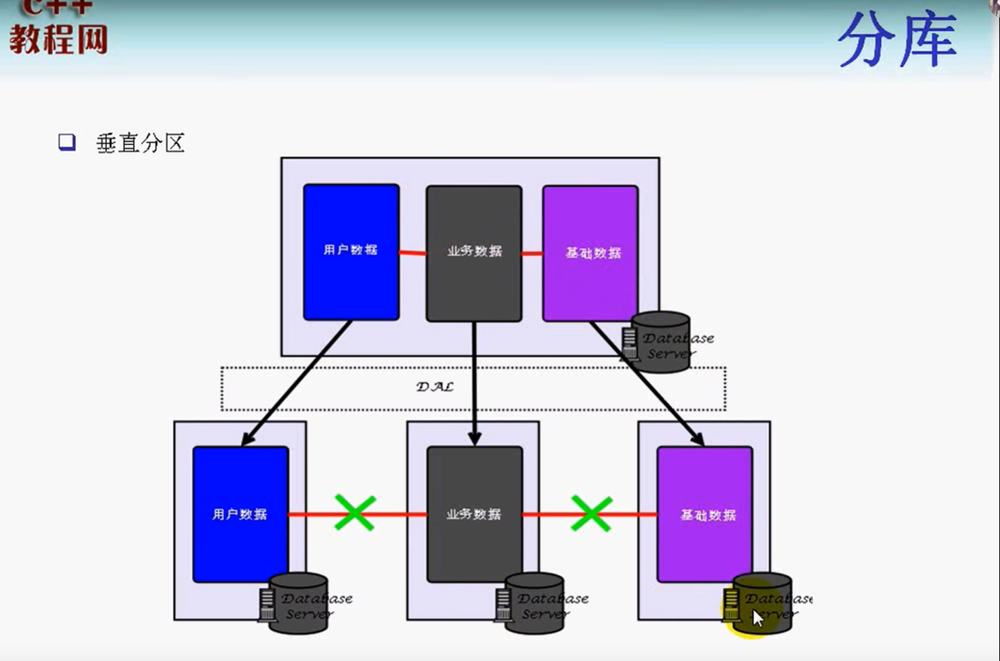

2. 分表：**水平分区**，每个数据库都有数据表，只是数据的记录被切分到不同的数据库。

   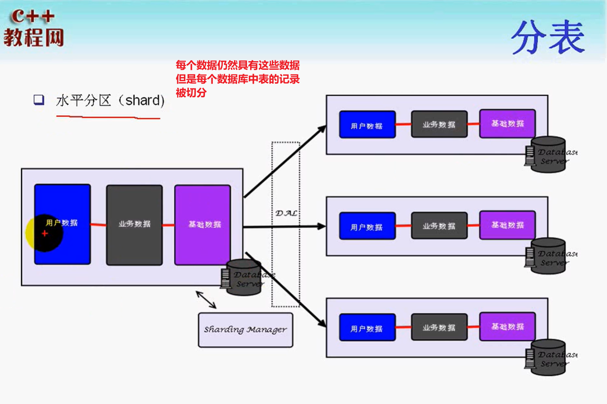

   > **数据库访问层编写难度增加**

### 从应用服务器层面优化（负载均衡）

理论上，一个应用服务器能够处理多个应用的业务请求。

当前端有大量应用请求到来的时候。负载均衡的做法

1. 任务服务器：**应用服务器被动接受任务方案**

2. 应用服务器主动到任务服务器接收任务、进行处理（**最科学**）

   > 好处：如果由任务服务器主动推送任务的模式，任务服务器可能无法做到公平调度
   >
   > **缺点：**任务服务器设计更为复杂

**任务服务器的作用：**

1. 相当于一个**HTTP客户端**，可以**查询、监视**应用服务器当前的负载
   - CPU高
   - IO高
   - 并发高
   - 内存换页高
2. 查询到这些信息之后，选取**负载最低的服务器**分配任务

 **任务服务器应该：**

1. 能够故障转移（心跳实现）**高可用要求**

## 大型网站架构演变过程

1. webserver和数据库分离

   - 不满足高可用

2. web动静资源分离

3. 前端、后端、数据库缓存处理

4. webserver集群+数据库读写分离

5. 分布式缓存

6. 分库分表

7. 多数据中心+分布式存储与计算

   > 目前大型网站对于**一致性**要求不是很高，对于这类数据没有必要保存在**关系型数据库**中
   >
   > **关系型数据库的**
   >
   > - 事务处理
   > - 大表连接join
   > - 锁竞争（事务的隔离级别影响`serialization`）
   >
   > 都是数据库服务器的性能杀手

   **因此，可以通过多数据中心，以`nosql`实现更大的并发**

   

### webserver和数据库分离

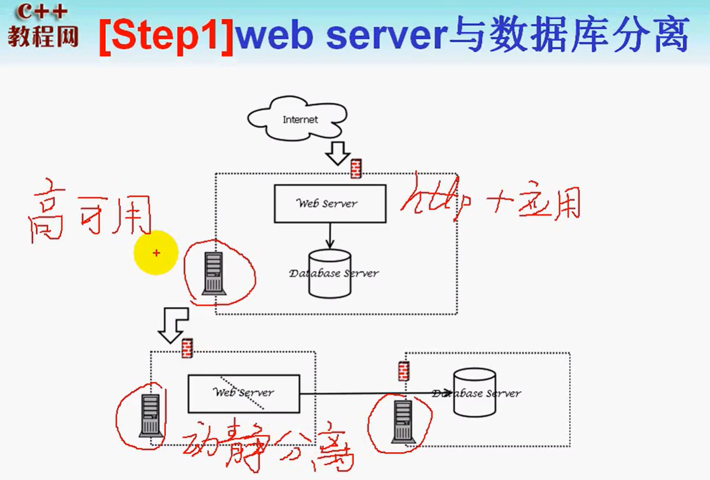

### web动静资源分离

**web请求的分类**

1. 动态请求：jsp, php
2. 静态请求：html, js, css, img

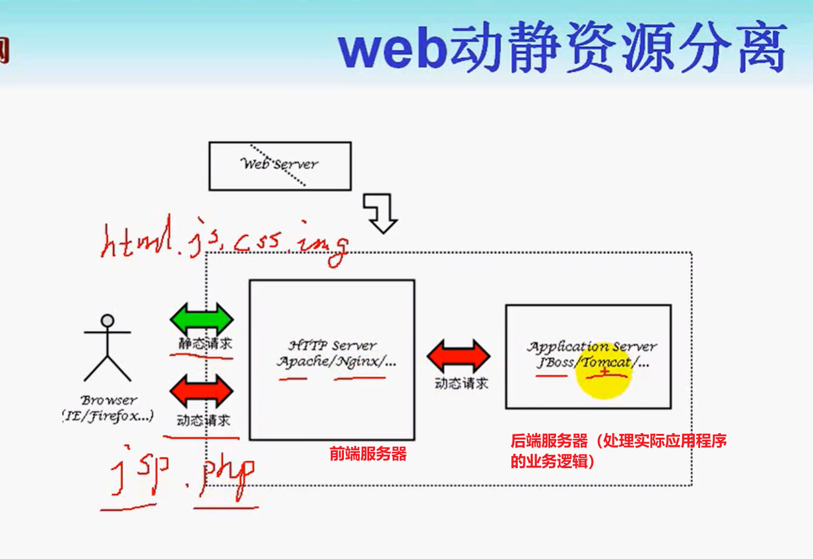

### 缓存处理

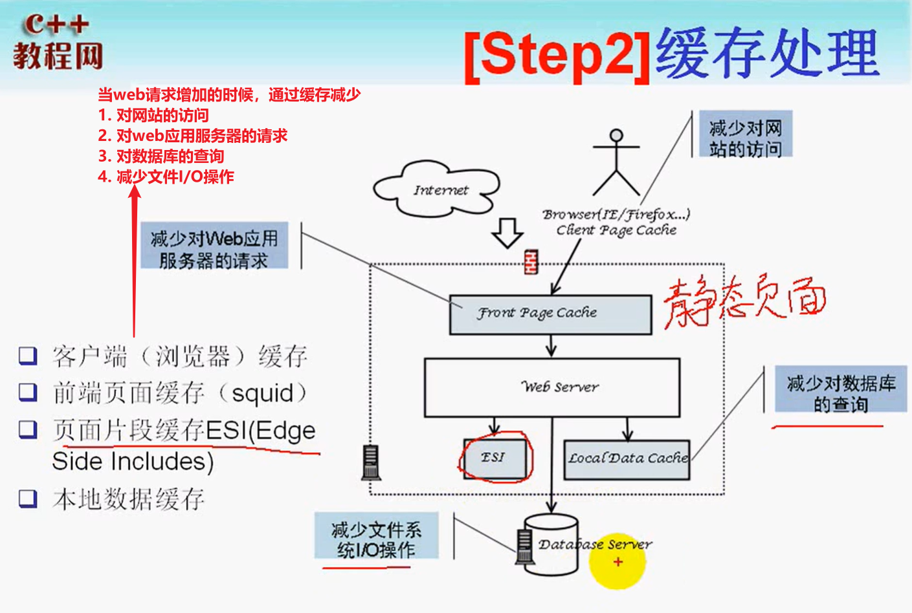

### webserver集群+读写分离（负载均衡）

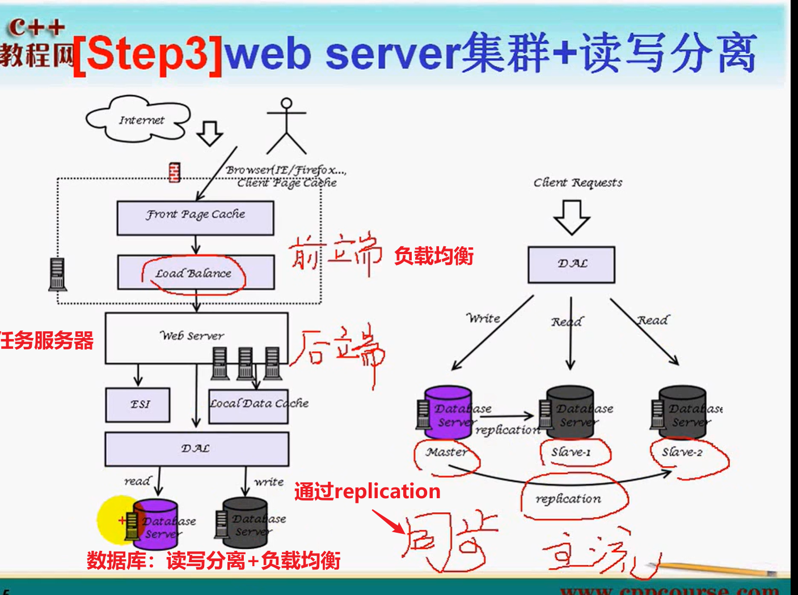

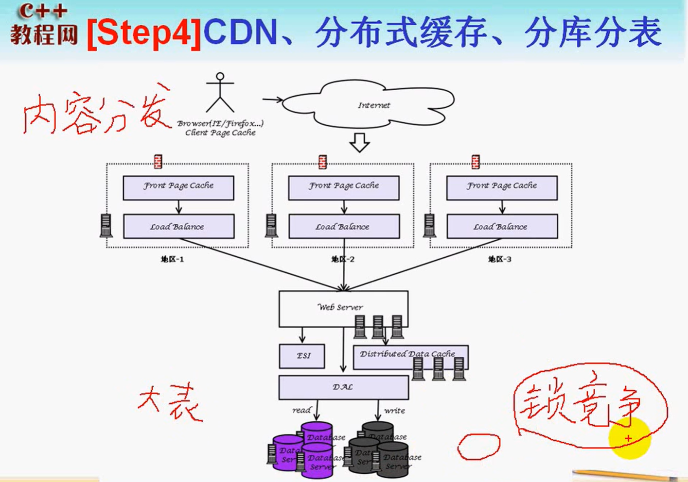

## 分布式

### 分布式缓存机制redis

redis的作用

1. 为什么需要缓存？
2. 为什么需要分布式缓存？

- **缓存的优势：减少对数据库的访问**

- **分布式的优势：各个应用服务器都能够访问**

### 负载均衡

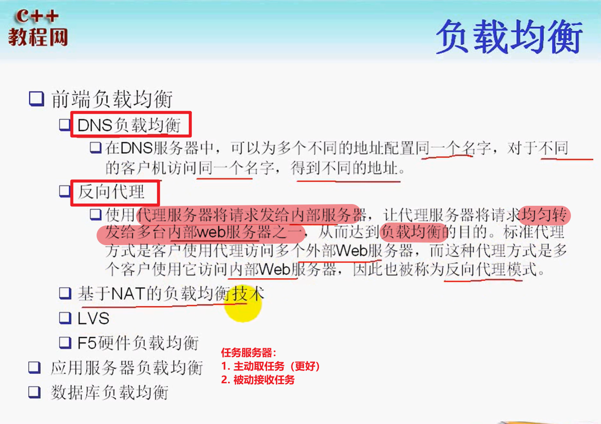

### 分布式存储

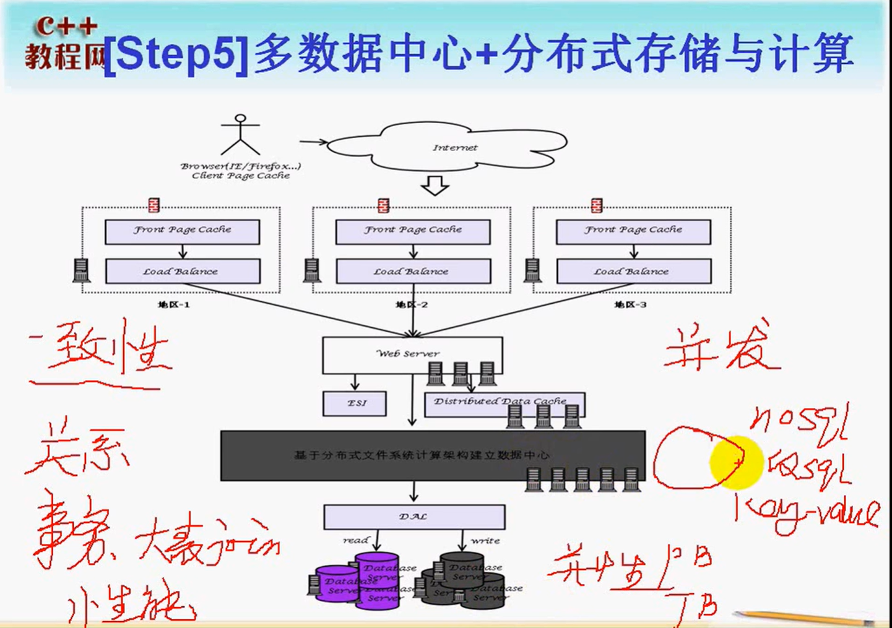

**分布式文件系统的优势：**

1. nosql是基于`key/value`存储的数据库
2. 可以建立在分布式文件系统之上
   - 减轻对IO的访问
   - 通过哈希快速查找

### 分布式计算框架`Map/Reduce`

**背景：**统计若干个文件中，每个单词的计数。这些文件位于多个计算机中，并且，每个文件很大。无法一次性加载到内存中。

**解决方案：**分布式计算

- 将文件进行分割，把每次统计好的词频暂时保存在KEY-VALUE数据库中（**map过程**）
- 从key-value数据库中进行数据合并（**Reduce**）

