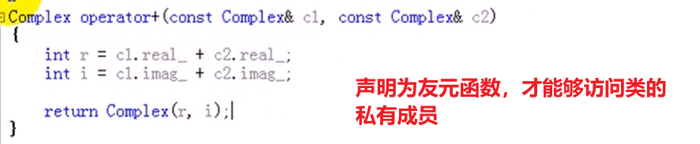
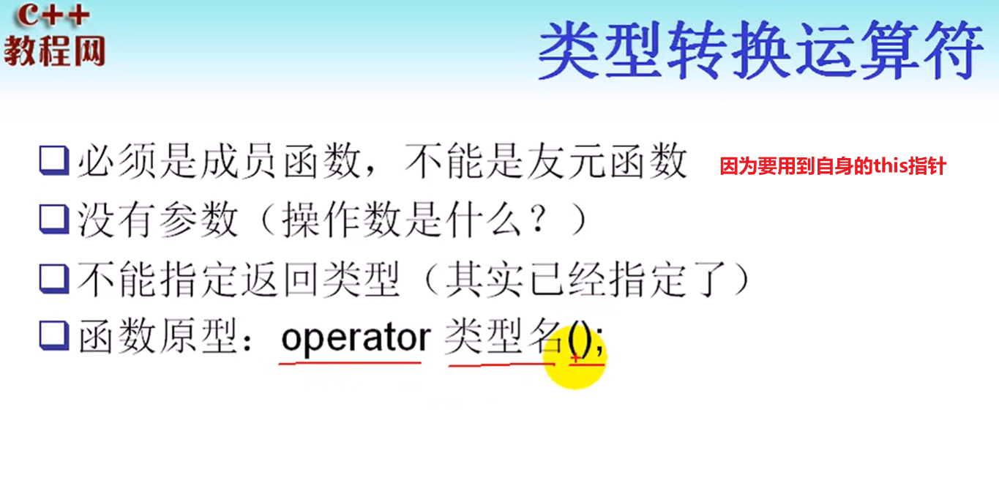
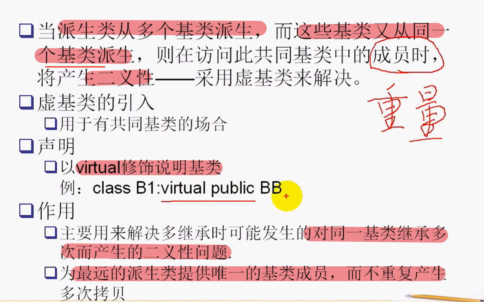
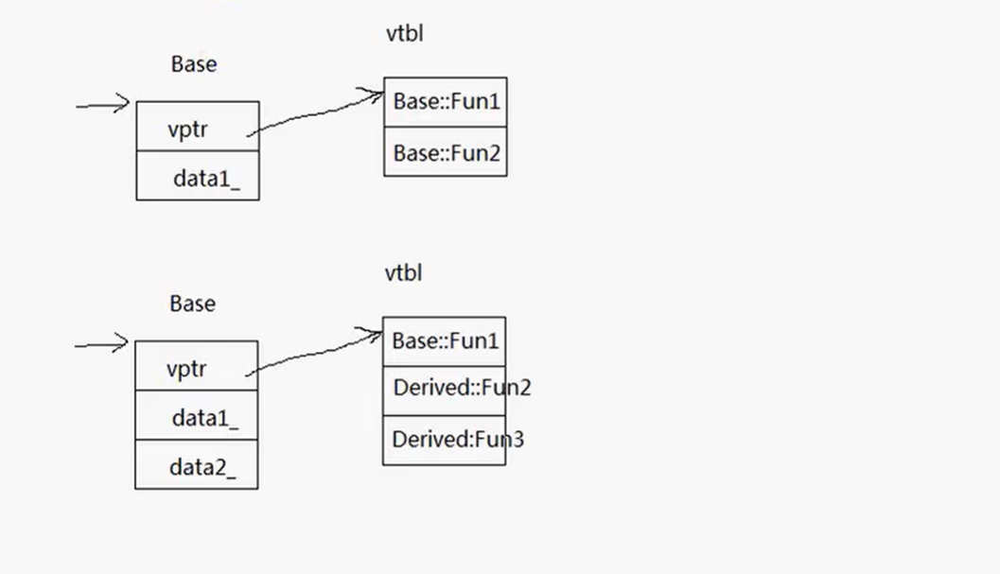
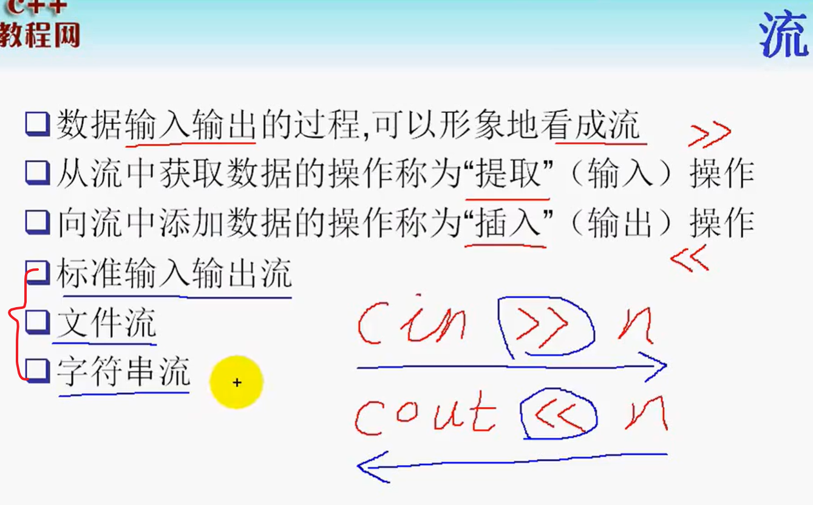
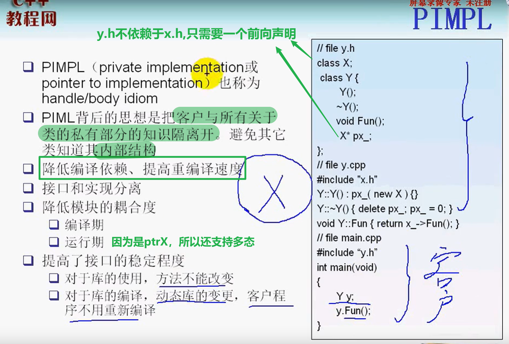
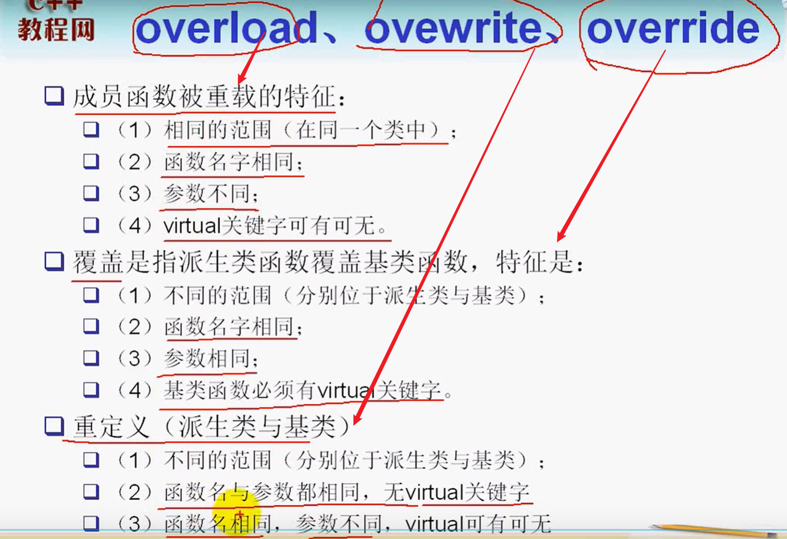

[TOC]


# C++基础


**数据抽象：**针对数据结构而言

**基于对象编程：**通过function/bind来实现（muduo库构建）

**面向对象编程：**程序由对象+对象+对象+消息传递构成

**面向泛型编程：**程序由对象+对象+抽象行为（能够施加在不同类型而又大相径庭的对象之上，**STL**）

**模板元编程：**

- 给出代码的产生规则，让编译器根据模板元产生新代码，实现我们预期的功能
- 让某些运行时的工作被提前到编译器来完成，从而增加了编译时间。但是提高了运行效率
- 可以实现神奇的类型推导（见STL源码剖析）

## C++代码编译运行

- 通过`gcc/g++ -c 源文件`生成`.obj`对象文件
- 然后通过`gcc/g++ x1.obj x2.obj`链接生成可执行文件`.exe或.out`

**windows下编写的文件，可以在linux系统下使用。但是需要执行相应的编译链接命令。通常利用`MakeFiles`或者`CMake`实现**

## 从C到C++

**在C语言中没有bool类型，可以用int来替换**

### const限定符


- **通过const来定义一个常量，因此必须初始化（常量必须初始化，同理，引用也必须初始化)**

- 常变量在初始化之后，不能再被赋值

### const和#define的区别


**高层次编程：const, enum, inline定义常量**

而底层编程，则更多的是使用`#define`定义常量，宏具有灵活性


## 运算符

### 作用域标识符：：

- 用于同局部变量同名的全局变量进行访问

  ```c++
  #include <iostream>
  
  using namespace std;
  
  int var = 100;
  
  int main(void)
  {
      int var = 50;
      cout << var << endl; // 50, 局部变量隐藏了全局变量
      cout << ::var << endl; // 100, 利用作用域::访问全局变量
      
      return 0;
  }
  ```

- 用于表示类的成员

### new和delete运算符

1. new运算符可以用于创建堆空间

   - 成功时返回首地址
   - 而失败时抛出`bad_alloc`异常

2. 语法

   - 指针变量 = new 数据类型
   - 指针变量 = new 数据类型[长度n]

   ```c++
   int * p = new int;
   char *pStr = new char[50];

3. new和delete需要配对，new [] 和delete[] 配对

 

**new运算符的作用分类**

- new operator：分配内存+调用构造函数
- operator new：只分配内存
- placement new：不分配内存，调用拷贝构造函数

## 函数

### 函数重载


**不能仅根据返回类型来定义函数的重载**

**为了支持重载，编译器会对重载的函数名进行`名字改编`**


### 带默认形参值的函数-可能产生二义性


### 函数的参数传递

1. 值传递
2. 引用传递：形参初始化的时候，不需要分配内存空间
3. 指针传递：本质也是值传递，实参在初始化形参的时候，也要分配内存空间，分配的时候4字节的空间。如果要修改指针的地址，单纯的用指针传递无法实现，必须使用指针的指针

**值传递和引用传递的区别**

- 值传递得到的是实参的副本，形参的改变无法影响到实参。
- 引用传递后，形参是实参的别名，和实参共享一块内存。可以通过形参的修改实现实参的修改。
- **对于自定义数据类型，在进行参数传递的时候，如果采用值传递，那么会涉及到相应的拷贝构造操作。因此，建议使用引用传递**

## 引用

**变量的属性**

- 名称
- 空间

**引用的特性：**

- 引用不是变量，只是所引用变量的别名
- 没有自己的独立空间
- 与所引用的变量共享内存空间
- 对引用所做的改变实际上是对他引用的变量的改变
- **引用一定要初始化**
- 引用一经初始化，不能重新指向其他变量（**指向其他变量，只是获得该变量的值**）

**引用的作用：**

1. 作为函数的参数传入
2. 作为函数的返回值

### const引用

**定义**：对一个const对象的引用，即不能通过引用修改该对象的值

- 无法对一个const对象进行普通引用，因为可能存在通过该普通引用修改常量的风险
- 可以通过`const reference to a nonconst obj`


### 引用作为函数返回值

**函数返回引用的一个主要目的：**为了可以将函数放在赋值运算符的左边

- 前置递增递减运算符重载返回值

- 这时候的引用在函数返回时初始化，初始化为函数体内部的被引用变量

- **不能返回对局部变量的引用**

  

```c++
#include <iostream>

using namespace std;

// 引用作为函数返回值
int a[] = {0,1,2,3,4,5};

int& index(int i)
{
    return a[i];
}

int main(void)
{
    index(3) = 100; // a[3] = 100;
    // 引用作为函数的返回值，使得函数可以放在赋值运算符左边
    // 函数返回引用，引用在函数返回的时候初始化
    
    return 0;
}
```

## 内联函数、带参数宏、类型转换运算符


### 内联函数：见知识点辨析

### 类型转换

**隐式转换：**编译器可以自动完成的（一般来说是安全的）

显示转换：***_cast**


#### const_cast


```c++
#include <iostream>

using namespace std;

// cast_cast用来移除常量性
// const_cast一般用于指针或者引用
void func(int &val)
{
    cout << "val = " << val << endl;
}
int main(void)
{
    const int val = 100;
    int n = val;
    
    // int *p = &val; error, 无法从const int* 转换为int*
    int *p = const_cast<int*>(&val); // 正确
    *p = 200; // 
    
    cout << *p << endl; // 200; 更改的是临时对象的值
    
    // 引用测试
    const int val2 = 200;
    int& refval2 = const_cast<int&>(val2); // 目的不应该是用来修改其引用对象的内容
    
    func(const_cast<int&>(val2)); // 为的是让函数能够接受这个实参
    
    return 0;
}
```

#### static_cast


#### reinterpret_cast


#### dynamic_cast,向下转型

## 类与对象


**结构化程序设计的思想：**

- 采用自顶向下，将系统视为分层的子程序的集合
- 可以将程序分为功能不同的模块，使得整个程序更有条理性
- 但是很多数据仍然属于整个程序，因而结构化程序设计思想还是需要很多的全局变量。在某个地方进行更改，所以会对整个程序产生难以预料的影响


**面向对象程序设计：**将系统看成通过交互作用来完成特定功能的对象集合。每个对象用自己的方法管理数据。

也就是说，只有对象内部的代码能够操作对象内部的数据

**程序 = 对象 + 对象 + 对象 + 信息交互**

**对象 = 算法 + 数据结构**（封装的思想）

### 面向对象介绍


### 面向对象的基本特征

1. **抽象**：抓住事物本质，而不是内部具体细节或具体实现。
   - **从具体到一般的过程，归纳，归类**
   - 对象->类（归类）
   - 大类->小类（分类）

2. **封装：**隐藏内部细节，只暴露需要对外展示的接口

    

3. **继承：**

   

4. **多态：**使得我们能够以一致的观点看待不同（但又大相径庭）的对象

   > 同一个接口被不同的对象调用时，产生不同的结果。


**开闭原则：**对增加功能开放、对修改、删除关闭。使得使用该对象的原有系统不会发生改变。

### 类的声明

**成员变量的命名规范**

```c++
int hour_; 
int m_hour; // 微软命名规范
```

**类的三种访问权限**


### 数据抽象的编程思想和封装


### 成员函数

#### 内联成员函数

**内联函数的优点：**

- 提高效率
- 在编译的时候将代码直接嵌入到调用的地方，从而减少了函数调用的开销

**缺点：**体积增大，以空间换时间的做法。

> 内联函数仅仅是给编译器一个提示，如果函数中有switch和for等循环分支语句，那么编译器可能不会进行内联

**内联函数的定义**

1. 直接在类体中给出实现
2. 在定义的时候，添加关键字`inline`

#### 成员函数的重载及缺省参数

**缺省参数的时候需要注意`二义性问题`**

#### 隐含的this指针


### 类作用域


**前向声明：**

- C++中类必须先定义，才能够实例化
- 两个类需要相互引用形成一个**环形引用时**，无法先定义使用，这时候需要使用到前向声明
- **前向声明的类不能实例化**，即不能够定义对象，只能够定义指针或者引用
- 作为类成员参数，也只能是指针或者引用

**环形引用：**

### 嵌套类

> 外部类需要使用嵌套类对象作为底层实现，并且该嵌套类只用于外围类的实现。且同时可以对用户隐藏该底层实现

**代码示例**

```c++
#include <iostream>

using namespace std;

class Outer
{
public:
	class Inner
    {
    public:
        void func()
        {
            cout << "Inner func()." << endl;
        }
        void testFunc();
    }
public:
    Inner obj_;
    void fun()
    {
        cout << "Outer func()." << endl;
        obj_.func();  // "Inner func()."
    }
};
// 嵌套类成员函数的类外实现
void Outer::Inner::testFunc(){
    cout << "Outer::Inner::testFunc()"; 
}

int main(void)
{
    Outer::Inner i;
    i.func(); // 在外部也能够使用嵌套类的功能

}
```

**注意事项：**


### 局部类


**为什么局部类不能有静态成员？**

> 

### 构造函数

**构造函数的作用：**为了保证对象的每个数据成员都被正确初始化

**构造函数的定义：**


**构造函数的特点：**

- **如果类不提供任何一个构造函数，系统将为我们提供一个不带参数的默认的构造函数**
- 全局对象的构造先于main函数

#### 构造函数和new运算符

**new运算符（new operator)**

- 分配内存（动态分配的内存，需要delete手动释放）
- 调用构造函数初始化

#### 转换构造函数

**带一个参数的构造函数的功能**

- 普通构造函数（初始化）
- 转换构造函数（初始化和`类型转化`）

**如何充当类型转化功能？**


> **类的构造函数只有一个参数**是非常危险的，因为编译器可以使用这种构造函数把参数的类型**隐式转换为类类型**
>
> **解决办法：**声明为`explicit`

#### 构造函数初始化列表

**构造函数执行的两个阶段：**

- 初始化阶段：通过参数列表初始化

- 普通计算段（在构造函数体中执行的语句）

  > 如果在普通计算段执行变量赋值操作，本质上不算是初始化操作。
  >
  > 因为此时类对象的空间已经分配好了

**初始化语法：**

```c++
class Clock{
public:
    Clock(int hour, int minute, int second): hour_(hour), 
    										 minute_(minute),
    										 second_(second)
   {
		// 其他初始化操作
   }
private:
    int hour_;
    int minute_;
    int second_;
};
```

#### 对象成员及其初始化：见Effective C++

```c++
#include <iostream>

using namespace std;

class Object{
 public:
    Object(int num): num_(num){
        cout << "Object" << endl;
    }
    ~Object()
    {
        cout << "~Object" << endl;
    }
private:
    int num_;
};

class Container{
public:
    Container():
    {
        cout << "Container默认构造" << endl;
    }
    Container(int num1, int num2): obj_(num1), obj2_(num2);
    ~Container()
    {
        cout << "Container的析构" << endl;
    }
private:
    Object obj_;
    Object obj2_;
};

int main(void)
{
    Container c;
    
    return 0;
}
```

**执行流程：**

- 先构造成员对象：obj_
- 再调用构造函数`Container`
- 然后析构`~Container`
- 然后析构`~Object`

**注意事项：**

- **如果成员对象有多个，那么对象变量的构造与参数列表中出现顺序无关，而与在类中声明的顺序有关**
- 如果对象成员`没有默认构造函数`，那么就一定要在`参数列表中显式地构造对象成员`

#### const成员、引用成员初始化

1. const成员只能通过参数列表初始化
2. 引用成员也只能通过参数列表初始化
3. 对象成员（对应的类没有默认构造函数）的初始化，只能通过参数列表初始化
4. **因为前面两者都是要求初始化，而实际上在构造函数体内执行的操作，不能称为初始化操作**

#### 枚举`enum`

> 对于声明为常量的const成员，只能保证其对于某一个对象是常量。如果要该变量对于整个类都是常量。那么应该使用枚举`enum`

```c++
#include <iostream>

using namespace std;

class Object{
public:
    enum KTYPE{
        kTYPE_A = 100,
        kTYPE_B = 200
    }
        
};

int main(void)
{
    cout << Object::kTYPE_A << endl; // 100
    cout << Object::kTYPE_B << endl; // 200
	Object obj1;
    cout << obj1.kTYPE_B << endl; // 200
    Object obj2;
    cout << obj2.kTYPE_B << endl; // 200
}
```

### 拷贝构造函数

**发生场景：**用一个对象来初始化另一个对象

```c++
#include "Test.h"

int main(void)
{
    Test t1(10);
    Test t2(t1); // 拷贝构造函数
    Test t3 = t1; // 仍然是拷贝构造,这时候的operator=等价于Test t3(t1);
    
    return 0;
}

// 拷贝构造函数实现
Test::Test(const Test& rhs) : num_(rhs.num_)
{
    cout << "拷贝构造函数" << endl;
}
```

**为什么拷贝构造的形参是引用传递？**

> 因为如果拷贝构造的传入参数不是引用传递，那么就是`值传递`的形式，在实参传递给形参的过程中，会出现一次拷贝赋值的操作。这时候又需要进行一次拷贝赋值操作。
>
> **就进入了一个递归调用拷贝构造的情形，直到堆栈溢出。程序崩溃**


```c++
#include <iostream>

using std::cout;

Test TestFunc(const Test& t)
{
    return t;
}

Test& TestFunc2(const Test& t)
{
    return t;
}

const Test& TestFunc3(const Test& t)
{
    return t;
}

int main(void)
{
    Test t(10);
    
    TestFunc(t); 
    // 这里面，当t作为实参传入的时候，由于接受形参是引用传递，不会调用拷贝构造
    // 但是，作为函数返回值，会构造一个临时对象，如果没有一个外部对象接受这个对象。
    // 那么这个临时对象就是在该行结束的时候，析构
    cout << "-------" << endl;
    Test t2 = TestFunc2(t); 
    // 这里会调用拷贝构造函数，因为返回值是一个对象。临时对象构造
    Test& t3 = TestFunc2(t); 
    // 这里会调用拷贝构造函数，因为返回值是一个引用。临时对象构造
    const Test& t4 = TestFunc3(t);
    // 直接是引用原有的对象t，因此没有任何函数调用
	return 0;
}
```


#### 深拷贝与浅拷贝

```c++
#include <iostream>
#include <cstring>

using namespace std;

class String{
public:
    String(char* str = "");
    ~String();
    
    void printStr();
    String& operator=(const String& other);
private:
    char *str_;
    char* AllocAndCpy(char* str);
};

String::String(char* str)
{
	int len = strlen(str) + 1;
    str_ = new char[len];
    memset(str_, 0, len);
    strcpy(str_, str);
}
String::~String()
{
    delete[] str_;
}

// 深拷贝实现
String::String(const String& other)
{
    
    int len = strlen(other.str_) + 1;
    str_ = new char[len];
    memset(str_, 0, len);
    strcpy(str_, other.str_);
}

// operator=
String& operator=(const String& other)
{
    // 前提是重载了operator==或者operator==
	if (*this != other) 
    {
        char* temp = str_;
        // delete[] str_，这里其实也不应该直接delete[] str_;
        // 因为一旦AllocAndCpy出了问题,那么this->str_数据就被污染了
        str_ = AllocAndCpy(other.str_); 
        delete[] temp;
    }
    return *this;
}
char* String::AllocAndCpy(char *str) // 但是这样容易造成内存泄漏
{
    int len = strlen(str) + 1;
    char *temp = new char[len];
    memset(temp, 0, len);
    strcpy(temp, str);
    
    return temp;
}
String::printStr()
{
    cout << "str_:" << str_ << endl; 
}
int main(void)
{
    String str1("hello world");
    
    str1.printStr();
    // 这时候还没有办法使用cout << str1 << endl; 因为没有重载operator<<
    
    // Error: String str2 = str1; 
    // 调用拷贝构造函数，系统提供的默认拷贝构造函数实现的是浅拷贝
    // str2.str_ = str1.str_;
    
    // 默认operator=也是浅拷贝
    String str3;
    str3 = str1; // 浅拷贝，需要自己实现operator=
}
```

**浅拷贝：**

- 多个指针指向同一块内存，存在的问题：在释放内存的时候，可能会造成内存的重复释放问题

- **解决办法：深拷贝**

  > 重新开辟新的内存，让指针指向这块新开辟的内存

#### 禁止拷贝

**应用场景：**要让对象是独一无二的，我们要禁止拷贝，方法如下：

1. 只需要将拷贝构造函数和operator=设置为`private`成员函数，并且不提供实现
2. `=delete`

#### 空类默认产生的成员


**空类的大小：**一个字节的空间，为了表示该类，并且方便生成实例

### 析构函数

**析构函数的特点：**


**析构函数可以显式调用：但是不建议这么使用，因为如果在析构函数中有内存释放操作。那么会出现内存重复释放的问题**

### 类与类之间的关系：StarUML绘制

**UML**：为软件开发提供了一些标准的图例，统一开发思想，从而促进团队协作


- 继承：类A继承自类B

- 关联：类A是类B的成员

  - 单向的，表示类B知道类A，而类B不知道类A
  - 双向的关联关系，（设计上应该避免）

- 聚合：比关联更强的关联关系。一个类是另一个类的成员，并且还存在整体与局部的关系（**整体并不负责局部的生命周期**）

- 组合：相比聚合而言，更强的关联关系。整体与局部的关系（**整体负责局部对象的生命周期**）

- 依赖关系

  


## 对象的使用

### static成员

**需要某个变量被所有的对象访问，比如统计某种类型对象已创建的数量**

- 全局变量
- static静态变量


**静态成员变量的声明和定义**

- 静态成员的声明放在类内
- 静态成员的定义：应该在文件作用域，任意一个函数之外定义（**不能够在类声明的时候，`实际上所有的类都成员变量都不能在类声明的时候定义`）**
- 静态成员是共有的，不属于某一个具体的对象

### static成员函数【见知识点辨析】

### 类、对象大小计算


### 四种对象的作用域与生存期


**未初始化的全局变量，会采用默认初始化，存储在BSS（block started by symbol）段中**

`两者区别见linux系统编程`


### static与单例模式

### const成员函数

- const成员函数不会修改对象的状态
- const成员函数只能访问数据成员的值，而不能修改它
- 可以通过`const`修饰符进行重载
- const成员函数可以修改被声明为`mutable`的数据成员

**const成员函数定义：**

```c++
class Test
{
public:
    Test(int x) : x_(x), outputTimes(0)
    {
        
    }
    
    int GetX() const
    {
		// ERROR: x_ = 100; const成员函数无法修改成员变量的值        
        return x_; 
    }
    
    void Output() const
    {
        cout << "x = " << x_ << endl;
        outputTimes++; // 我们又希望能够在输出一次的情况下，修改数据成员outputTimes
    }
    
    int GetOutputTimes() const
    {
        return outputTimes;
    }
private:
    int x_;
    mutable int outputTimes;
};

int main(void)
{
    const Test t(10); 
    
    t.GetX();
    
    return 0;
}
```

### const对象

**const对象定义：**

```c++
const 类名 对象名;
```

- const对象只能调用const成员函数，不能调用非const成员函数

## 数据抽象与封装

1. C语言实现版本

   ```c++
   #include <stdio.h>
   #include <stdlib.h> 
   #include <assert.h>
   
   struct Link
   {
       int data;
       struct Link* next;
   };
   struct Stack{
   	struct Link* head;
       struct int size;
   }
   
   void StackInit(struct Stack* stack)
   {
       stack->head = nullptr;
       stack->size = 0;
   }
   
   void StackPush(struct Stack* stack, const int data)
   {
       struct Link* node;
       node = (struct Link*)malloc(sizeof(struct Link));
       assert(node != nullptr);
       
       node->data = data;
       node->next = stack->head;
       stack->head = node;
       stack->size++;
   }
   
   int StackEmpty(struct Stack* stack)
   {
       return (stack->size == 0); // c语言中没有bool类型
   }
   int StackPop(struct Stack* stack, int* data)
   {
       if (StackEmpty(stack))
       {
           return 0;
       }
       struct Link* temp = stack->head; // 保存头结点
       *data = stack->head->data;
       stack->head = stack->head->next;
       free(temp); // 释放原来的头结点的内存
       
       return 1;
   }
   
   void StackClear(struct Stack* stack)
   {
       struct Link* temp;
       while (!StackEmpty(stack))
       {
           temp = stack->head;
           stack->head = stack->head->next;
           free(temp);
       }
       
       stack->size = 0;
   }
   ```

2. C++版本实现

## 友元

- 友元的作用在于提高程序运行效率

- 但是不建议声明过多的友元，否则类的封装属性就不太明显了。暴露过多的private成员变量

- 友元关系是单向的

  > A是B的友元类（在B类中，friend class A），但是在A中，B不是A的友元。即B不能够访问A的私有成员

- 友元关系不能够传递：A是B的友元类，B又是C的友元类，并不代表A是C的友元类

- 友元关系是不能够被继承：A是B的友元类，C继承自A，并不代表C是B的友元类

### 友元介绍


### 友元函数


### 友元类

```c++
class A
{
  friend class B; // 声明B时A的友元，此时B可以访问A中的私有成员  
};
```

## 运算符重载

### 运算符重载


> 最后一条如果不满足，就应该通过函数重载实现相关功能

### 成员函数重载


```c++
Complex c3 = c1 + c2;
// 如果是成员函数重载，等价于c1.operator+(c2);
// 如果是下面的友元函数重载，等价于operator+(c1, c2);
```

### 友元函数重载



**会比成员函数重载运算符的形参多一个**

### 重载的规则


### ++运算符重载


**注意要点：后置递增的重载**

```c++
class Integer
{
public:
    Integer(int i) : n_(i){}
    void show()
    {
        cout << "n_ = " << n_ << endl;
    }
    Integer& operator++() // 前置递增
    {
        ++this->n_;
        
        return *this;
    }
    Integer operator++(int) // 后置递增，并通过int区分
    {
        Integer temp(*this);
        ++this->n_;
        
        return temp; // 因为返回的是临时对象，所以不能返回引用。
    }
    // 以友元的方式重载后置递增
    friend Integer operator++(Integer& i, int); 
private:
    int n_;
};

Integer operator++(Integer& i, int)
{
    Integer temp(*this);
    ++this->n_;

    return temp; // 因为返回的是临时对象，所以不能返回引用。
}
```

### ！运算符重载

1. 当字符串非空的时候返回为假
2. 当字符串为空的时候，返回为真

### 字符串类的[]运算符重载

```c++
char& String::operator[](int index)
{
    // 为了缩短代码量，可以让non-const版本调用const版本
    return const_cast<char&>(static_cast<const String&>(*this)[index]);
    //return str_[index];
} // 返回引用的目的是为了能够作为左值存在，能够被修改

String s1("hello world");
s1[1] = 'A';

// 为了避免const String被修改，应该重载operator[]
const char& String::operator[](int index) const
{
    return str_[index];
}
```

### +运算符的重载：二元运算符通过友元函数进行重载


> 为什么不能用成员函数重载？
>
> 因为成员函数的第一个隐含参数是自身， 因此无法实现`String str = "aa" + str2;`这样的操作

### 流运算符重载

1. 输出流运算符`<<`的重载，因为第一个参数为流对象。因此必须通过友元函数重载。并且返回一个流对象，为了能够连续输出

```c++
#include <iostream>

ostream& operator<<(ostream& os, const String& str)
{
    os<<str.str_;
    
    return os;
}
```

2. 插入运算符`>>`重载

``` c++
istream& operator>>(istream& is, String& str)
{
    char temp[1024];
    cin >> temp;
    str = temp;
    
    return is; // 返回引用的目的是为了能够继续作为左值连续输入
}
```

### 类型转换运算符重载



```c++
// 类型转换符的作用，将类类型转换为其他类型
// 而转换构造函数，是通过隐式转换将其他类型转换为类类型
class Integer
{
public:
    operator int();
private:
    int n_;
};

Integer::operator int()
{
    return n_;
}
```

### 指针访问运算符`->`重载

**什么样的情况下需要重载`->`运算符？**

> 当我们通过对象自动析构的原来来管理内存的时候，需要间接访问该内存的一些数据操作

```c++
#include <iostream>

class DBHelper
{
public:
    DBHelper(){}
    ~DBHelper(){}
    void open()
    {
        std::cout << "open db..." << std::endl;
	}
    void close()
    {
        std::cout << "close db..." << std::endl;
    }
};

// 由于我们不知道创建的DPHelper对象应该何时析构，所以可以将其内置为class DB的数据成员，
// 然后创建DB栈对象，利用栈对象的声明周期结束时，自动析构的特性来管理DBHelper的生命周期

class DB
{
public:
    DB(){
		db_ = new DBHelper();
    }
    ~DB()
    {
        delete db_;
    }
    DBHelper* operator->()
    {
        return db_;
    }
private:
    DBHelper* db_;
};

int main(void)
{
    DB db;
    db->open(); // 希望通过dp间接访问DBHelper的操作，那么需要重载->
    
    return 0;
}
```

**好处：**

- 实现了类似智能指针的内存管理方法
- 并且，由于DB有DBHelper的基类指针，如果后续有派生类继承自DBHelper，那么就可以产生多态

### [operator new和operator delete重载](https://www.bilibili.com/video/BV127411h7t4?p=25)


**new关键字的三种用法**

- new operator：在内部通过malloc分配内存，然后调用对象的构造函数.**不可以被重载**
- operator new：只分配内存。**可以被重载**
- placement new：在已经存在内存上构造对象

```c++
#include <iostream>

using namespace std;

// 全局的operator new重载
void operator new(size_t size)
{
    void* p = malloc(size);

    return p;
}

void operator new[](size_t size)
{
    void* p = malloc(size);

    return p;
}

void operator delete[](void* p)
{
    free(p);
}
void operator delete(void* p) // 调用优先级更高
{
    free(p);
}
void operator delete(void* p, size_t size) // operator delete的重载形式2
{
    free(p);
}

class Test
{
public:
    Test(int n) : n_(n)
    {
        
    }
    Test(const Test& other) : n_(other.n_)
    {
        cout << "Test(const Test& other)" << endl;
    }
    ~Test()
    {
        cout << "~Test()" << endl;
    }
    void operator new(size_t size) // operator new重载
    {
        void* p = malloc(size);
        
        return p;
    }
    
    void* operator new(size_t size, void* p) // placement new重载
    {
        return p; 
    }
    
    void operator new(void* p1, void* p2) // placement delete对应的delete
    {
        return p; 
    }
    
    void operator delete(void* p) // 调用优先级更高
    {
        free(p);
    }
    void operator delete(void* p, size_t size) // operator delete的重载形式2
    {
        free(p);
    }
private:
    int n_;
};

int main(void)
{
	Test* pt1 = new Test(100); // new operator = operator new + constructor
    
    char chunk[10];
    
    Test* pt2 = new(chunk) Test(200); // placement new; 不分配内存+构造函数调用
    
   	pt2->~Test(); // 显示调用析构函数
    Test* pt3 = reinterpret_cast<Test*>(chunk);
    return 0;
}
```

**operator new的用于跟踪的重载形式：**

```c++
void operator new(size_t size, const char* file, long line)
{
    cout << file << ":" << line << endl;
    
    void* p = malloc(size);
    
    return p;
}

void operator delete(void* p, const char* file, long line)
{
    cout << file << ":" << line << endl;
    
    free(p);
}

#define new new(__FILE__, __LINE__)
Test* pt4 = new(__FILE__, __LINE__) Test(300); // 便于排查内存泄漏
delete ptr4;
```

## 标准库类型

### 标准库string类型


### map容器使用

**map容器的元素插入方式**

> 插入到map容器内部的元素默认是按照key从小到大来排序
>
> **因此，必须要求插入的key类型支持operator<**
>
> 当然，也可以传入自定义的排序规则

```c++
#include <map>

map<string, int> mapTest;

mapTest["aaa"] = 100; // int& operator[](const string& index)重载
mapTest.insert(map<string, int>::value_type("bbb", 200));
mapTest.insert(pair<string, int>("ccc", 300));
mapTest.insert(make_pair("ddd", 400));
```

## 继承

> 继承是面向对象设计的一个重要特性，没有使用到继承的程序设计，即使用到了class这一抽象数据类型，也不能成为面向对象编程设计。

- 派生类是基类的具体化
- 派生类的范围小，更具体
- 而基类的范围大，更抽象

### 代码重用


**组合：将一个类作为另一个类的对象成员**

### 继承的语法

```c++
class 派生类名 ： 继承方式 基类名
{
    派生类新增成员的说明;
};
```

### 继承的级别


### 接口继承和实现继承


### 继承与重定义

1. 数据成员的重定义：**隐藏**
2. 成员函数的重定义：


### 继承于构造函数

**不能够被派生类继承的成员函数**

- 构造函数
- 析构函数
- operator=赋值


**代码示例：**

```c++
#include <iostream>
using namespace std;

class Base
{
public:
    // 编译器不再提供默认构造函数
    Base(int b): b_(b)
    {
        cout << "Base..." << endl;
    }
    ~Base()
    {
        cout << "~Base()" <<endl;
    }
private:
    int b_;
};

class Derived : public Base
{
public:
    Derived(int d) : d_(d), Base(10) // 调用基类的构造函数
    {
        cout << "Derived()..." << endl;
    }
    Derived(int b, int d) : d_(d), Base(b) // 调用基类的构造函数
    {
        cout << "Derived(int b, int d)..." << endl;
    }
    ~Derived()
    {
		cout << "~Derived()..." << endl;
    }
    
private:
    int d_;
};

int main(void)
{
    Derived d(100); // 要构造一个派生类对象，先调用基类的构造函数
    cout << d.b_ << " " << d.d_ << endl;
    Derived bd(10, 200); // 给基类的构造函数传值
    return 0;
}
```

**小结：**

> 如果基类没有默认构造函数，那么在派生类的构造函数中，就需要对基类构造进行显示调用。因为派生类对象的构造函数晚于基类的构造函数调用。
>
> 如果不这样做，就会出错。
>
> ```c++
> Derived(int d) : d_(d), Base(10) // 调用基类的构造函数
> {
>     cout << "Derived()..." << endl;
> }
> Derived(int b, int d) : d_(d), Base(b) // 调用基类的构造函数
> {
>     cout << "Derived(int b, int d)..." << endl;
> }
> ```

### 拷贝构造函数的实现：应该逐成员赋值


### 静态成员与继承

静态成员被所有类共享，无所谓继承。在基类和派生类中都只有一份

### 转换与继承

派生类对象也是基类对象，这意味着在使用到基类对象的地方，也可以使用派生类对象

**当public继承时**

- 派生类对象指针可以转化为基类对象指针。
- 可以将派生类对象看成基类对象（会产生`对象切割object slicing`），但是派生类特有的成员消失

- 而基类指针无法转换为派生类指针
- **基类指针可以强制转换为派生类指针，但是不安全**
- 基类对象无法强制转换为派生类独享

 

#### 将基类对象转换为派生类对象的实现（不推荐这种不安全的转型操作）

**实现方法：**

- 在派生类中提供对应的转换构造函数
- 在基类中提供类型转换符

```c++
#include <iostream>
#include <string>

class Manager;

class Employee
{
public:
    Employee(int id, int dpatId, string name) : id(id), dpatId_(dpatId), name_(name)
    {}
    ~Employee(){}
    operator Manager(); 
    // 不能直接在这里实现，因为这时候manager只是一个前向声明
private:
    int id_;
    int dpatId_;
    string name_;
};

class Manager : public Employee
{
public:
    Manager(int id, int dpatId, string name, int level): Employee(id, dpatId, name), level_(level)
    {}
    ~Manager(){}
    Manager(const Employee& emp) : Employee(emp), level_(-1) // 转换构造函数
    {
        
    }
private:
    int level_;
};

// 类内的转型运算符
Employee::operator Manger()
{
    return Manager(id, dpatId, name_, -1);
}
```

### 多重继承


**多重继承存在的问题：**容易出现二义性，多个基类中包含同名变量或函数

**解决办法：**采用虚基类来解决

### 虚继承和虚基类：用于钻石继承



### 虚基类及其派生类构造函数


### [虚继承对C++对象内存模型造成的影响](https://www.bilibili.com/video/BV127411h7t4?p=33&spm_id_from=pageDriver)

- 遵循结构体的内存对齐原则
- 类的大小与数据成员有关，与成员函数无关
- 类的大小与静态数据成员无关
- 虚继承对类的大小的影响
- 虚函数对类的大小的影响


```c++
#include <iostream>

using namespace std;

class BB
{
public:
    BB(int b) : bb_(b){}
    
public:
    int bb_;
};

class B1 : virtual public BB
{
public:
    B1(int b1, int b) : b1_(b1), BB(b){}
    int b1_;
};

class B2 : virtual public BB
{
public:
    B2(int b2, int b) : b2_(b2), BB(b){}
    int b2_;
};

class DD : public B1, public B2
{
public:
    DD(int d, int b1, int b2, int b) : dd_(d), B1(b1, b), B2(b2, b), BB(b)
    {}
    int dd_;
};
// 钻石继承的方式

int main(void)
{
    cout << sizeof(BB) << endl; // 4
    cout << sizeof(B1) << endl; // 12
    cout << sizeof(DD) << endl; // 24

    return 0;
}
```


> 通过指针访问虚基类的成员，是间接访问

### 多态

**多态的定义：**调用同名的函数产生不同的行为

**多态的实现：**

- 函数重载
- 运算符重载
- 模板
- 虚函数（动态多态）：通过virtual函数实现

**前面三种都是静态多态，编译期间确定，在编译器就已确定要调用的函数。**

### 静态绑定与动态绑定

**动态绑定的实现：**

> 虚函数的动态绑定是通过虚表来实现的。`包含虚函数的类头4个字节存放指向虚表的指针`

```c++
#include <iostream>

using namespace std;

class Base
{
public:
    virtual void Func1()
    {
        cout << "Base::Func1() ... " << endl;
    }
    virtual void Func2()
    {
        cout << "Base::Func2() ... " << endl;
    }
    int data1_;
};

class Derived : public Base
{
public:
    virtual void Func2()
    {
        cout << "Derived::Func2() ..." << endl;
    }
    
    virtual void Func3()
    {
		cout << "Derived::Func3() ..." << endl;
    }
    int data2_;
};

typedef void (*FUNC)(); // 定义一个函数指针，名称为FUNC
int main(void)
{
    Base b;
    cout << sizeof(Base) << endl;
    cout << sizeof(Derived) << endl;
    
    long** p = (long**)&b; // 指向base的虚表指针所指向的虚表
    FUNC fun = (FUNC)p[0][0]; // 将p[0][0]强制转换为FUNC
    fun();
    fun = (FUNC)p[0][1]; // Func2
    fun();
    
    Derived d;
    p = (long**)&d;
    
    fun = (FUNC)p[0][0]; // Base::Func1
    fun();
    fun = (FUNC)p[0][1]; // Derived::Func2
    fun();
    fun = (FUNC)p[0][2]; // Derived::Func3
    fun();
    
    return 0;
}
```



### 虚函数


- **不能将虚函数声明为静态函数或者友元函数，因为他们都没有this指针，无法通过虚表指针进行动态绑定**

- 构造函数不能声明为虚函数

  > 因为，在构造函数没有调用完之前，是没有办法分配内存，无法得到vptr，进而也无法进行动态绑定构造函数的入口地址

- 而析构函数应该声明为虚函数

### 虚析构函数

如果一个类要作为多态基类，那么就应该将其析构函数定义成虚函数。这样才能够在基类指针释放的时候，才能够正确的释放基类指针指向的派生类对象的内存。（调用派生类的内存）


**纯虚析构函数：**如果base类没有任何成员函数，但是又希望作为基类。那就应该将其析构函数作为`纯虚析构函数`

通常情况下，在基类中纯虚函数不需要实现。**例外是纯虚析构函数要给出实现（空实现）**。

> 为什么：因为派生类对象在释放的时候，无法调用基类的析构函数。

### object slicing与虚函数

**对象切割：派生类向上转型的时候，会发生类型切割**

> 完完全全将派生类对象转为了基类对象，包括虚函数表。会发生一次**拷贝构造**


### 纯虚函数

**虚函数：**通过将基类指针指向派生类对象，这时候通过基类指针调用的虚函数实际上是调用的派生类对象的相应实现

- 当基类的接口没办法提供具体实现，或者说只需要提供一个接口而不提供默认实现的时候。应该将基类对应的函数声明为纯虚函数

- 拥有纯虚函数的类是一个抽象类，并且抽象类不能够实例化。**但是可以声明抽象类的指针和引用**
- 派生类中必须实现基类中的纯虚函数，否则仍将它看成一个抽象类


### [对象的动态创建](https://www.bilibili.com/video/BV127411h7t4?p=36&spm_id_from=pageDriver)

**反射技术：**动态获取类型信息（方法和属性）

**动态创建对象：**

- 动态调用对象的方法
- 动态调用对象的属性
- 对原有的类不做任何更改，只需要增加一个宏就能够实现动态创建

> 需要给每个类添加元数据

**能够适配新创建的类，并且避免使用if-else语句。结合配置文件使用**

**组件编程思想：**

### runtime type information（RTTI）：都不如虚函数的虚函数表效率来得高

运行时类型信息，主要通过

- dynamic_cast运算符：基类指针向下转型的时候，是安全的。
  - 要支持`dynamic_cast`需要编译器支持运行时类型识别。
  - 要具有多态类型的继承体系（即基类有虚函数）
- typeid运算符：用于运行时类型识别，返回值类型为type_info
- type_info


> 不能将typeinfo赋值给其他对象，因为它的拷贝构造函数是私有的

## 异常

### C语言错误处理方法

- 返回值（if-else语句判断返回值）：比较繁琐，每次函数调用都要判断
- 失败时返回-1
- goto语句：当函数内部发生错误时，跳转到局部的错误处理
- setjmp/longjmp


  


> 相比于goto的优势：可以跨函数跳转，适用于错误发生点离调用点远的情形


> 如果不对抛出的异常进行处理，那么系统会对该错误进行默认的处理。而C语言中如果没有对某个异常进行捕获处理，那么将被忽略

### 程序错误


### 异常的语法

```c++
try
{
    // try语句块
}
catch (类型1 参数1)
{
    // 针对类型1的异常处理
}
catch (类型2 参数2)
{
    // 针对类型2的异常处理
}
...
```

### **异常抛出：**

```c++
#include <iostream>
#include <string>

using namespace std;

class MyException
{
public:
    MyException(const char* message) : message_(message)
    {
        cout << "MyException..." << endl;
    }
    MyException(const MyException& other) : message_(other.message_)
    {
        cout << "MyException..." << endl;
    }
    ~MyException()
    {
        cout << "~MyException" << endl;
    }
    string what() const
    { return message_; }
private:
    string message_;
};

double Divide(double a, double b)
{
    if (b == 0.0d)
    {
        MyException e("division by zeros");
        throw e;
        // 如果是 throw MyException("division by zeros"); 
        // 那么会减少一次临时对象的构造工作
        // throw 1; // 不会被catch(double)捕获，不做类型转换
    }
}

int main(void)
{
    try
    {
        cout << Divide(5.0, 0.0d) << endl;
    }
    catch(MyException& e)
    {
        cout << e.what() << endl;
    }
    catch(...) // 捕获任意类型的异常
    {
        cout << "catch exception ..." << endl;
    }
    return 0;
}
```

### **异常的捕获**

- 一个异常处理器一般只能捕捉一种类型的异常
- 异常处理器的参数类型和抛出异常的类型相同
- ...表示可以捕获任何异常

### 异常的传播


### 栈展开


**如何保证已构造的成员：`当成员是指针的时候`**

### 异常与继承

1. 如果异常类型是一个类，他的基类也是一个异常类型。那么应该将派生类的错误处理放在前面，而基类的错误处理放在后面。MyException被一个类继承

## I/O流类库

- 标准I/O流
- 文件流
- 字符串流


 


# STL

## 模板

**模板的定义：**

- 模板也是一种静态多态的实现方式。将程序所处理的对象的类型参数化。
- 采用模板编程，可以为各种逻辑功能相同，而数据类型不同的程序提供一种代码共享的机制

**模板的引入初衷：**


- 宏替换：不做类型检查
- 重载：为每个类型提供一个重载版本，程序自己来维护这些重载的版本（可拓展性差）

**模板的特性：**为具有相同代码逻辑的代码提供一个模板，并将类型作为参数传递。从而**实例化出对应数据类型的版本**。不同的版本由编译器来维护。（会做安全的类型检查）

- 函数模板
- 类模板（muduo的thread local）
- STL的容器模板

### 函数模板

**函数模板声明形式：**


**函数模板的使用：**


**因此，模板不建议使用分离式编译。而应该将实现也放在`.h`文件中**

#### 函数模板特化

**问题：为什么需要模板特化？**

> 特化的模板，本质上也是模板。只是为了适配特定的数据类型
>
> 读完STL源码剖析看是否能找到答案

**特化形式：**


### 类模板

**类模板：**将类定义中的数据类型参数化

可以用相同的类模板，来组建任意类型的容器组合

#### 类模板定义

类的成员函数就变成了`函数模板`


#### 类模板的使用


### 非类型模板参数

> 对于函数模板与类模板，模板参数并不局限于类型。普通值也可以做为模板参数

```c++
template <typename T, int MAXSIZE>
class Stack
{
public:
    Stack();
    ~Stack();
    
    void Push(const T& elem);
    void Pop();
    T& Top();
    const T& top() const;
private:
    T* elems_;
    int top_;
};

template <typename T, int MAXSIZE>
Stack<T, MAXSIZE>::Stack() : top_(-1)
{
    elems_ = new T[MAXSIZE];
}

template <typename T, int MAXSIZE>
void Stack<T, MAXSIZE>::Push(const T& elem)
{
    if (top_ + 1 >= MAXSIZE)
        throw out_Of_range("out of range");
    elems_[++top_] = elem;
}
```

### 缺省模板参数


### 成员模板


**应用场景：auto_ptr的拷贝构造函数就是一个成员模板**


### 关键字typename


### 派生类和模板

### 面向对象与泛型


### 小结

1. 编译器的函数匹配原则
   - 全局的非模板函数
   - 模板函数推导
     - 默认
     - 或者显示指定

2. 类模板必须显示实例化为模板类，才可以实例化对象
   - 模板也可以传递非类型参数`template <typename T, int MAXSIZE>`

## STL的六大组件

### 容器

### 适配器

代码复用的方式，不是通过继承。而是适配。

### 函数对象

### 分配器allocator

### 算法

### 迭代器

# 小项目

## 面向对象计算器设计【未】

## 面向泛型版的计算器实现


## 银行储蓄系统

# C++新特性

**C++11还有其他的新特性，比如**

- auto关键字类型推导

## 智能指针

## 右值引用？

## function/bind（基于对象编程）

## lambda表达式

# MySQL

《数据库系统概论》


##  关系数据库

**一个关系对应数据库中的一张表**

> 员工（编号、姓名、年龄、民族、部门）

**主键：**能够唯一标识一条记录，可以有多个属性构成主键


**冗余存储的改进方式：**`外键存储`（外键必须是另一张表格的主键）


# 拓展总结

## boost智能指针

智能指针是利用RAII(Resource Acquisition Is Initial：资源获取即初始化)来管理资源。在构造函数中对资源进行初始化，在析构函数中对资源进行释放

**本质思想：**

> 将堆对象的生存期用栈对象（智能指针）来管理，当new一个堆对象的时候，立刻用智能指针来接管。具体做法是在构造函数进行初始化（用一个指针指向堆对象），在析构函数中调用delete来释放堆对象
>
> 而智能指针本身是一个`栈对象`，它的作用域结束的时候，自动调用析构函数。从而调用了delete释放了堆对象


### scoped_ptr\<T\>

- scoped_ptr管理的对象既不能够拷贝，也不能够转移。（底层实现：拷贝构造函数，operator=是private）

```c++
#include <boost/scoped_ptr.hpp>
#include <iostream>

class X
{
public:
    X()
    {
        cout << "construct X" << endl;
    }
    ~X()
    {
        cout << "destruct X" << endl;
    }
};

void testScoped_ptr()
{
	boost::scoped_ptr<X> p(new X);
}

int main(void)
{
    cout << "entering main" << endl;
    
    testScoped_ptr();
    
    cout << "exiting main" << endl;
    
    return 0;
}
```

### shared_ptr<T\>（线程安全的）

**成员函数：**

- `use_count`:原子性操作

- `reset`

- shared_ptr<T\>可以放在vector当中。而auto_ptr不可以。因为在底层实现的时候，shared_ptr的接口和vector的push_back的接口一致，都是const引用传递

- 避免使用匿名的临时的`shared_ptr`对象

  


### 循环引用


**解决办法：**

- 手动打破循环引用

  ```c++
  parent->child_.reset();
  child->parent_.reset();
  ```

- weak_ptr<T\>打破循环引用

 

### weak_ptr


### scoped_array和shared_array

```c++
boost::scoped_array<X> xx(new X[3]);
```


## 单例模式和auto_ptr

### 单例模式

- 保证一个类只有一个实例，并提供一个全局访问点
- 禁止拷贝

**原理实现：**将构造函数设为private成员，这样就无法在外部任意地创建对象

**代码实现**

```c++
#include <iostream>

using namespace std;

class Singleton{
public:
    static Singleton* GetInstance()
    {
        if (instance_ == nullptr)
        {
            instance_ = new Singleton; // 调用private构造函数
        }
    }
    ~Singleton()
    {
        
    }
    class Garbo
    {
    public:
        ~Garbo()
        {
            if (Singleton::instance_ != nullptr)
            {
                delete instance_;
            }
        }
    }
private:
    Singleton(const Singleton& other);
    Singleton& operator=(const Singleton& other); // 禁止拷贝
    Singleton()
    {}
    static Singleton* instance_; // 引用性声明
    
    static Garbo garbo_;
};

Singleton::Garbo Singleton::garbo; // 定义garbo_
static Singleton* instance_; // 定义性声明

int main(void)
{
    Singleton* s1 = Singleton::GetInstance(); 
    Singleton* s2 = Singleton::GetInstance(); // 返回的总是同一个实例

    return 0;
}
```

- instance_是一个static成员变量，所有对象共有。
- `GetInstance()`是一个全局访问点

**当前存在的问题：**

- 无法调用析构函数，存在资源泄露的可能
- 还没有实现禁止拷贝功能

**解决方案：**

- **利用对象的确定性析构来实现`嵌套Garbo类`**

- 局部的静态对象（在运行期初始化）

  

  > 但是这不是线程安全的，因为是在函数内部定义的static局部变量

### auto_ptr在单例模式中的应用

**代码实现：**

```c++
#include <iostream>
#include <memory>

using namespace std;

class Singleton{
public:
    static Singleton* GetInstance()
    {
        if (!instance_.get()) // .get() 返回原生指针
        {
            instance_ = auto_ptr<Singleton>(new Singleton); 
            // 调用private构造函数
        }
        return instance_.get(); // 和.release()不同
    }
    ~Singleton()
    {
        cout << "~Singleton()" << endl;
    }
private:
    Singleton(const Singleton& other);
    Singleton& operator=(const Singleton& other); // 禁止拷贝
    Singleton()
    {
        cout << "Singleton()" << endl;
    }
    static auto_ptr<Singleton> instance_; // 引用性声明
    
};

auto_ptr<Singleton> Singleton::instance_; // 定义性声明

int main(void)
{
    Singleton* s1 = Singleton::GetInstance(); 
    Singleton* s2 = Singleton::GetInstance(); // 返回的总是同一个实例

    return 0;
}
```

### muduo中单例模式实现

#### ThreadLocalSingleton模板类实现

```c++
template<typename T>
class ThreadLocalSingleton : boost::noncopyable // 默认private继承
{
 public:

  static T& instance()
  {
    if (!t_value_)
    {
      t_value_ = new T();
      deleter_.set(t_value_);  
    }
    return *t_value_;
  }

  static T* pointer()
  {
    return t_value_;
  }

 private:

  static void destructor(void* obj)
  {
    assert(obj == t_value_);
    typedef char T_must_be_complete_type[sizeof(T) == 0 ? -1 : 1];
    delete t_value_;
    t_value_ = 0;
  }

  // 嵌套类
  class Deleter // 为了能够回调函数destructor，使得deleter对象被销毁的时候，t_value也能够被释放
  {
   public:
    Deleter()
    {
      pthread_key_create(&pkey_, &ThreadLocalSingleton::destructor);
    }

    ~Deleter()
    {
      pthread_key_delete(pkey_); // 析构函数调用的时候，会删除key，并且注册了destructor,那么也会析构与之绑定的newObj，即t_value_;
    }

    void set(T* newObj)
    {
      assert(pthread_getspecific(pkey_) == NULL);
      pthread_setspecific(pkey_, newObj);
    }

    pthread_key_t pkey_;
  };

  static __thread T* t_value_; // 加了__thread表示每个线程都拥有一份
  static Deleter deleter_; // 销毁指针所指向的对象
};

// 后面是static成员变量的定义
template<typename T>
__thread T* ThreadLocalSingleton<T>::t_value_ = 0;

template<typename T>
typename ThreadLocalSingleton<T>::Deleter ThreadLocalSingleton<T>::deleter_;
```

**pthread_key相关函数**

```c++
#include <pthread.h>

int pthread_key_create(pthread_key_t *key, void (*destructor)(void*));
// 返回值：成功时将新创建的key保存在*Key,并且返回0，否则返回error
pthread_key_delete(pthread_key_t *key);

pthread_getspecific(pthread_key_t *key);
pthread_setspecific(pthread_key_t *key, T* newobje);
```

- pthread_key_create：一旦一个线程创建了一个key，那么所有的线程都拥有这个key
- pthread_key_delete：删除这个key，但是不删除这个数据，要删除数据需要在create的时候注册一个回调函数。（数据是堆上数据）
- pthread_getspecific：通过key得到线程特有数据
- pthread_setspecific：指定特定的数据，线程私有的

## Noncopyable实现

```c++
#include <iostream>

class Noncopyable
{
 public:
  noncopyable(const noncopyable&) = delete; // =delete禁止拷贝构造
  void operator=(const noncopyable&) = delete;

 protected:
  noncopyable() = default;
  ~noncopyable() = default;
};

class Parent : private Noncopyable // 声明为private继承，是因为只需要继承默认实现
{
public:
    // 符合规范的拷贝构造函数定义
    Parent(const Parent& other) : Noncopyable(other) // 见effective c++
    {
        
    }  
};

int main(void)
{
    Parent p1;
    // Parent p2(p1); Error: 无法访问private成员
    // 要调用parent的拷贝构造函数，parent拷贝构造函数又要调用Noncopyable的拷贝构造函数
}
```

## 用宏实现sizeof的功能

1. 计算一个变量的大小`sizeof_v`：通过指针偏移得到
2. 计算一个类型的大小`sizeof_t`

```c++
#include <iostream>

using namespace std;
// 两个指针相见，得到的是相隔几个元素 
// &x + 1：x的地址向后偏移一个元素地址
#define sizeof_v(x) (char*)(&x + 1) - (char*)&x
#define sizeof_t(t) static_cast<int>((t*)0 + 1)

// 对齐宏，要求b是2的整数次方
#define ALIGN(v, b) ((v+b-1) &^(b - 1))

class Empty
{
};
int main(void)
{
    Empty e;
    int n;
    
    cout << sizeof_v(e) << endl; // 1
    cout << sizeof_t(Empty) << endl; // 1
    cout << sizoef_t(n) << endl; // 4
    cout << sizeof_v(int) << endl; // 4
    
    cout << ALIGN(3, 16) << endl; // 将v对齐到b的整数倍（上取整）
    
}
```

3. 实现某个数对齐到整数（2的整数次方）倍

   

   > **对齐宏的使用：**内存池中，内存块大小是规则的。否则会产生空隙，**内存碎片**

## 编程技巧

1.  通过typedef实现编译期间发现错误

   ```c++
    typedef char T_must_be_complete_type[sizeof(T) == 0 ? -1 : 1]; 
   ```

2. 实现功能的时候，先编写测试代码；见`String`类实现

### 工厂模式


### 常量是否可以更改？

将变量声明为常量，目的在于告诉使用者，其值不应该被修改。而不是不能够被修改

```c++
const int n = 100;

int *pn = &n;

*pn = 200;
```

### 使用PIMPL




## 知识点辨析

### 重载（overload）、重写（重定义overwrite）、覆盖（override）

- 重载发生在同一个作用域
- 重写发生在基类和派生类之间
- 覆盖：虚函数之间



### 组合和继承

- 继承相当于将基类作为一个成员类对象使用
- 继承是is-a
- 组合是has-a


### 只能在构造函数的参数列表初始化的情况

1. **const成员变量**：只能够在初始化列表中初始化。（在构造函数体中就不是初始化了，其实算是赋值）

2. **引用成员**

3. 当**基类没有默认构造函数**的时候，需要在派生类的构造函数初始化列表中调用

   > 派生类的构造函数需要给基类的构造函数传递对应的参数

4. 类成员对象的构造，由该类的构造函数负责。

   - 基类对象有一个**对象成员，并且该对象所属的类没有默认构造函数**。那么该基类应该负责该对象成员的构造和析构工作。

### 构造函数的调用顺序

1. **派生类对象的构造次序**
   - 基类构造函数
   - 派生类对象成员的构造函数
   - 派生类自身的构造函数
2. **如果基类也有一个对象成员，则该成员的构造函数还要早于基类的构造函数**
   - 基类成员对象的构造函数
   - 基类的构造函数
   - 派生类自身的构造函数
3. 如果类中有多个对象成员，那么这些对象成员的构造函数按照声明的顺序调用

## 拓展阅读

- [ ] C++primer（正在）
- [x] Effective C++（可以再看）
- [ ] C++编码规范
- [ ] 敏捷软件开发-原则、模式与实践（关于面向对象的语言学习）
- [ ] 代码大全，第二版

