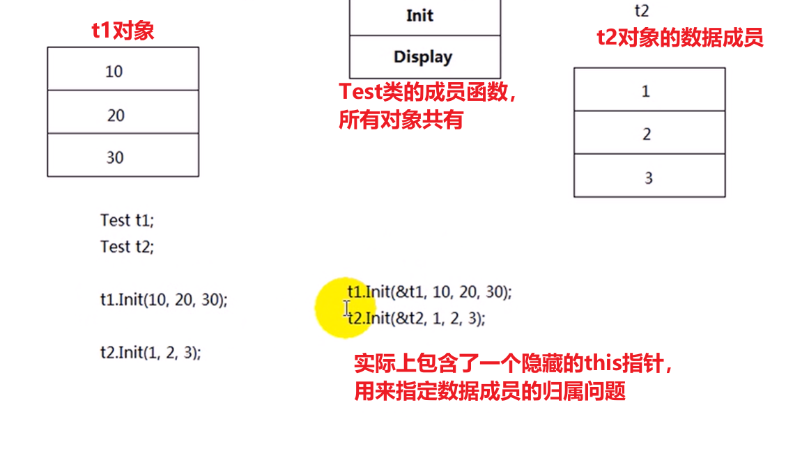

# C++基础


**数据抽象：**针对数据结构而言

**基于对象编程：**通过function/bind来实现（muduo库构建）

**面向对象编程：**程序由对象+对象+对象+消息传递构成

**面向泛型编程：**程序由对象+对象+抽象行为（能够施加在不同类型而又大相径庭的对象之上，**STL**）

**模板元编程：**

- 给出代码的产生规则，让编译器根据模板元产生新代码，实现我们预期的功能
- 让某些运行时的工作被提前到编译器来完成，从而增加了编译时间。但是提高了运行效率
- 可以实现神奇的类型推导（见STL源码剖析）

## C++代码编译运行

- 通过`gcc/g++ -c 源文件`生成`.obj`对象文件
- 然后通过`gcc/g++ x1.obj x2.obj`链接生成可执行文件`.exe或.out`

**windows下编写的文件，可以在linux系统下使用。但是需要执行相应的编译链接命令。通常利用`MakeFiles`或者`CMake`实现**

## 从C到C++

**在C语言中没有bool类型，可以用int来替换**

### const限定符


- **通过const来定义一个常量，因此必须初始化（常量必须初始化，同理，引用也必须初始化)**

- 常变量在初始化之后，不能再被赋值

### const和#define的区别


**高层次编程：const, enum, inline定义常量**

而底层编程，则更多的是使用`#define`定义常量，宏具有灵活性


## 运算符

### 作用域标识符：：

- 用于同局部变量同名的全局变量进行访问

  ```c++
  #include <iostream>
  
  using namespace std;
  
  int var = 100;
  
  int main(void)
  {
      int var = 50;
      cout << var << endl; // 50, 局部变量隐藏了全局变量
      cout << ::var << endl; // 100, 利用作用域::访问全局变量
      
      return 0;
  }
  ```

- 用于表示类的成员

### new和delete运算符

1. new运算符可以用于创建堆空间

   - 成功时返回首地址
   - 而失败时抛出`bad_alloc`异常

2. 语法

   - 指针变量 = new 数据类型
   - 指针变量 = new 数据类型[长度n]

   ```c++
   int * p = new int;
   char *pStr = new char[50];

3. new和delete需要配对，new [] 和delete[] 配对

 

**new运算符的作用分类**

- new operator：分配内存+调用构造函数
- operator new：只分配内存
- placement new：不分配内存，调用拷贝构造函数

## 函数

### 函数重载


**不能仅根据返回类型来定义函数的重载**

**为了支持重载，编译器会对重载的函数名进行`名字改编`**


### 带默认形参值的函数-可能产生二义性


### 函数的参数传递

1. 值传递
2. 引用传递：形参初始化的时候，不需要分配内存空间
3. 指针传递：本质也是值传递，实参在初始化形参的时候，也要分配内存空间，分配的时候4字节的空间。如果要修改指针的地址，单纯的用指针传递无法实现，必须使用指针的指针

**值传递和引用传递的区别**

- 值传递得到的是实参的副本，形参的改变无法影响到实参。
- 引用传递后，形参是实参的别名，和实参共享一块内存。可以通过形参的修改实现实参的修改。
- **对于自定义数据类型，在进行参数传递的时候，如果采用值传递，那么会涉及到相应的拷贝构造操作。因此，建议使用引用传递**

## 引用

**变量的属性**

- 名称
- 空间

**引用的特性：**

- 引用不是变量，只是所引用变量的别名
- 没有自己的独立空间
- 与所引用的变量共享内存空间
- 对引用所做的改变实际上是对他引用的变量的改变
- **引用一定要初始化**
- 引用一经初始化，不能重新指向其他变量（**指向其他变量，只是获得该变量的值**）

**引用的作用：**

1. 作为函数的参数传入
2. 作为函数的返回值

### const引用

**定义**：对一个const对象的引用，即不能通过引用修改该对象的值

- 无法对一个const对象进行普通引用，因为可能存在通过该普通引用修改常量的风险
- 可以通过`const reference to a nonconst obj`


### 引用作为函数返回值

**函数返回引用的一个主要目的：**为了可以将函数放在赋值运算符的左边

- 前置递增递减运算符重载返回值

- 这时候的引用在函数返回时初始化，初始化为函数体内部的被引用变量

- **不能返回对局部变量的引用**

  

```c++
#include <iostream>

using namespace std;

// 引用作为函数返回值
int a[] = {0,1,2,3,4,5};

int& index(int i)
{
    return a[i];
}

int main(void)
{
    index(3) = 100; // a[3] = 100;
    // 引用作为函数的返回值，使得函数可以放在赋值运算符左边
    // 函数返回引用，引用在函数返回的时候初始化
    
    return 0;
}
```

## 内联函数、带参数宏、类型转换运算符


### 内联函数：见知识点辨析

### 类型转换

**隐式转换：**编译器可以自动完成的（一般来说是安全的）

显示转换：***_cast**


#### const_cast


```c++
#include <iostream>

using namespace std;

// cast_cast用来移除常量性
// const_cast一般用于指针或者引用
void func(int &val)
{
    cout << "val = " << val << endl;
}
int main(void)
{
    const int val = 100;
    int n = val;
    
    // int *p = &val; error, 无法从const int* 转换为int*
    int *p = const_cast<int*>(&val); // 正确
    *p = 200; // 
    
    cout << *p << endl; // 200; 更改的是临时对象的值
    
    // 引用测试
    const int val2 = 200;
    int& refval2 = const_cast<int&>(val2); // 目的不应该是用来修改其引用对象的内容
    
    func(const_cast<int&>(val2)); // 为的是让函数能够接受这个实参
    
    return 0;
}
```

#### static_cast


#### reinterpret_cast


#### dynamic_cast,向下转型

## 类与对象


**结构化程序设计的思想：**

- 采用自顶向下，将系统视为分层的子程序的集合
- 可以将程序分为功能不同的模块，使得整个程序更有条理性
- 但是很多数据仍然属于整个程序，因而结构化程序设计思想还是需要很多的全局变量。在某个地方进行更改，所以会对整个程序产生难以预料的影响


**面向对象程序设计：**将系统看成通过交互作用来完成特定功能的对象集合。每个对象用自己的方法管理数据。

也就是说，只有对象内部的代码能够操作对象内部的数据

**程序 = 对象 + 对象 + 对象 + 信息交互**

**对象 = 算法 + 数据结构**（封装的思想）

### 面向对象介绍


### 面向对象的基本特征

1. **抽象**：抓住事物本质，而不是内部具体细节或具体实现。
   - **从具体到一般的过程，归纳，归类**
   - 对象->类（归类）
   - 大类->小类（分类）

2. **封装：**隐藏内部细节，只暴露需要对外展示的接口

    

3. **继承：**

   

4. **多态：**使得我们能够以一致的观点看待不同（但又大相径庭）的对象

   > 同一个接口被不同的对象调用时，产生不同的结果。


**开闭原则：**对增加功能开放、对修改、删除关闭。使得使用该对象的原有系统不会发生改变。

### 类的声明

**成员变量的命名规范**

```c++
int hour_; 
int m_hour; // 微软命名规范
```

**类的三种访问权限**


### 数据抽象的编程思想和封装


### 成员函数

#### 内联成员函数

**内联函数的优点：**

- 提高效率
- 在编译的时候将代码直接嵌入到调用的地方，从而减少了函数调用的开销

**缺点：**体积增大，以空间换时间的做法。

> 内联函数仅仅是给编译器一个提示，如果函数中有switch和for等循环分支语句，那么编译器可能不会进行内联

**内联函数的定义**

1. 直接在类体中给出实现
2. 在定义的时候，添加关键字`inline`

#### 成员函数的重载及缺省参数

**缺省参数的时候需要注意`二义性问题`**

#### 隐含的this指针




### 类作用域


**前向声明：**

- C++中类必须先定义，才能够实例化
- 两个类需要相互引用形成一个**环形引用时**，无法先定义使用，这时候需要使用到前向声明
- **前向声明的类不能实例化**，即不能够定义对象，只能够定义指针或者引用
- 作为类成员参数，也只能是指针或者引用

**环形引用：**

### 嵌套类

> 外部类需要使用嵌套类对象作为底层实现，并且该嵌套类只用于外围类的实现。且同时可以对用户隐藏该底层实现

**代码示例**

```c++
#include <iostream>

using namespace std;

class Outer
{
public:
	class Inner
    {
    public:
        void func()
        {
            cout << "Inner func()." << endl;
        }
        void testFunc();
    }
public:
    Inner obj_;
    void fun()
    {
        cout << "Outer func()." << endl;
        obj_.func();  // "Inner func()."
    }
};
// 嵌套类成员函数的类外实现
void Outer::Inner::testFunc(){
    cout << "Outer::Inner::testFunc()"; 
}

int main(void)
{
    Outer::Inner i;
    i.func(); // 在外部也能够使用嵌套类的功能

}
```

**注意事项：**


### 局部类


**为什么局部类不能有静态成员？**

> 

### 构造函数

**构造函数的作用：**为了保证对象的每个数据成员都被正确初始化

**构造函数的定义：**


**构造函数的特点：**

- **如果类不提供任何一个构造函数，系统将为我们提供一个不带参数的默认的构造函数**
- 全局对象的构造先于main函数

#### 构造函数和new运算符

**new运算符（new operator)**

- 分配内存（动态分配的内存，需要delete手动释放）
- 调用构造函数初始化

#### 转换构造函数

**带一个参数的构造函数的功能**

- 普通构造函数（初始化）
- 转换构造函数（初始化和`类型转化`）

**如何充当类型转化功能？**


> **类的构造函数只有一个参数**是非常危险的，因为编译器可以使用这种构造函数把参数的类型**隐式转换为类类型**
>
> **解决办法：**声明为`explicit`

#### 构造函数初始化列表

**构造函数执行的两个阶段：**

- 初始化阶段：通过参数列表初始化

- 普通计算段（在构造函数体中执行的语句）

  > 如果在普通计算段执行变量赋值操作，本质上不算是初始化操作。
  >
  > 因为此时类对象的空间已经分配好了

**初始化语法：**

```c++
class Clock{
public:
    Clock(int hour, int minute, int second): hour_(hour), 
    										 minute_(minute),
    										 second_(second)
   {
		// 其他初始化操作
   }
private:
    int hour_;
    int minute_;
    int second_;
};
```

#### 对象成员及其初始化：见Effective C++

```c++
#include <iostream>

using namespace std;

class Object{
 public:
    Object(int num): num_(num){
        cout << "Object" << endl;
    }
    ~Object()
    {
        cout << "~Object" << endl;
    }
private:
    int num_;
};

class Container{
public:
    Container():
    {
        cout << "Container默认构造" << endl;
    }
    Container(int num1, int num2): obj_(num1), obj2_(num2);
    ~Container()
    {
        cout << "Container的析构" << endl;
    }
private:
    Object obj_;
    Object obj2_;
};

int main(void)
{
    Container c;
    
    return 0;
}
```

**执行流程：**

- 先构造成员对象：obj_
- 再调用构造函数`Container`
- 然后析构`~Container`
- 然后析构`~Object`

**注意事项：**

- **如果成员对象有多个，那么对象变量的构造与参数列表中出现顺序无关，而与在类中声明的顺序有关**
- 如果对象成员`没有默认构造函数`，那么就一定要在`参数列表中显式地构造对象成员`

#### const成员、引用成员初始化

1. const成员只能通过参数列表初始化
2. 引用成员也只能通过参数列表初始化
3. 对象成员（对应的类没有默认构造函数）的初始化，只能通过参数列表初始化
4. **因为前面两者都是要求初始化，而实际上在构造函数体内执行的操作，不能称为初始化操作**

#### 枚举`enum`

> 对于声明为常量的const成员，只能保证其对于某一个对象是常量。如果要该变量对于整个类都是常量。那么应该使用枚举`enum`

```c++
#include <iostream>

using namespace std;

class Object{
public:
    enum KTYPE{
        kTYPE_A = 100,
        kTYPE_B = 200
    }
        
};

int main(void)
{
    cout << Object::kTYPE_A << endl; // 100
    cout << Object::kTYPE_B << endl; // 200
	Object obj1;
    cout << obj1.kTYPE_B << endl; // 200
    Object obj2;
    cout << obj2.kTYPE_B << endl; // 200
}
```

### 拷贝构造函数

**发生场景：**用一个对象来初始化另一个对象

```c++
#include "Test.h"

int main(void)
{
    Test t1(10);
    Test t2(t1); // 拷贝构造函数
    Test t3 = t1; // 仍然是拷贝构造,这时候的operator=等价于Test t3(t1);
    
    return 0;
}

// 拷贝构造函数实现
Test::Test(const Test& rhs) : num_(rhs.num_)
{
    cout << "拷贝构造函数" << endl;
}
```

**为什么拷贝构造的形参是引用传递？**

> 因为如果拷贝构造的传入参数不是引用传递，那么就是`值传递`的形式，在实参传递给形参的过程中，会出现一次拷贝赋值的操作。这时候又需要进行一次拷贝赋值操作。
>
> **就进入了一个递归调用拷贝构造的情形，直到堆栈溢出。程序崩溃**


```c++
#include <iostream>

using std::cout;

Test TestFunc(const Test& t)
{
    return t;
}

Test& TestFunc2(const Test& t)
{
    return t;
}

const Test& TestFunc3(const Test& t)
{
    return t;
}

int main(void)
{
    Test t(10);
    
    TestFunc(t); 
    // 这里面，当t作为实参传入的时候，由于接受形参是引用传递，不会调用拷贝构造
    // 但是，作为函数返回值，会构造一个临时对象，如果没有一个外部对象接受这个对象。
    // 那么这个临时对象就是在该行结束的时候，析构
    cout << "-------" << endl;
    Test t2 = TestFunc2(t); 
    // 这里会调用拷贝构造函数，因为返回值是一个对象。临时对象构造
    Test& t3 = TestFunc2(t); 
    // 这里会调用拷贝构造函数，因为返回值是一个引用。临时对象构造
    const Test& t4 = TestFunc3(t);
    // 直接是引用原有的对象t，因此没有任何函数调用
	return 0;
}
```


#### 深拷贝与浅拷贝

```c++
#include <iostream>
#include <cstring>

using namespace std;

class String{
public:
    String(char* str = "");
    ~String();
    
    void printStr();
    String& operator=(const String& other);
private:
    char *str_;
    char* AllocAndCpy(char* str);
};

String::String(char* str)
{
	int len = strlen(str) + 1;
    str_ = new char[len];
    memset(str_, 0, len);
    strcpy(str_, str);
}
String::~String()
{
    delete[] str_;
}

// 深拷贝实现
String::String(const String& other)
{
    
    int len = strlen(other.str_) + 1;
    str_ = new char[len];
    memset(str_, 0, len);
    strcpy(str_, other.str_);
}

// operator=
String& operator=(const String& other)
{
    // 前提是重载了operator==或者operator==
	if (*this != other) 
    {
        char* temp = str_;
        // delete[] str_，这里其实也不应该直接delete[] str_;
        // 因为一旦AllocAndCpy出了问题,那么this->str_数据就被污染了
        str_ = AllocAndCpy(other.str_); 
        delete[] temp;
    }
    return *this;
}
char* String::AllocAndCpy(char *str) // 但是这样容易造成内存泄漏
{
    int len = strlen(str) + 1;
    char *temp = new char[len];
    memset(temp, 0, len);
    strcpy(temp, str);
    
    return temp;
}
String::printStr()
{
    cout << "str_:" << str_ << endl; 
}
int main(void)
{
    String str1("hello world");
    
    str1.printStr();
    // 这时候还没有办法使用cout << str1 << endl; 因为没有重载operator<<
    
    // Error: String str2 = str1; 
    // 调用拷贝构造函数，系统提供的默认拷贝构造函数实现的是浅拷贝
    // str2.str_ = str1.str_;
    
    // 默认operator=也是浅拷贝
    String str3;
    str3 = str1; // 浅拷贝，需要自己实现operator=
}
```

**浅拷贝：**

- 多个指针指向同一块内存，存在的问题：在释放内存的时候，可能会造成内存的重复释放问题

- **解决办法：深拷贝**

  > 重新开辟新的内存，让指针指向这块新开辟的内存

#### 禁止拷贝

**应用场景：**要让对象是独一无二的，我们要禁止拷贝，方法如下：

1. 只需要将拷贝构造函数和operator=设置为`private`成员函数，并且不提供实现
2. `=delete`

#### 空类默认产生的成员


**空类的大小：**一个字节的空间，为了表示该类，并且方便生成实例

### 析构函数

**析构函数的特点：**


**析构函数可以显式调用：但是不建议这么使用，因为如果在析构函数中有内存释放操作。那么会出现内存重复释放的问题**

## 对象的使用

### static成员

**需要某个变量被所有的对象访问，比如统计某种类型对象已创建的数量**

- 全局变量
- static静态变量


**静态成员变量的声明和定义**

- 静态成员的声明放在类内
- 静态成员的定义：应该在文件作用域，任意一个函数之外定义（**不能够在类声明的时候，`实际上所有的类都成员变量都不能在类声明的时候定义`）**
- 静态成员是共有的，不属于某一个具体的对象

### static成员函数【见知识点辨析】

### 类、对象大小计算


### 四种对象的作用域与生存期


**未初始化的全局变量，会采用默认初始化，存储在BSS（block started by symbol）段中**

`两者区别见linux系统编程`


### static与单例模式

### const成员函数

- const成员函数不会修改对象的状态
- const成员函数只能访问数据成员的值，而不能修改它
- 可以通过`const`修饰符进行重载
- const成员函数可以修改被声明为`mutable`的数据成员

**const成员函数定义：**

```c++
class Test
{
public:
    Test(int x) : x_(x), outputTimes(0)
    {
        
    }
    
    int GetX() const
    {
		// ERROR: x_ = 100; const成员函数无法修改成员变量的值        
        return x_; 
    }
    
    void Output() const
    {
        cout << "x = " << x_ << endl;
        outputTimes++; // 我们又希望能够在输出一次的情况下，修改数据成员outputTimes
    }
    
    int GetOutputTimes() const
    {
        return outputTimes;
    }
private:
    int x_;
    mutable int outputTimes;
};

int main(void)
{
    const Test t(10); 
    
    t.GetX();
    
    return 0;
}
```

### const对象

**const对象定义：**

```c++
const 类名 对象名;
```

- const对象只能调用const成员函数，不能调用非const成员函数

## 数据抽象与封装

1. C语言实现版本

   ```c++
   #include <stdio.h>
   #include <stdlib.h> 
   #include <assert.h>
   
   struct Link
   {
       int data;
       struct Link* next;
   };
   struct Stack{
   	struct Link* head;
       struct int size;
   }
   
   void StackInit(struct Stack* stack)
   {
       stack->head = nullptr;
       stack->size = 0;
   }
   
   void StackPush(struct Stack* stack, const int data)
   {
       struct Link* node;
       node = (struct Link*)malloc(sizeof(struct Link));
       assert(node != nullptr);
       
       node->data = data;
       node->next = stack->head;
       stack->head = node;
       stack->size++;
   }
   
   int StackEmpty(struct Stack* stack)
   {
       return (stack->size == 0); // c语言中没有bool类型
   }
   int StackPop(struct Stack* stack, int* data)
   {
       if (StackEmpty(stack))
       {
           return 0;
       }
       struct Link* temp = stack->head; // 保存头结点
       *data = stack->head->data;
       stack->head = stack->head->next;
       free(temp); // 释放原来的头结点的内存
       
       return 1;
   }
   
   void StackClear(struct Stack* stack)
   {
       struct Link* temp;
       while (!StackEmpty(stack))
       {
           temp = stack->head;
           stack->head = stack->head->next;
           free(temp);
       }
       
       stack->size = 0;
   }
   ```

2. C++版本实现

## 友元

- 友元的作用在于提高程序运行效率

- 但是不建议声明过多的友元，否则类的封装属性就不太明显了。暴露过多的private成员变量

- 友元关系是单向的

  > A是B的友元类（在B类中，friend class A），但是在A中，B不是A的友元。即B不能够访问A的私有成员

- 友元关系不能够传递：A是B的友元类，B又是C的友元类，并不代表A是C的友元类

- 友元关系是不能够被继承：A是B的友元类，C继承自A，并不代表C是B的友元类

### 友元介绍


### 友元函数


### 友元类

```c++
class A
{
  friend class B; // 声明B时A的友元，此时B可以访问A中的私有成员  
};
```

## 运算符重载

### 运算符重载


> 最后一条如果不满足，就应该通过函数重载实现相关功能


### 成员函数重载


# 模板

# C++新特性

**C++11还有其他的新特性，比如**

- auto关键字类型推导

## 智能指针

## 右值引用？

## function/bind（基于对象编程）

## lambda表达式

# 拓展总结

## 单例模式和auto_ptr

### 单例模式

- 保证一个类只有一个实例，并提供一个全局访问点
- 禁止拷贝

**原理实现：**将构造函数设为private成员，这样就无法在外部任意地创建对象

**代码实现**

```c++
#include <iostream>

using namespace std;

class Singleton{
public:
    static Singleton* GetInstance()
    {
        if (instance_ == nullptr)
        {
            instance_ = new Singleton; // 调用private构造函数
        }
    }
    ~Singleton()
    {
        
    }
    class Garbo
    {
    public:
        ~Garbo()
        {
            if (Singleton::instance_ != nullptr)
            {
                delete instance_;
            }
        }
    }
private:
    Singleton(const Singleton& other);
    Singleton& operator=(const Singleton& other); // 禁止拷贝
    Singleton()
    {}
    static Singleton* instance_; // 引用性声明
    
    static Garbo garbo_;
};

Singleton::Garbo Singleton::garbo; // 定义garbo_
static Singleton* instance_; // 定义性声明

int main(void)
{
    Singleton* s1 = Singleton::GetInstance(); 
    Singleton* s2 = Singleton::GetInstance(); // 返回的总是同一个实例

    return 0;
}
```

- instance_是一个static成员变量，所有对象共有。
- `GetInstance()`是一个全局访问点

**当前存在的问题：**

- 无法调用析构函数，存在资源泄露的可能
- 还没有实现禁止拷贝功能

**解决方案：**

- **利用对象的确定性析构来实现`嵌套Garbo类`**

- 局部的静态对象（在运行期初始化）

  

  > 但是这不是线程安全的，因为是在函数内部定义的static局部变量

### auto_ptr在单例模式中的应用

**代码实现：**

```c++
#include <iostream>
#include <memory>

using namespace std;

class Singleton{
public:
    static Singleton* GetInstance()
    {
        if (!instance_.get()) // .get() 返回原生指针
        {
            instance_ = auto_ptr<Singleton>(new Singleton); 
            // 调用private构造函数
        }
        return instance_.get(); // 和.release()不同
    }
    ~Singleton()
    {
        cout << "~Singleton()" << endl;
    }
private:
    Singleton(const Singleton& other);
    Singleton& operator=(const Singleton& other); // 禁止拷贝
    Singleton()
    {
        cout << "Singleton()" << endl;
    }
    static auto_ptr<Singleton> instance_; // 引用性声明
    
};

auto_ptr<Singleton> Singleton::instance_; // 定义性声明

int main(void)
{
    Singleton* s1 = Singleton::GetInstance(); 
    Singleton* s2 = Singleton::GetInstance(); // 返回的总是同一个实例

    return 0;
}
```

### muduo中单例模式实现

#### ThreadLocalSingleton模板类实现

```c++
template<typename T>
class ThreadLocalSingleton : boost::noncopyable // 默认private继承
{
 public:

  static T& instance()
  {
    if (!t_value_)
    {
      t_value_ = new T();
      deleter_.set(t_value_);  
    }
    return *t_value_;
  }

  static T* pointer()
  {
    return t_value_;
  }

 private:

  static void destructor(void* obj)
  {
    assert(obj == t_value_);
    typedef char T_must_be_complete_type[sizeof(T) == 0 ? -1 : 1];
    delete t_value_;
    t_value_ = 0;
  }

  // 嵌套类
  class Deleter // 为了能够回调函数destructor，使得deleter对象被销毁的时候，t_value也能够被释放
  {
   public:
    Deleter()
    {
      pthread_key_create(&pkey_, &ThreadLocalSingleton::destructor);
    }

    ~Deleter()
    {
      pthread_key_delete(pkey_);
    }

    void set(T* newObj)
    {
      assert(pthread_getspecific(pkey_) == NULL);
      pthread_setspecific(pkey_, newObj);
    }

    pthread_key_t pkey_;
  };

  static __thread T* t_value_; // 加了__thread表示每个线程都拥有一份
  static Deleter deleter_; // 销毁指针所指向的对象
};

// 后面是static成员变量的定义
template<typename T>
__thread T* ThreadLocalSingleton<T>::t_value_ = 0;

template<typename T>
typename ThreadLocalSingleton<T>::Deleter ThreadLocalSingleton<T>::deleter_;
```

**pthread_key相关函数**

```c++
#include <pthread.h>

int pthread_key_create(pthread_key_t *key, void (*destructor)(void*));
// 返回值：成功时将新创建的key保存在*Key,并且返回0，否则返回error
pthread_key_delete(pthread_key_t *key);

pthread_getspecific(pthread_key_t *key);
pthread_setspecific(pthread_key_t *key, T* newobje);
```

- pthread_key_create：一旦一个线程创建了一个key，那么所有的线程都拥有这个key
- pthread_key_delete：删除这个key，但是不删除这个数据，要删除数据需要在create的时候注册一个回调函数。（数据是堆上数据）
- pthread_getspecific：通过key得到线程特有数据
- pthread_setspecific：指定特定的数据，线程私有的

## Noncopyable实现

```c++
#include <iostream>

class Noncopyable
{
 public:
  noncopyable(const noncopyable&) = delete; // =delete禁止拷贝构造
  void operator=(const noncopyable&) = delete;

 protected:
  noncopyable() = default;
  ~noncopyable() = default;
};

class Parent : private Noncopyable // 声明为private继承，是因为只需要继承默认实现
{
public:
    // 符合规范的拷贝构造函数定义
    Parent(const Parent& other) : Noncopyable(other) // 见effective c++
    {
        
    }  
};

int main(void)
{
    Parent p1;
    // Parent p2(p1); Error: 无法访问private成员
    // 要调用parent的拷贝构造函数，parent拷贝构造函数又要调用Noncopyable的拷贝构造函数
}
```

## 用宏实现sizeof的功能

1. 计算一个变量的大小`sizeof_v`：通过指针偏移得到
2. 计算一个类型的大小`sizeof_t`

```c++
#include <iostream>

using namespace std;
// 两个指针相见，得到的是相隔几个元素 
// &x + 1：x的地址向后偏移一个元素地址
#define sizeof_v(x) (char*)(&x + 1) - (char*)&x
#define sizeof_t(t) static_cast<int>((t*)0 + 1)

// 对齐宏，要求b是2的整数次方
#define ALIGN(v, b) ((v+b-1) &^(b - 1))

class Empty
{
};
int main(void)
{
    Empty e;
    int n;
    
    cout << sizeof_v(e) << endl; // 1
    cout << sizeof_t(Empty) << endl; // 1
    cout << sizoef_t(n) << endl; // 4
    cout << sizeof_v(int) << endl; // 4
    
    cout << ALIGN(3, 16) << endl; // 将v对齐到b的整数倍（上取整）
    
}
```

3. 实现某个数对齐到整数（2的整数次方）倍

   

   > **对齐宏的使用：**内存池中，内存块大小是规则的。否则会产生空隙，**内存碎片**

## 编程技巧

1.  通过typedef实现编译期间发现错误

   ```c++
    typedef char T_must_be_complete_type[sizeof(T) == 0 ? -1 : 1]; 
   ```

## 补充阅读

- [ ] C++primer（正在）
- [x] Effective C++（可以再看）
- [ ] C++编码规范
- [ ] 敏捷软件开发-原则、模式与实践（关于面向对象的语言学习）
- [ ] 代码大全，第二版

